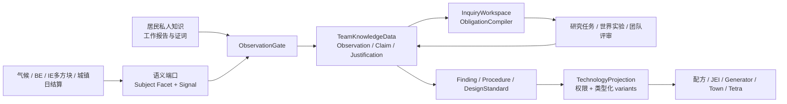

我的结论是：Pro 的核心方向正确，但工程上必须收束成一套“受约束的生成式研究系统”，而不是试图制作万能科学模拟器。

> 世界系统提供事实；研究内核保存观察、主张与论证；工作流编译器生成当前义务；玩家和居民作出选择并执行实验；稳定知识成果再被编译成现有配方权限、原型权限和 variants。

旧 `Research → Clue → Effect` 不应继续膨胀为新核心，而应成为兼容层和迁移来源。

## 我对原方案的四个关键修正

1. 不建立第二套“隐藏世界因果模型”

气候、温度、能量塔、城镇生产本身就是世界真相。研究系统只能通过语义端口观察和干预它们，不能复制一套平行物理，否则迟早与真实玩法分叉。

`MechanismSchema` 表示团队可能掌握的解释模式，而不是真正决定世界运行的代码。

2. 不把事件溯源当唯一存档真相

如果依赖“用当前规则重放全部旧事件重建知识图”，规则或代码改变后，同一历史可能得出不同结果。

我建议采用：

- 物化的当前认识状态作为存档真相；
- 关键研究事件作为来源和叙事账本；
- 原始实验轨迹结束后压缩成证据摘要；
- 规则重载只影响未来推理，不自动重写历史。

即“状态优先，日志佐证”，而不是纯事件溯源。

3. 不把所有对象强塞进统一“机器输入—输出”模型

研究对象还可能是居民群体、材料、气候区域、动物、建筑空间或物流流量。应以可组合 facet 表达：

- `SpatialFacet`
- `ProcessFacet`
- `FlowFacet`
- `PopulationFacet`
- `ObservableFacet`
- `InterventionFacet`

另外，主体身份、主体类型和队伍归属必须分开；不应把 `owner` 塞进 `ResearchSubjectRef`，因为归属可能变化，而实验历史中的对象身份不能随之变化。

4. 标准化技术不应总是魔法式升级全队机器

成果投影至少分为：

- 配方或设计权限；
- 团队程序/培训带来的全局贡献；
- 需要安装到具体机器的改装；
- 特定实验中临时启用的原型。

旧 `generator_effi` 可以暂时保留全队加成语义，但新硬件技术最好经历“标准已掌握 → 制造改装件 → 安装到机器”，而不是所有旧机器自动变强。

## 玩法模型

我建议把研究分为四类，而不只分“理论/实验”：

1. 发现型：认识世界中已经存在的机制，产出 `Finding`。
2. 诊断型：解释机器或城镇异常，产出诊断、维护 `Procedure`。
3. 恢复型：组合遗迹、旧设备、档案和难民记忆，恢复失传知识。
4. 工程型：提出指标、比较方案、制造原型并标准化，产出 `DesignStandard`。

恢复型尤其重要。当前 81 个研究定义中，主要内容是 106 个物品线索、103 个纸牌游戏线索、128 个配方解锁和 27 个多方块解锁，只有 6 个 stats 效果。这说明大部分旧科技更像文明恢复或工程开发，而不是基础科学发现。

玩家循环可以是：

```text
信号与报告
→ 玩家记录为观察
→ 系统发现矛盾、异常或目标缺口
→ 形成 ResearchLead
→ 玩家选择问题框架
→ 居民提出候选解释
→ 编译当前研究义务
→ 计算、讨论、测量或搭建实验
→ 支持 / 反驳 / 无法判断 / 异常
→ 玩家接受暂定结论、继续验证或归档
→ Finding / Procedure / DesignStandard
→ 原型、部署与技术投影
```

系统只产生候选和解释路径。选择哪些记录值得研究、采用哪个问题框架、接受何种结论，仍由玩家决定。

研究可以包含明确工作量，例如“两名居民整理三天日志”，但这只是任务耗时，不是“知识完成度 72%”。

## 建议的工程架构



### 1. 新建队伍级认识数据，不继续扩张旧上帝对象

现有 [TeamResearchData.java](/Users/wyc/Development/FrostedHeart/src/main/java/com/teammoeg/frostedresearch/data/TeamResearchData.java) 已同时承担迁移、进度、洞察、完成判定、效果、监听器、缓存和发包，接近 900 行。

我建议新增独立的 Chorda team special data：

```text
TeamKnowledgeData
├── observationStore
├── epistemicState
├── inquiries
├── knowledgeAssets
├── residentKnowledge
├── deploymentLedger
├── journal
└── stateRevision
```

旧 `TeamResearchData` 在迁移期间继续保存老进度、线索和效果状态。

目前为空壳的 [TeamResearchManager.java](/Users/wyc/Development/FrostedHeart/src/main/java/com/teammoeg/frostedresearch/api/TeamResearchManager.java) 可以升格成唯一事务服务：

```java
handle(team, ResearchCommand) -> ResearchMutationBatch
```

其他系统只能：

- 提交信号或行为意图；
- 读取不可变 `TechnologyProjection`；
- 订阅低频成果变化。

不能直接取得并修改知识图。

### 2. 认识图采用“主张—论证”模型

团队认识状态可写为：

\[
K=(O,C,J,A)
\]

- \(O\)：观察与证据；
- \(C\)：主张；
- \(J\)：支持或攻击主张的论证超边；
- \(A\)：稳定知识资产。

```java
ClaimKey =
    predicate
    + roleBoundArguments
    + normalizedScope;

Justification =
    premises
    + conclusion
    + polarity
    + rule
    + provenance;
```

状态可以是：

```text
PROPOSED
SUPPORTED
CONTESTED
REVIEW_READY
ACCEPTED
REJECTED
NEEDS_REVIEW
```

`ACCEPTED` 应包含玩家的接受行为和适用范围，而不是仅由一个后台概率阈值决定。旧前提失去支持时，下游技术先进入 `NEEDS_REVIEW`，不应瞬间消失或让机器停摆。

### 3. 推理采用受限增量规则，而不是通用全图搜索

规则形式：

```text
Pattern + Guard + Emit + DedupKey + Explanation
```

每次只处理 `GraphDelta` 附近：

```text
新观察
→ 根据变量/主体/上下文索引找到相关规则
→ 执行有限局部 join
→ 生成 Lead、候选假设或义务
```

约束建议：

- 机制链长度不超过 2–4；
- 每轮候选不超过 3–6；
- 所有生成结果必须携带解释路径；
- 不允许自动创造新概念；
- 候选只能来自已注册机制、公共知识或居民私人知识。

这本质上是小型、类型化、增量 Datalog，而不是图数据库或运行时 AI。

### 4. 实验有真实生命周期，研究阶段没有固定状态机

`Inquiry` 的“理论/实验/分析”阶段应由当前 obligation frontier 推导。

但一次物理实验本身可以有真实状态：

```text
DRAFT → ARMED → RUNNING → AWAITING_ANALYSIS → ARCHIVED
```

实验控制台只链接、记录和验证，不应直接修改任意机器变量。玩家仍通过真实方块、物流、升级件和环境实施干预。

正式实验期间才高频采样；结束后保存：

- 干预是否到位；
- 控制条件偏差；
- 输入、输出与环境摘要；
- 故障和缺失段；
- 对各假设的支持/反驳关系；
- 代表性曲线。

普通机器则按操作周期、班次或每日聚合，不能全世界逐 tick 记录。

## 与现有系统的具体耦合

### 城镇

现有 [TownHistoryEntry.java](/Users/wyc/Development/FrostedHeart/src/main/java/com/teammoeg/frostedheart/content/town/TownHistoryEntry.java) 和 [TownSignalEvent.java](/Users/wyc/Development/FrostedHeart/src/main/java/com/teammoeg/frostedheart/content/town/observation/TownSignalEvent.java) 已经提供日结算快照和危机事件。

新系统应增加 `TownResearchObservationBridge`：

- `TownSignalEvent` 作为事故/阈值证据；
- `TownHistoryEntry` 和建筑 `DailyReport` 提供定量事实；
- 物流站只观察请求量、实际供应、吞吐和堵塞，不凭空知道机器内部状态；
- 矿场、狩猎产生 `ExpeditionReport`；
- 研究所建筑只生成不可变 `ResearchWorkReport`，再交给 `TeamResearchManager`。

如果新增研究所建筑，最好先把当前集中式 `ITownBuilding.CODEC` 提取成 `TownBuildingType` 注册机制。

### 居民与难民

当前 [Resident.java](/Users/wyc/Development/FrostedHeart/src/main/java/com/teammoeg/frostedheart/content/town/resident/Resident.java) 已有力量、智力、教育和岗位熟练度。第一版不必急着再加入很多通用数值。

优先增加独立的、按居民 UUID 索引的研究覆盖层：

```text
ResidentKnowledgeProfile
├── backgroundTags
├── knownConcepts
├── mechanismSchemas
├── procedures
├── caseMemories
└── teachableKnowledge
```

难民携带的是知识包、证词和设计经验，不是直接解锁。只有交谈、相关工作、讨论、写作或教学才会外化为团队知识。

### 温度和机器

[WorldTemperature.java](/Users/wyc/Development/FrostedHeart/src/main/java/com/teammoeg/frostedheart/content/climate/WorldTemperature.java) 可以作为标准 `SpatialContextEnricher`。

Create、IE、能量塔和城镇建筑通过 adapter 暴露变量与 facet；核心研究模块不直接依赖它们的具体类。第三方机器不需要普遍写 UUID，只有被实验绑定时才建立 incarnation，避免拆掉重放后把两代机器混为同一个实验对象。

### 效果、配方和 variants

将裸 `CompoundTag variants` 升级为：

```java
VariantKey<T>
VariantContribution<T>
VariantResolver<T>
```

贡献以知识资产为来源，带明确运算方式、单位和范围，最终值可完全重算。

迁移期继续把结果反向物化到 `generator_effi`、`generator_heat` 等旧键，因此 [GeneratorData.java](/Users/wyc/Development/FrostedHeart/src/main/java/com/teammoeg/frostedheart/content/climate/block/generator/GeneratorData.java) 等消费者可以暂时不动。

权限统一查询：

```java
TechnologyAccessService.query(team, actionKey)
```

成熟度建议使用：

```text
UNKNOWN
UNDERSTOOD
PROTOTYPE_ONLY
STANDARDIZED
```

`ActionKey` 要区分 `CRAFT / FORM / USE / AUTOMATE`，不能只按输出物品或运行时 `Recipe` 对象判断。StoneAge 的磨盘、晒架、鞣制架、树桩和燧石工作台都走自定义配方类型，说明新系统仍需要在实际执行点提供适配器。

### UI

现有 [research-ui.md](/Users/wyc/Development/FrostedHeart/docs/research/research-ui.md) 中 `EXPERIMENT` 页签已经是空的未来边界。

我会把 UI 拆成：

- 知识档案：展示已形成的 Finding、Procedure、DesignStandard，复用现有图布局与 viewport；
- 研究工作台：展示一个 Inquiry 的关键证据、候选解释、当前义务、实验和时间线；
- 报告收件箱：让玩家从机器/城镇/NPC 报告中决定哪些值得正式记录。

客户端不需要同步完整无界知识图。同步应携带 `teamEpoch + catalogRevision + stateRevision`，通常只发送总览、当前 Inquiry 和增量变化。

## 第一条垂直切片

我建议不要先做“严寒导致能源塔热损失”，因为当前代码中 T1 燃料效率主要由配方时长、基础倍率和 `generator_effi` 决定；世界里不存在的规律不能伪装成科学发现。

最合适的是把现有 [generator_efficiency_1.json](/Users/wyc/Development/FrostedHeart/run/config/fhresearches/generator_efficiency_1.json) 改造为工程型 inquiry：

1. 燃料储备警告或玩家提出“降低塔燃料消耗”目标；
2. 物流与塔运行记录形成基线；
3. 难民供热工程经验提供候选改良方案；
4. 研究所完成燃料过程、负载和供热需求计算；
5. 玩家制造临时燃烧/进气原型；
6. 实验控制台比较同燃料、同负载下的基线与原型运行；
7. 现场试验确认持续运行和维护要求；
8. 形成 `DesignStandard(generator_combustion_efficiency_v1)`；
9. 第一版继续投影为 `generator_effi += 0.10`，以后再改成机器改装件。

真正的发现型切片可以随后选用已经存在的机制，例如：

- 建筑温度与狩猎停工；
- 住宅失温与居民状态；
- 热场距离、覆盖与室内温度变化。

## 渐进迁移顺序

1. 新建 `TeamKnowledgeData`、`TeamResearchManager`、typed projection 和 revisioned DTO，不改变玩法。
2. 建立 `LegacyResearchProjectionAdapter`：旧完成状态/效果映射成 KnowledgeAsset 与贡献，继续输出旧 variants 和解锁表。
3. 旧研究完成时同时产生稳定资产；验证旧新投影一致。
4. 接入城镇历史和一个能量塔 adapter，制作报告收件箱。
5. 完成一个 Inquiry—Obligation—Experiment—DesignStandard 垂直切片。
6. 加入难民知识包、研究所工作和教学。
7. 将旧 81 个节点逐个分类为恢复型、诊断型或工程型 scripted inquiry。
8. 最后才逐步退役研究点、纸牌线索、裸 variants 和对象引用式 lock list。

FTBQ 当前仍有 200 个 `frostedheart:insight` 奖励，不能在第一阶段删除洞察；先把它们适配为研究信用、观察机会或恢复资料，再逐章迁移。

最重要的五条架构纪律是：

- 研究核心不复制世界模拟；
- 自动化只生成候选，不替玩家作结论；
- 事件日志不承担唯一存档真相；
- 游戏系统只读取编译后的稳定投影；
- 不进行一次性重写，先用兼容层贯通一条真实垂直切片。

本轮仅做了只读分析，没有修改工作区。