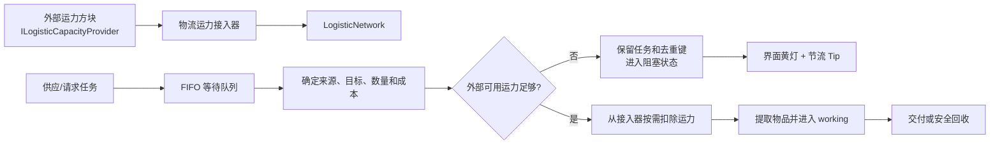

# 物流系统运力机制修改计划

## 1. 目标与已确认原则

为每个物流网络增加“运力”约束。供应箱主动推送和请求箱拉取物品都必须从外部运力来源取得足够运力，才能开始运输。

本轮方案采用以下原则：

- 运力不自动恢复，也不由物流网络凭空生成。
- 物流网络不设置大型运力池，不长期囤积外部输入的运力。
- 新增“物流运力接入器”方块，用于发现并读取相邻外部方块提供的运力 capability。
- 运输开始时按需从外部 provider 提取准确的运力数量。
- 运力不足时不得提前从物品来源中提取物品。
- 运力不足导致任务持续阻塞时，除了物流箱界面状态，还向物流核心所属队伍的在线玩家发送 Tip。
- 不要求完整迁移没有运力字段的旧存档，只要求缺字段、旧 working 任务或无 provider 时不会崩溃和丢失物品。
- 配置层允许小数，内部不直接使用 `float` 累加，而使用 `long` 定点数保证精度和可重复性。

## 2. 总体架构



物流网络只维护以下内容：

- 当前注册的运力接入器集合。
- 最近一次模拟得到的外部可用运力，供调度和界面显示。
- 当前 FIFO 队首任务所需运力。
- 运力阻塞状态及 Tip 节流状态。
- 极少量的异常结算余量 `capacityCredit`，仅用于处理 provider 模拟值与实际提取值不一致的防御性场景。

网络不再包含“最大运力”“每 tick 恢复”“自动回满”等概念。

## 3. 运力数值与精度

### 3.1 定点数方案

配置和界面使用带小数的“运力”单位，内部统一换算为 `long`：

```text
1 运力 = 1000 内部单位
```

新增工具类：

```text
src/main/java/com/teammoeg/frostedheart/content/robotics/logistics/capacity/LogisticCapacityUnits.java
```

建议接口：

```java
static final long SCALE = 1000L;

long toInternal(double displayedCapacity);
double toDisplay(long internalCapacity);
String format(long internalCapacity);
long saturatingAdd(long left, long right);
long saturatingMultiply(long left, long right);
```

这样既可以在配置中填写 `0.25`、`2.5` 等小数，又不会因反复使用 `float` 或 `double` 扣减产生误差。

### 3.2 推荐初始成本

| 配置 | 推荐值 | 含义 |
|---|---:|---|
| `enableTransportCapacity` | `true` | 是否启用外部运力限制 |
| `transportBaseCost` | `0.0` | 每次任务的固定成本 |
| `transportCostPerItem` | `10.0` | 每件物品的基础成本 |
| `transportCostPer16Blocks` | `0.0` | 每 16 格距离的附加成本，第一版关闭 |
| `capacityWarningDelayTicks` | `100` | 连续阻塞多久后发送警告 Tip |

默认每件物品消耗 10 运力，为后续加入物品重量、距离、升级倍率和不同 provider 效率留下足够的整数调节空间；配置仍允许小数微调。

第一版成本公式：

```text
displayCost = baseCost + itemCount * costPerItem
internalCost = round(displayCost * 1000)
```

代码中保留距离参数，但第一版默认距离成本为 0。启用距离成本时再使用：

```text
distanceSegments = ceil(horizontalDistance / 16)
displayCost = baseCost
            + itemCount * costPerItem
            + distanceSegments * distanceCostPer16Blocks
```

所有乘加使用饱和计算。出现负数、NaN、无穷大或溢出配置时记录一次错误并钳制为安全值，不能让服务器崩溃。

## 4. 外部运力 capability

### 4.1 Provider API

新增：

```text
src/main/java/com/teammoeg/frostedheart/content/robotics/logistics/capacity/ILogisticCapacityProvider.java
```

推荐接口：

```java
public interface ILogisticCapacityProvider {
    long getAvailableCapacity();

    long extractCapacity(long maxAmount, boolean simulate);
}
```

契约：

- 数值均为 `LogisticCapacityUnits` 定义的内部单位。
- 返回值必须位于 `0..maxAmount`。
- `simulate=true` 时不能修改 provider 状态。
- `simulate=false` 时返回本次实际扣除量。
- provider 自己负责持久化其运力来源，物流系统不复制其库存。
- provider 必须在内容变化时正确保存自己的方块实体。
- capability 可以按面暴露，接入器查询时传入面对接入器的方向。

在 `FHCapabilities` 中注册：

```java
TransientCapability<ILogisticCapacityProvider> LOGISTIC_CAPACITY_PROVIDER
```

这是一个 API 接入点，不应自动把 Forge Energy、热量或任意流体解释为运力。具体外部方块必须显式实现该 capability，或由独立兼容适配器完成转换，避免发生隐式资源兑换。

### 4.2 模拟与实际提取

任务准备阶段采用两步操作：

1. 对所有已注册接入器执行模拟提取，确认总量足够。
2. 在同一个服务端 tick 中立即执行实际提取，然后才提取物品。

服务器逻辑是单线程的，正确实现的 capability 在这两个连续步骤之间通常不会变化。但仍需处理错误或不稳定 provider：

- 如果实际提取量达到成本，任务正常开始。
- 如果实际提取量不足，不提取物品，任务继续等待。
- 已经从前几个 provider 提取但尚不足一单的部分记录为 `capacityCredit`，供同一网络后续任务继续使用，避免外部运力凭空消失。
- `capacityCredit` 只用于结算不一致，不主动预充，且上限为当前最大单任务成本；超过上限的部分拒绝记录并输出限频错误日志。
- `capacityCredit` 必须持久化，否则服务器在异常 provider 发生部分扣除后重启会丢失这部分运力。

这不是大型运力存储，而是外部提取事务的防御性尾差缓冲。正常 provider 下它始终为 0。

## 5. 物流运力接入器方块

### 5.1 新增内容

建议命名：

```text
Block ID: frostedheart:logistic_capacity_interface
Block entity: LogisticCapacityInterfaceBlockEntity
```

主要文件：

```text
src/main/java/com/teammoeg/frostedheart/content/robotics/logistics/capacity/LogisticCapacityInterfaceBlock.java
src/main/java/com/teammoeg/frostedheart/content/robotics/logistics/capacity/LogisticCapacityInterfaceBlockEntity.java
```

并在以下注册位置增加对应条目：

```text
FHBlocks
FHBlockEntityTypes
方块状态、模型、物品模型、掉落表、翻译和创造模式页
```

如果实现阶段还要增加合成配方或整合包配置，必须先按仓库规范定位并读取 companion modpack 仓库的 `AGENTS.md`，同时在两个 Git 仓库中核对相关 ID。

### 5.2 相邻扫描

接入器服务端行为：

- 每 20 tick 检查六个相邻方块。
- 方块邻居变化时提前标记扫描缓存失效。
- 对每个相邻方块查询朝向接入器一侧的 `LOGISTIC_CAPACITY_PROVIDER` capability。
- 缓存 `LazyOptional`，并监听失效以触发重新扫描。
- 相同 provider 从多个面返回同一实例时按身份去重，避免模拟可用量被重复统计。
- 不主动从 provider 抽取运力，只有网络准备实际任务时才按需抽取。
- 自身不暴露 provider capability，防止相邻接入器互相循环读取。

### 5.3 接入物流网络

接入器采用 Supplier/Storage 的网络连接模式：

- 周期性查找当前位置所属的最近物流核心。
- 连接成功时调用 `network.addCapacityInterface(capability)`。
- 切换网络时先从旧网络显式移除，再注册到新网络。
- 断网、方块移除和区块卸载时显式注销。
- 网络切换不搬运或复制任何外部运力。

新增内部接口：

```text
src/main/java/com/teammoeg/frostedheart/content/robotics/logistics/capacity/ILogisticCapacityAccess.java
```

推荐接口：

```java
public interface ILogisticCapacityAccess {
    BlockPos getPos();
    long simulateExtraction(long limit);
    long extractCapacity(long limit);
    int getProviderCount();
    boolean isValid();
}
```

`ILogisticCapacityProvider` 是外部方块暴露的 Forge capability；`ILogisticCapacityAccess` 是物流网络调用接入器的内部接口，不注册为公共 capability。`LogisticCapacityInterfaceBlockEntity` 负责把相邻的一个或多个 provider 聚合成一个 access 实例。

`LogisticNetwork` 使用身份集合维护接入器，定期剔除失效 `LazyOptional`，并提供：

```java
void addCapacityInterface(LazyOptional<ILogisticCapacityAccess> access);
void removeCapacityInterface(LazyOptional<ILogisticCapacityAccess> access);
long simulateAvailableCapacity(long limit);
CapacityExtractionResult tryExtractCapacity(long required);
int getCapacityInterfaceCount();
```

接入器与外部 provider 分层：网络只认识接入器，接入器负责聚合相邻 provider。这样相邻扫描、方向、失效监听和去重不会进入网络调度代码。

## 6. 成本策略

新增：

```text
src/main/java/com/teammoeg/frostedheart/content/robotics/logistics/capacity/LogisticCapacityPolicy.java
```

职责：

```java
long calculateCost(BlockPos from, BlockPos to, int itemCount);
int maxTransferableItems(BlockPos from, BlockPos to);
```

策略从服务端配置读取小数参数并预先转换为内部定点数。PushTask、RequestTask 和接入器均不直接读取 `FHConfig`。

如果单个完整堆叠成本非常高，不需要按照某个“网络最大运力”拆分，因为网络没有运力池上限；只要外部 provider 能提供足够运力就可以运输完整目标批量。后续若要限制单次运输量，应增加独立的 `maxItemsPerTransportTask` 配置，而不是重新引入大型运力池。

## 7. 任务准备协议与调度

### 7.1 三态准备结果

现有 `LogisticTask.prepare()` 使用 `null` 同时表示“没有工作”和“暂时不可执行”，无法正确表达外部运力等待。

新增：

```text
src/main/java/com/teammoeg/frostedheart/content/robotics/logistics/tasks/LogisticPrepareResult.java
```

状态：

- `STARTED`：已取得运力并提取物品，进入 working。
- `WAITING_FOR_CAPACITY`：来源和目标有效，但外部运力不足，任务保留。
- `ABORTED`：来源、目标或物品已不存在，任务结束并释放去重键。

网络调度规则：

1. 查看 FIFO 队首任务，不立即 `poll`。
2. 任务先确定来源、目标、计划数量和精确成本。
3. `WAITING_FOR_CAPACITY` 时保留队首、任务键和原物品，并结束本轮新任务准入。
4. `STARTED` 时才移除队首并加入 working。
5. `ABORTED` 时移除队首并释放任务键。
6. 已处于 working 的任务不再收费。

严格等待 FIFO 队首会牺牲少量利用率，但可以避免高成本任务长期被后续低成本任务饿死。

### 7.2 PushTask

`LogisticPushTask.prepare()` 调整为：

1. 验证源 capability 和源槽。
2. 读取源堆叠，不执行提取。
3. 查找可写入的物流存储目标。
4. 根据源数量和目标容量计算计划数量。
5. 计算运力成本。
6. 调用网络模拟并实际扣除外部运力。
7. 运力不足时返回 `WAITING_FOR_CAPACITY`，不改源库存。
8. 运力成功扣除后执行物品提取。
9. 如果物品提取为空或少于计划数量，将多扣部分计入 `capacityCredit` 或通过网络结算接口返还给信用余额。
10. 提取成功后进入现有运输阶段。

### 7.3 RequestTask

`LogisticRequestTask.prepare()` 使用相同顺序：先确定来源、请求目标、数量和成本，再扣运力并提取物品。

请求投递失败后转换为 PushTask 回库属于同一次已付费运输，不能二次收费。异常回库和核心拆除时的安全掉落也不收费，否则物品安全路径可能因缺运力而死锁。

## 8. 运力不足 Tip

### 8.1 可行性结论

该功能可行。现有城镇能量塔警报已经证明以下链路可用：

- 服务端状态穿越检测。
- 10 秒窗口节流和合并。
- `TeamDataHolder` 向在线队员发包。
- 客户端将通知展示为临时 Tip。

但不能直接复用 `TownSignalNotificationPacket`，因为它绑定了城镇事件枚举、城镇客户端开关、城镇事件页面点击动作和城镇文案。物流系统应复用 Tip 基础设施与设计模式，而不是依赖城镇事件类型。

### 8.2 物流专用通知组件

新增：

```text
src/main/java/com/teammoeg/frostedheart/content/robotics/logistics/notification/LogisticCapacityTipThrottle.java
src/main/java/com/teammoeg/frostedheart/content/robotics/logistics/notification/LogisticCapacityNotificationPacket.java
src/main/java/com/teammoeg/frostedheart/content/robotics/logistics/client/LogisticCapacityTipPresentation.java
```

节流状态机保持纯逻辑，便于单元测试：

- 第一次遇到运力不足只进入 pending，不立刻报警。
- 连续阻塞达到 `capacityWarningDelayTicks`，发送一次“物流网络因运力不足停摆”警告。
- 同一阻塞期间不重复发送警告。
- 发过警告后，下一次任务成功取得运力并发出时发送一次“物流运力供应恢复”提示。
- 若等待任务被取消或来源消失，静默清除 pending，不发送虚假的恢复提示。
- 状态在 200 tick 内反复切换时采用与 `TownTowerTipThrottle` 类似的延迟合并，避免警告和恢复连续刷屏。

### 8.3 通知对象

正式物流核心的 `LogisticState` 已继承 `OwnerState`，可以通过 owner UUID 解析 `TeamDataHolder`。实施时需要把通知归属传给网络：

```java
void setOwner(UUID owner);
```

并在 `LogisticCoreLogic.onOwnerChange()` 中同步更新。

发送规则：

- 有有效 owner/team：向该队伍所有在线成员发送。
- 没有 owner 或无法解析队伍：不广播，只保留物流箱界面状态和 debug 日志。
- 测试物流核心目前没有所有者状态，因此默认不发送 Tip，避免向全服误报。
- 多个核心分别节流，Tip ID 包含维度和核心位置，防止不同网络互相覆盖。

客户端增加：

```text
enableLogisticCapacityTips = true
```

全局 `enableTip` 或该开关关闭时不展示。通知包只携带安全的通知类型和核心位置，不传输任意服务端文本。

### 8.4 文案

至少增加以下中英文翻译：

- `tips.frostedheart.logistics.capacity_blocked.title`
- `tips.frostedheart.logistics.capacity_blocked.description`
- `tips.frostedheart.logistics.capacity_restored.title`
- `tips.frostedheart.logistics.capacity_restored.description`

警告建议显示 8 至 12 秒、黄色或红色字体，不置顶，不提供城镇事件页面点击动作。

## 9. 物流箱界面

当前 `BotDockStatus` 有一个没有实际绑定的数字文本框，可改为只读运力状态区域。

`LogisticStatusBlockEntity` 和 `LogisticChestMenu` 增加：

```java
long getExternalCapacityAvailable();
long getHeadTaskCapacityRequired();
boolean isWaitingForTransportCapacity();
int getCapacityInterfaceCount();
```

由于菜单数据槽主要支持 `int`，界面同步采用安全截断后的显示单位，或者拆分 `long` 为两个 `int`。不要把内部 milli-unit 直接截断后当作完整运力。

推荐显示：

```text
空闲：外部可用 1250.5
阻塞：可用 320.0 / 需要 640.0
未接入：无运力接入器
```

显示值使用网络最近一次限频模拟结果，不要为每个打开菜单的玩家每 tick 重复扫描所有相邻 provider。建议网络最多每 20 tick 更新一次纯显示缓存；任务准入仍执行实时模拟。

状态规则：

- 物流网络断开：红色网络灯。
- 网络连接且有接入器：绿色网络灯。
- 有任务因运力不足阻塞：黄色运力灯或黄色数值。
- 没有接入器但当前无任务：显示“未接入”，不发送警告。
- 没有接入器且存在有效等待任务：进入阻塞并按节流规则发送 Tip。

运力接入器本身第一版可以没有 GUI，但方块 tooltip 应说明它会读取相邻方块的运力 provider，并可通过方块状态或粒子表示是否检测到 provider。

## 10. 持久化与旧存档

不进行完整旧存档迁移，只实施最小安全兼容：

- 新字段使用 `contains`、可选字段或默认值读取。
- 缺少 `capacityCredit` 时按 0 处理。
- 缺少通知节流状态时按“尚未通知”处理。
- 非法负数、NaN 转换结果或溢出值钳制为 0，并记录限频错误日志。
- 旧存档中的 working 任务已经携带物品但没有付费标记时，允许它继续完成或安全回收，不追溯扣费。
- waiting 任务仍不保存；工作方加载后会重新提交。
- 旧存档没有运力接入器时网络正常加载，但新运输会因无外部来源等待。
- provider capability 失效或外部模组缺失时视为不可用，不能在 capability 解析处抛出异常导致核心无法加载。

建议仅持久化：

```text
capacityCredit: long
```

Tip 节流状态可以不持久化。服务器重启后若网络再次连续阻塞，会在等待期结束后重新警告一次；这比为了通知状态增加复杂迁移更可靠。

## 11. 配置修改

在 `FHConfig.Server` 下新增 `Logistics` 配置组：

```text
enableTransportCapacity
transportBaseCost
transportCostPerItem
transportCostPer16Blocks
capacityWarningDelayTicks
```

在 `FHConfig.Client` 增加：

```text
enableLogisticCapacityTips
```

服务端成本使用 `DoubleValue`，加载到 `LogisticCapacityPolicy` 时立即转换为定点 `long`。任务热路径不得反复读取 Forge 配置或执行浮点运算。

## 12. 测试计划

### 12.1 纯逻辑测试

新增或扩展：

```text
LogisticCapacityUnitsTest
LogisticCapacityPolicyTest
LogisticCapacityTipThrottleTest
```

覆盖：

1. `0.1`、`0.25`、`2.5` 等小数转换后精确扣减。
2. 默认单物品成本为 10 运力。
3. 大数量乘法和加法不会溢出。
4. NaN、无穷大和负配置被安全拒绝或钳制。
5. 警告只在连续阻塞达到延迟后发送一次。
6. 短暂不足不会发送 Tip。
7. 已警告网络恢复后只发送一次恢复 Tip。
8. 阻塞任务取消不会发送恢复 Tip。
9. 200 tick 内反复切换会被合并。

### 12.2 Provider 与接入器测试

使用假的 provider 和假的接入器覆盖：

1. 模拟提取不修改外部余额。
2. 实际提取只扣除任务需要的数量。
3. 多个 provider 能够合计满足一个任务。
4. 总量不足时不提取物品。
5. provider 在模拟后返回较少实际值时，部分结果进入 `capacityCredit`。
6. 相同 provider 从多个方向出现时不会重复计数。
7. capability 失效后接入器会重新扫描。
8. 接入器换网、卸载和拆除时从旧网络注销。
9. 两个物流网络不会共享接入器或运力。

### 12.3 物流任务回归

扩展现有 `LogisticNetworkTest`：

1. PushTask 运力充足时扣费并完成传输。
2. RequestTask 运力充足时扣费并完成传输。
3. 运力不足时源库存完全不变。
4. 运力不足时任务和去重键继续保留。
5. 外部 provider 补充运力后等待任务自动开始。
6. FIFO 队首不会被低成本后续任务绕过。
7. RequestTask 转成回库 PushTask 时不重复收费。
8. 任务取消、网络切换和核心拆除时，物品安全回收不收费。
9. `capacityCredit` 保存和加载正确。
10. 缺少所有新增 NBT 字段时网络能够加载且不崩溃。
11. 旧 working 任务能够完成或安全回收，不追溯收费。

### 12.4 Tip 集成测试

1. 正式核心能够把 owner 解析到 `TeamDataHolder`。
2. 警告只发送给所属队伍的在线成员。
3. 无 owner 的正式核心和测试核心不会向全服广播。
4. 客户端关闭物流 Tip 后不展示。
5. 不同核心使用不同通知 ID，不互相覆盖。

## 13. 游戏内验收

1. 外部 provider 紧邻接入器，供应箱能够消耗其运力并推送物品。
2. 移除 provider 或耗尽外部运力后，源物品留在原库存。
3. 阻塞超过 5 秒后，核心所属队伍收到一次 Tip。
4. 补充外部运力后任务自动开始，并收到一次恢复 Tip。
5. 快速耗尽和补充不会刷屏。
6. 打开供应、存储或请求箱可以看到“可用/需要”和接入器状态。
7. 多个相邻 provider 的容量能够合并使用。
8. 拆除或卸载接入器后，网络不会继续引用失效 capability。
9. 区块卸载和服务器重启不会复制运力、重复收费或丢失物品。
10. 多核心网络的 provider、阻塞状态和 Tip 互不影响。
11. 没有新字段的旧世界能够进入，旧运输任务不会导致崩溃。

## 14. 实施顺序

1. 增加定点单位工具、成本配置和 `LogisticCapacityPolicy`，完成纯逻辑测试。
2. 定义并注册 `ILogisticCapacityProvider` capability，编写测试 provider。
3. 实现物流运力接入器、相邻扫描、失效监听和网络注册。
4. 在 `LogisticNetwork` 中实现 provider 聚合、模拟、实际提取及 `capacityCredit`。
5. 引入三态任务准备结果，保持严格 FIFO 和去重键语义。
6. 接入 PushTask，再接入 RequestTask及其回库转换。
7. 实现物流专用 Tip 节流器、owner/team 目标解析、S2C 包和客户端展示。
8. 增加物流箱状态同步、只读运力显示和中英文翻译。
9. 执行定向测试、编译、`git diff --check` 和旧 NBT 缺字段测试。
10. 如果增加配方或整合包配置，读取 companion 仓库规则并分别验证两个 Git 仓库。
11. 完成游戏内 provider、断供、恢复、重启、多核心和 Tip 验收。
12. 按项目规范新增开发日志，记录实际 provider 来源、最终数值和遗留平衡问题。

## 15. 实施前仍需确认的内容

外部接入架构已经明确，但至少需要一个实际方块实现 `ILogisticCapacityProvider`，否则接入器只有 API 和测试用途。实施前应确定第一种真实运力来源属于哪一类：

- 本模组新增的运力生产/存储方块。
- 城镇或其他系统已有方块的适配器。
- 由 companion modpack 或其他模组提供 capability。
- 调试用无限 provider，仅用于开发验证，不进入正常生存玩法。

这个选择只影响运力如何产生和保存，不改变物流网络、任务扣费、接入器和 Tip 的主体设计。
