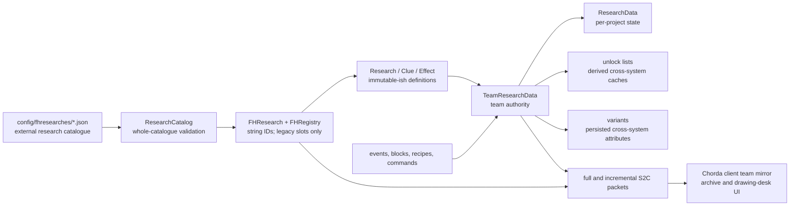
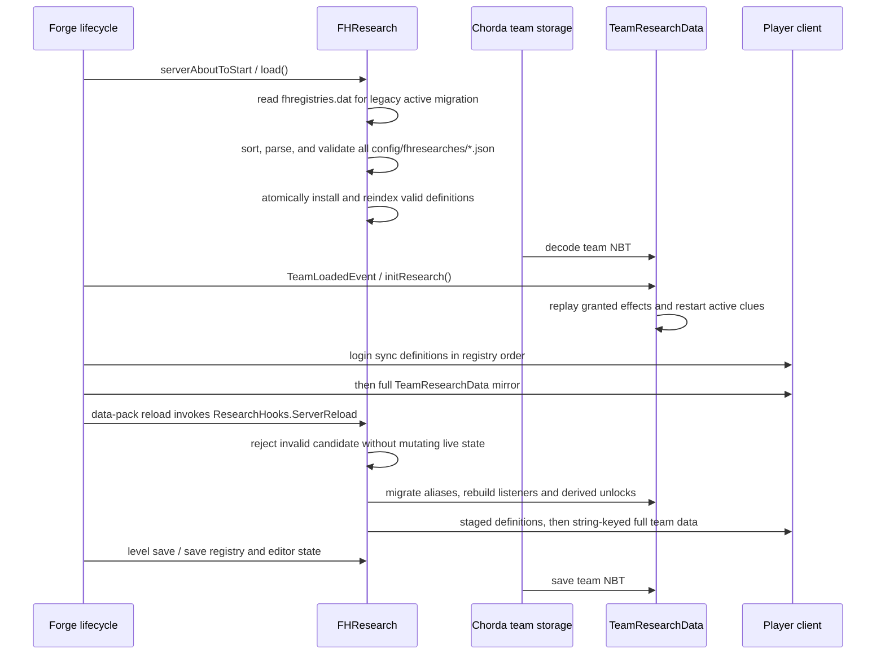

# Research System Architecture

- Status: `Current`
- Last verified: `2026-08-27`
- Scope: Runtime ownership, legacy progression, V2 Phase 2 knowledge/result workflow, lifecycle, and the shortest path through the implementation
- Code anchors: [`FRSpecialDataTypes`](../../src/main/java/com/teammoeg/frostedresearch/FRSpecialDataTypes.java), [`ResearchResultCatalog`](../../src/main/java/com/teammoeg/frostedresearch/knowledge/ResearchResultCatalog.java), [`ResearchWorkflowRegistry`](../../src/main/java/com/teammoeg/frostedresearch/knowledge/ResearchWorkflowRegistry.java), [`ObservationProviderRegistry`](../../src/main/java/com/teammoeg/frostedresearch/knowledge/observation/ObservationProviderRegistry.java), [`TeamKnowledgeData`](../../src/main/java/com/teammoeg/frostedresearch/data/TeamKnowledgeData.java), [`TeamResearchService`](../../src/main/java/com/teammoeg/frostedresearch/api/TeamResearchService.java), [`TechnologyAccessResolver`](../../src/main/java/com/teammoeg/frostedresearch/knowledge/TechnologyAccessResolver.java)

## One-Sentence Model

A server retains the legacy `Research` graph and its `TeamResearchData`, while V2 records topic-free observations and runs data-authored topics through registered idea, protocol, resolution, and Finding-view handlers; schema-2 `TeamKnowledgeData` owns the resulting observations, ideas, reports, and four acquireable result-ID sets, and `TechnologyAccessResolver` combines both authorities into the one default-open access projection consumed by gameplay and JEI.

## Ownership Layers

The system separates definition, authority, projection, and physical-item facts. Keeping them separate is the most important architectural rule:

| Layer | Owner | Examples | Persistence |
|---|---|---|---|
| Definition | `FHResearch.researches` | parents, clues, effects, costs, flags, migration aliases | JSON in server `config/fhresearches`; old name-to-slot snapshot remains only for legacy active-ID migration |
| Authoritative progress | team `TeamResearchData` | string-keyed active project, long committed points, nonce-keyed clues/effects, insight, variants | versioned Chorda team NBT |
| Derived/cache/client state | unlock lists, graph layout, `ResearchWorkspaceState` | locked recipe sets, UI selection, camera, search, bookmarks | rebuilt or transient; not durable team truth |
| V2 workflow/result definitions | `ResearchResultCatalog.Snapshot` plus `ResearchWorkflowRegistry` | topic declarations, executable handler IDs, five typed results, prototype profile revision, managed targets | effective datapack JSON plus startup-registered handlers; immutable catalogue snapshot with monotonic revision |
| V2 team authority | team `TeamKnowledgeData` | observations, ideas, comparison artifacts, and acquired Finding, Design, Construction, and Procedure IDs, including orphans | schema-2 Chorda team NBT |
| V2 projection | `KnowledgeProjection`, `KnowledgeLabProjection`, `TechnologyAccessProjection` | ambient actions/views, complete safe archive, and access decisions with provenance | rebuilt and sent in a full S2C snapshot; not durable truth |
| Prototype fact | `upgrade_prototype` ItemStack | profile, frozen revision, serial, owner team | namespaced item NBT; never an acquired team ID |

The client must not invent a second progression model. Legacy UI reads the synchronized Chorda team mirror through `ClientResearchDataAPI`; V2 UI reads the atomically replaced `ClientKnowledgeDataAPI` snapshot. Both send intents for server validation.

## Module Bootstrapping

`FRMain` is the Forge mod entry point for mod ID `frostedresearch`. It registers:

- `FRContents`: drawing desk content, research items, recipe serializers, menu, sounds, and Create-backed calculator content;
- `FRSpecialDataTypes.RESEARCH_DATA`: Chorda's `SpecialDataType<TeamResearchData>` with local ID `research`;
- `FRSpecialDataTypes.KNOWLEDGE_DATA`: independent `SpecialDataType<TeamKnowledgeData>` with ID `frostedresearch:knowledge`;
- `frostedresearch:upgrade_prototype`: non-stackable physical shell, intentionally absent from the normal creative tab;
- server configuration and common/client event handlers;
- the `FRNetwork` message channel during common setup;
- compatibility modules selected by loaded-mod checks.

Important registry IDs include:

| Kind | ID |
|---|---|
| block and block entity | `frostedresearch:drawing_desk` |
| menu | `frostedresearch:draw_desk` |
| Create block and block entity | `frostedresearch:mechanical_calculator` |
| recipe types and serializers | `frostedresearch:paper`, `frostedresearch:inspire` |
| creative tab | `frostedresearch:main` |

## Package Map

| Package | Responsibility | Start with |
|---|---|---|
| `research` | transactional catalogue loading, string identity, definition graph, lock lists | `ResearchCatalog`, `FHResearch`, `Research` |
| `research.clues` | polymorphic prerequisites and contribution triggers | `Clue`, `ListenerClue`, concrete clue classes |
| `research.effects` | polymorphic rewards and derived unlock state | `Effect`, concrete effect classes |
| `data` | team/project state, formulas, persistence codecs, public enum tokens | `TeamResearchData`, `ResearchData`, `ClueData`, `ResearchVariant` |
| `knowledge` | V2 observation/idea/workflow models, executable handler registry, result codecs, datapack catalogue, projections, provenance and access resolver | `KnowledgeRecord`, `ResearchWorkflowRegistry`, `ResearchResultCatalogLoader`, `TechnologyAccessResolver` |
| `knowledge.observation` | topic-free observation contexts, provider enrichment, semantic deduplication, and the generic block fallback | `ObservationProviderRegistry`, `ObservationProvider`, `GenericBlockObservationProvider` |
| `network` | definition, full-state, delta-state, and player-intent messages | `FRNetwork`, packet classes |
| `handler` and `events` | Forge lifecycle, trigger routing, locks, reload and team events | `FHServerEvents`, `ResearchCommonEvents`, `ResearchHooks` |
| `blocks`, `item`, `recipe` | drawing desk, calculator, tools, paper/inspiration recipes | `DrawingDeskTileEntity`, `MechanicalCalculatorTileEntity`, `RubbingTool` |
| `gui` | drawing-desk screen, legacy archive/graph, and V2 Knowledge Laboratory | `DrawDeskScreen`, `ResearchArchiveLayer`, `KnowledgeLabLayer` |
| `api` | team-data lookup, mutation service and client/server helper boundary | `ResearchDataAPI`, `KnowledgeDataAPI`, `TeamResearchService` |
| `compat` | JEI, FTB Quests/Teams, Tetra, Create and IE integration | each compat package |
| `number` | unfinished/unused number-resource abstraction | do not assume it drives current progression |

## Server Lifecycle

Legacy research JSON is deliberately outside the vanilla datapack resource tree. In parallel, V2 reads `data/<namespace>/frostedresearch/topics/<path>.json` and `.../prototypes/<path>.json`; an empty V2 directory is valid. A V2 candidate is installed only after aggregate validation, and an invalid candidate retains the previous result snapshot. The mod datapack bundles the Phase 2 `the_winter_rescue:geology_understanding` topic and its stable recipes, while the companion pack remains the production source of the playable legacy catalogue and mirrors the Phase 2 resources.

## V2 Discovery And Research Flow

```mermaid
flowchart LR
    Observe["Observation channel"] --> Provider["ObservationProviderRegistry\ngeneric fallback + domain enrichment"]
    Provider --> Record["topic-free KnowledgeRecord"]
    Record --> Board["drawing-desk pins"]
    Board --> Match["registered IdeaSourceHandler"]
    Match --> Hidden["server-side candidate"]
    Hidden --> Game["V2 inspiration card game"]
    Game --> Idea["one rule: record Idea\nmultiple rules: player chooses"]
    Idea --> Method["registered ProtocolHandler"]
    Method --> Work["optional artifact + Idea state"]
    Work --> Resolve["registered ResolutionHandler"]
    Resolve --> Results["Finding / Design / Construction / Procedure"]
```

The notebook chooses an observation channel and retained context fields, not a topic. A forty-tick capture creates a topic-free block or entity record. `ObservationProviderRegistry` always has a generic block fallback and selects the highest-priority provider that supports the context; Frosted Heart registers geology enrichment from `GeologyResearchIntegration`. Before an `IdeaRecord` exists, `ResearchWorkflowRegistry#findCandidates` evaluates each registered rule against arbitrary pinned subsets and returns at most three table matches. Completing inspiration records a sole revalidated match immediately; multiple matches require a choice. Only persisted Ideas cause `ResearchWorkflowRegistry#actionCards` to expose post-Idea work. A protocol execution may append a method artifact or only advance Idea state. `TeamResearchService` remains the shared mutation and execution boundary; topic-specific evidence selection and outcome rules live in registered handlers.

## Runtime Control Flow

The common player flow is:

1. A player opens a team-owned drawing desk.
2. The client selects a definition from the synchronized catalogue.
3. `FHResearchControlPacket(COMMIT_ITEM)` asks the server to pay required items and insight levels and activate the project.
4. `TeamResearchData` may hold several activated or paused `ResearchData` records, but `activeResearchId` selects at most one current project for listener/item/game routing.
5. Direct experiment points and completed clues update the project.
6. `TeamResearchData#checkResearchComplete` is the only normal completion decision point.
7. Completion grants team-safe effects immediately; effects requiring a concrete player remain claimable.
8. Rebuilt unlock lists and persisted variants are consumed by crafting, block, multiblock, generator, forecast, villager, and UI systems.

`ResearchData.active` means a project has been paid for and is eligible to resume; it is not the same as being the one selected by `TeamResearchData.activeResearchId`.

## Authority And Trust Boundaries

- The server owns definitions after load, team progress, costs, clue completion, experiment points, effects, and commands.
- The client owns archive presentation state only. `ResearchWorkspaceState` is scoped to one screen instance and is not persisted across reopening.
- Definitions and console-command effects are trusted administrator/modpack configuration, not untrusted player input.
- Player C2S packets are untrusted input. Research-control paths re-check game rules; drawing-desk operations additionally bind the packet to the sender's open menu, loaded tile, level, distance, team owner, operation shape, and `9 x 9` board bounds.
- Research data belongs to a Chorda team, not a player capability. With FTB Teams present, membership selects the team holder; otherwise Chorda supplies a distinct single-player fallback team per player.
- Every restricted execution resolves an owner before authorization. Player actions use the real player's current team. Machine actions use the block entity's persisted owner. Fake players and ownerless machines fail closed for restricted content, while unrestricted content remains executable.
- Create mechanical crafting scopes its owner in a nested, exception-safe `ThreadLocal` around the actual recipe lookup. The owner cannot leak between neighbouring machines, nested calls, exceptions, or server threads.

## Extension Boundaries

Supported extension points are narrower than the package structure may suggest:

- add clue/effect codecs through their typed registries before definitions load;
- read/write team state through `ResearchDataAPI` and listen to research events;
- declare new research JSON in server configuration and translations in resource assets;
- register bounded V2 observation providers, idea-source handlers, protocol handlers, resolution handlers, and Finding-view handlers before the datapack catalogue validates;
- register domain-neutral person-knowledge package definitions in `PersonKnowledgePackageCatalog`; content integrations own their package IDs, roll ranges, replies, and optional offers;
- declare V2 topics that reference those stable handler IDs instead of reading arbitrary Java fields or NBT;
- add enforcement for a new game system by using global lock lists plus team unlock lists, or by consuming a variant.

There is still no datapack replacement for the playable legacy research graph or general-purpose arbitrary-script `Requirement` hierarchy. The V2 loader compiles the bounded `legacy`, `idea_sources`, `inspiration`, `protocols`, `resolution`, results/rewards, and prototype identity/revision fields; executable meaning comes only from registered handlers. See [results-and-access.md](results-and-access.md) for the exact boundary.
