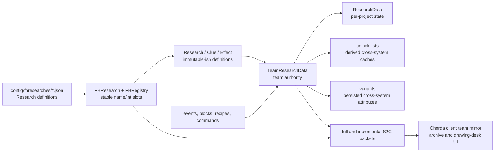
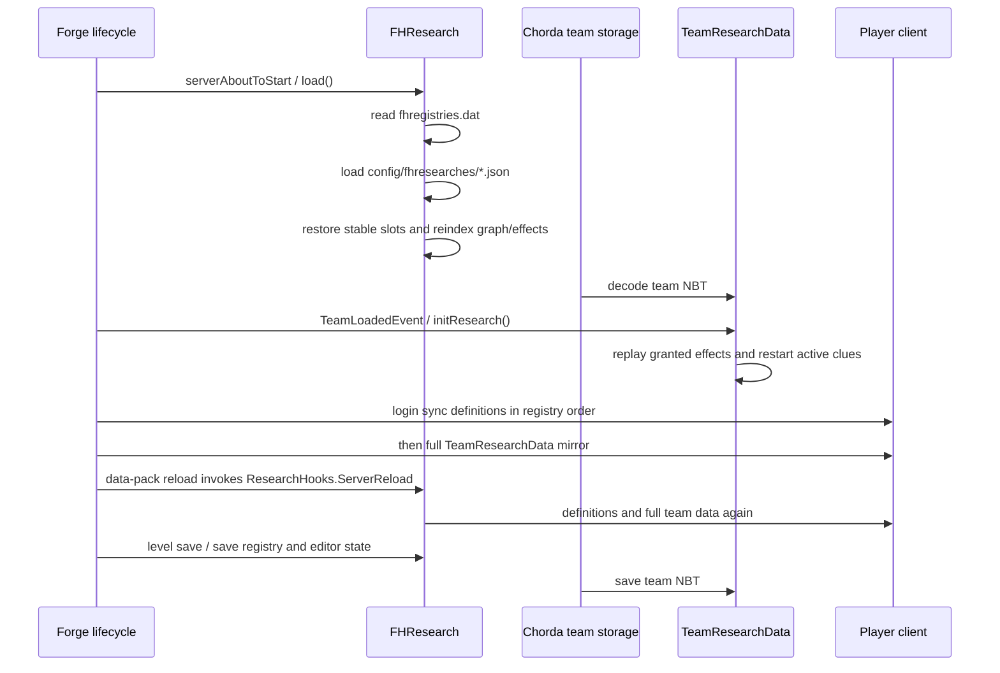

# Research System Architecture

- Status: `Current`
- Last verified: `2026-08-22`
- Scope: Runtime ownership, subsystem boundaries, lifecycle, and the shortest path through the implementation
- Code anchors: [`FRMain`](../../src/main/java/com/teammoeg/frostedresearch/FRMain.java), [`FRContents`](../../src/main/java/com/teammoeg/frostedresearch/FRContents.java), [`FRSpecialDataTypes`](../../src/main/java/com/teammoeg/frostedresearch/FRSpecialDataTypes.java), [`FHResearch`](../../src/main/java/com/teammoeg/frostedresearch/FHResearch.java), [`FHRegistry`](../../src/main/java/com/teammoeg/frostedresearch/FHRegistry.java), [`ResearchCommonEvents`](../../src/main/java/com/teammoeg/frostedresearch/handler/ResearchCommonEvents.java), [`ResearchHooks`](../../src/main/java/com/teammoeg/frostedresearch/ResearchHooks.java), [`ResearchDataAPI`](../../src/main/java/com/teammoeg/frostedresearch/api/ResearchDataAPI.java)

## One-Sentence Model

A server loads file-based `Research` definitions into a stable-slot registry, Chorda stores one `TeamResearchData` value for each team, gameplay hooks mutate that state, effects derive unlock caches and attributes from completed research, and packets mirror definitions and team state to client UI.

## Ownership Layers

There are three different kinds of data. Keeping them separate is the most important architectural rule:

| Layer | Owner | Examples | Persistence |
|---|---|---|---|
| Definition | `FHResearch.researches` | parents, clues, effects, costs, flags | JSON in server `config/fhresearches`; name-to-slot list in `fhregistries.dat` |
| Authoritative progress | team `TeamResearchData` | active project, committed points, completed clues/effects, insight, variants | Chorda team NBT |
| Derived/cache/client state | unlock lists, graph layout, `ResearchWorkspaceState` | locked recipe sets, UI selection, camera, search, bookmarks | rebuilt or transient; not durable team truth |

The client must not invent a second progression model. It reads a synchronized Chorda team mirror through `ClientResearchDataAPI` and sends intent packets for server validation.

## Module Bootstrapping

`FRMain` is the Forge mod entry point for mod ID `frostedresearch`. It registers:

- `FRContents`: drawing desk content, research items, recipe serializers, menu, sounds, and optional Create content;
- `FRSpecialDataTypes.RESEARCH_DATA`: Chorda's `SpecialDataType<TeamResearchData>` with local ID `research`;
- server configuration and common/client event handlers;
- the `FRNetwork` message channel during common setup;
- compatibility modules selected by loaded-mod checks.

Important registry IDs include:

| Kind | ID |
|---|---|
| block and block entity | `frostedresearch:drawing_desk` |
| menu | `frostedresearch:draw_desk` |
| optional Create block and block entity | `frostedresearch:mechanical_calculator` |
| recipe types and serializers | `frostedresearch:paper`, `frostedresearch:inspire` |
| creative tab | `frostedresearch:main` |

## Package Map

| Package | Responsibility | Start with |
|---|---|---|
| `research` | catalogue loading, stable registry, definition graph, lock lists | `FHResearch`, `FHRegistry`, `Research` |
| `research.clues` | polymorphic prerequisites and contribution triggers | `Clue`, `ListenerClue`, concrete clue classes |
| `research.effects` | polymorphic rewards and derived unlock state | `Effect`, concrete effect classes |
| `data` | team/project state, formulas, persistence codecs, public enum tokens | `TeamResearchData`, `ResearchData`, `ClueData`, `ResearchVariant` |
| `network` | definition, full-state, delta-state, and player-intent messages | `FRNetwork`, packet classes |
| `handler` and `events` | Forge lifecycle, trigger routing, locks, reload and team events | `FHServerEvents`, `ResearchCommonEvents`, `ResearchHooks` |
| `blocks`, `item`, `recipe` | drawing desk, calculator, tools, paper/inspiration recipes | `DrawingDeskTileEntity`, `MechanicalCalculatorTileEntity`, `RubbingTool` |
| `gui` | drawing-desk screen, archive, graph, project workspace | `DrawDeskScreen`, `ResearchArchiveLayer` |
| `api` | team-data lookup and client/server helper boundary | `ResearchDataAPI`, `ClientResearchDataAPI` |
| `compat` | JEI, FTB Quests/Teams, Tetra, Create and IE integration | each compat package |
| `number` | unfinished/unused number-resource abstraction | do not assume it drives current progression |

## Server Lifecycle

Research JSON is deliberately outside the vanilla datapack resource tree. `/reload` still reloads it because `ResearchHooks.ServerReload` participates in the server resource reload lifecycle; this does not make it a datapack format.

## Runtime Control Flow

The common player flow is:

1. A player opens a team-owned drawing desk.
2. The client selects a definition from the synchronized catalogue.
3. `FHResearchControlPacket(COMMIT_ITEM)` asks the server to pay required items and insight levels and activate the project.
4. `TeamResearchData` may hold several activated or paused `ResearchData` records, but `activeResearchId` selects at most one current project for listener/item/game routing.
5. Direct experiment points and completed clues update the project.
6. `TeamResearchData#checkResearchComplete` is the only normal completion decision point.
7. Completion grants team-safe effects immediately; effects requiring a concrete player remain claimable.
8. Rebuilt unlock lists and persisted variants are consumed by crafting, block, multiblock, generator, forecast, villager, and UI systems.

`ResearchData.active` means a project has been paid for and is eligible to resume; it is not the same as being the one selected by `TeamResearchData.activeResearchId`.

## Authority And Trust Boundaries

- The server owns definitions after load, team progress, costs, clue completion, experiment points, effects, and commands.
- The client owns archive presentation state only. `ResearchWorkspaceState` is scoped to one screen instance and is not persisted across reopening.
- Definitions and console-command effects are trusted administrator/modpack configuration, not untrusted player input.
- Player C2S packets are untrusted input. Research-control paths re-check game rules; drawing-desk operations additionally bind the packet to the sender's open menu, loaded tile, level, distance, team owner, operation shape, and `9 x 9` board bounds.
- Research data belongs to a Chorda team, not a player capability. With FTB Teams present, membership selects the team holder; otherwise Chorda supplies a single-player fallback team.

## Extension Boundaries

Supported extension points are narrower than the package structure may suggest:

- add clue/effect codecs through their typed registries before definitions load;
- read/write team state through `ResearchDataAPI` and listen to research events;
- declare new research JSON in server configuration and translations in resource assets;
- add enforcement for a new game system by using global lock lists plus team unlock lists, or by consuming a variant.

There is no current datapack loader for research definitions, schema-version migration service, stable public immutable progress DTO, or general-purpose `Requirement` hierarchy. Tetra's `ResearchRequirement` is a compatibility adapter, not the core model.
