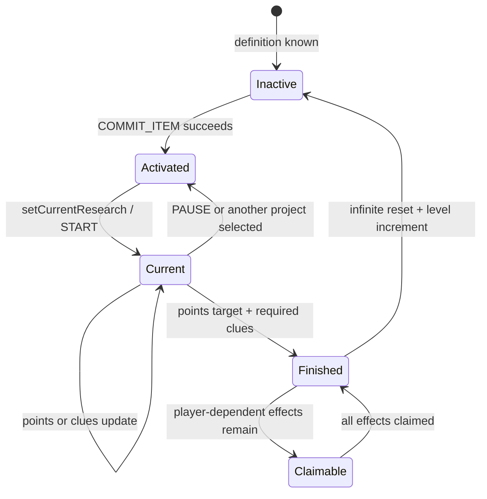

# Research State, Persistence, And Synchronization

- Status: `Current`
- Last verified: `2026-08-22`
- Scope: Team and per-research structures, formulas, transitions, insight, saved files, definition registry, packet model, and reload behavior
- Code anchors: [`TeamResearchData`](../../src/main/java/com/teammoeg/frostedresearch/data/TeamResearchData.java), [`ResearchData`](../../src/main/java/com/teammoeg/frostedresearch/data/ResearchData.java), [`ClueData`](../../src/main/java/com/teammoeg/frostedresearch/data/ClueData.java), [`FRNetwork`](../../src/main/java/com/teammoeg/frostedresearch/FRNetwork.java), [`ResearchCommonEvents`](../../src/main/java/com/teammoeg/frostedresearch/handler/ResearchCommonEvents.java)

## State Hierarchy

Research progress is team data:

```text
TeamDataHolder
└── data.research: TeamResearchData
    ├── variants: CompoundTag
    ├── researches: Map<research string ID, ResearchData>
    │   └── ResearchData
    │       ├── active / finished / level / committed
    │       ├── clueData: Map<clue nonce, ClueData>
    │       └── effectData: Map<effect nonce, boolean>
    ├── activeResearchId: stable registry integer, or -1
    ├── insight / usedInsightLevel
    └── visitedArea: BitSet
```

It is not stored in a player capability. `ResearchDataAPI.getData(Player)` resolves the player's current Chorda team, so team joins/leaves change which saved research state a player observes.

When FTB Teams is absent, `SinglePlayerTeam#getOnlineMembers` returns the associated `ServerPlayer` as a single-member collection while online and an empty collection while offline. This allows the same `TeamDataHolder#sendToOnline` incremental-sync path to serve fallback teams.

## `ResearchData`: One Project

| Field | Type | Default | Meaning |
|---|---|---|---|
| `active` | boolean | `false` | activation cost has been paid; the project can be selected/resumed |
| `finished` | boolean | `false` | completion was reached |
| `level` | integer | `0` | repeat count for infinite research |
| `committed` | integer in codec | `0` | direct experiment points |
| `clueData` | map by clue nonce | empty | completed flag plus optional custom NBT |
| `effectData` | map by effect nonce | empty | whether each effect has been granted/claimed |

`ResearchData.EMPTY` is a defensive sentinel returned for absent data in some read paths. It must not be treated as a mutable project record.

`ClueData` persists `completed` and optional `CompoundTag data`. Its compressed/network branch serializes only `completed`; custom clue payload NBT is therefore server/save-only with the current codec. Built-in clues do not currently use that payload.

## `TeamResearchData`: One Team

| Field | Persisted | Full client sync | Meaning |
|---|---:|---:|---|
| `variants` | yes | yes | arbitrary typed NBT attributes written mainly by `EffectStats` |
| `researches` | yes, string-key map | yes, registry-aligned list | all materialized per-project states |
| `activeResearchId` | yes | yes | current research registry slot; `-1` means none |
| `insight` | yes | yes | total insight points earned |
| `usedInsightLevel` | yes | yes | levels already spent on activation |
| `insightLevel` | no | no | calculated from `insight` |
| `visitedArea` | yes | **no** | server-only exploration-sector bitset |

The full network codec changes `researches` from a string-keyed map to a list aligned with `FHResearch.researches`. It intentionally omits `visitedArea`.

## Experiment-Point Formula

Define:

- `P`: research `points`, integer required experiment points;
- `D`: `ResearchData.committed`, directly submitted integer points;
- `c_i`: dimensionless `Clue.value` for each completed clue;
- `C = Σ c_i`: total completed clue contribution.

`ResearchData#getTotalCommitted` computes:

```text
if C >= 0.999:
    effective = P
else:
    effective = min(D + trunc(C * P), P)
```

For ordinary nonnegative contributions, Java's integer conversion is equivalent to `floor`. The `0.999` threshold avoids floating-point error when contributions are intended to sum to one.

`ResearchData#getProgress` returns `effective / P`. The implementation does not validate `P > 0`, clamp `D` at zero, clamp individual `c_i`, or lower-bound `effective`. Malformed/API-provided values can therefore produce negative progress, overlarge intermediate values, or division by zero/NaN.

## Completion Rule

`TeamResearchData#checkResearchComplete` finishes a project only when both are true:

1. `getTotalCommitted(research) >= research.getRequiredPoints()`;
2. every clue whose `required` flag is true has completed `ClueData`.

The second test is exposed by `ResearchData#canComplete`. A required clue is a Boolean gate even when its contribution value is zero. A clue with a contribution is not automatically required.

Completion then:

- marks the project finished;
- attempts every ungranted effect;
- sends project/effect updates and posts research status events;
- clears `activeResearchId` when this was the current project;
- leaves player-dependent item/command/experience effects ungranted for later claim.

For `infinite` research, once every effect is granted, the project state is reset and `level` is incremented. This means a player-dependent reward must be claimed before the next repeat begins.

## Activation And Current Selection



`FHResearchControlPacket` routes three actions:

| Action | Server conditions | Result |
|---|---|---|
| `COMMIT_ITEM` | definition exists; not `locked`; all resolvable parents finished; enough unused insight levels; activation ingredients available | consumes ingredients/levels, marks project active, selects it, starts listeners |
| `START` | project's `ResearchData.active` is true and it is unfinished | selects it as current and starts non-always listeners |
| `PAUSE` | current selection matches | ends non-always listeners and clears current selection |

There can be many activated/paused projects but only one `activeResearchId` current target. Item clues, the drawing-desk theory game, and most non-always listeners route through that current target.

## Reset Semantics

`TeamResearchData#resetData` is the administrative rollback path. It:

- invokes `Effect#revoke` for every effect whose current grant flag is recorded and for every completed infinite iteration represented by `level`; additive `EffectStats` reversal is multiplied by that application count;
- clears active/finished/committed state and clue/effect maps;
- clears `activeResearchId` when it selects the reset project and ends its non-always listeners;
- resets the infinite `level` counter to `0`;
- replays every other completed-and-granted research into the derived unlock lists, restoring overlapping unlocks after the target effect removes its entries without clearing unrelated retained rewards;
- sends effect revocations, an exact variants snapshot when needed, and the reset project state to online team members.

`EffectStats` and research-derived recipe/block/multiblock/category unlocks are reversible. Set-like effects need only one removal even after repeated infinite iterations; additive effects override `Effect#revoke(TeamResearchData, int)` to reverse every recorded application. Item stacks, experience already awarded, and command side effects cannot be recovered reliably and their `revoke` implementations are intentionally no-ops. Reset also does not infer refunds for activation ingredients or `usedInsightLevel`; those costs are aggregate team state rather than per-iteration ledgers. Clearing an effect flag permits the effect to be granted again if the project is recompleted.

Infinite-research iteration rollover deliberately uses `TeamResearchData#resetForRepeat`, not the administrative path. It clears the just-finished iteration's progress/grant flags while retaining its awarded effects and current repeat level so `grantEffects` can increment that level. `ResearchData#setFinished(false)` remains a lower-level partial mutation and is not equivalent to either reset workflow.

## Insight Model

Let `I` be total insight points and `L` the derived insight level:

```text
L(I) = floor(sqrt(8I + 9) - 3)
I_required(L) = ceil(((L + 3)^2 - 9) / 8)
available levels = L(I) - usedInsightLevel
```

Research activation consumes levels by increasing `usedInsightLevel`; it does not subtract insight points. The used value is clamped by its setter to the calculated level, while low-level APIs can still supply negative total insight.

Insight sources are:

- exploration via `InsightHandler`;
- `InspireRecipe` item submission at the drawing desk;
- FTB Quests' insight reward when that integration is loaded;
- permission-level-2 commands or API calls.

### Exploration Sector Mapping

Every 20 ticks, `InsightHandler` maps the player's horizontal position into a radial sector:

```text
R = server config insightAreaRange, default 128 blocks, minimum 1
n = floor(sqrt(x^2 + z^2) / R)
sector count on ring n = 2n + 1
ring rotation = 7 degrees * n
visited index = n^2 + angular sector m
```

The team's `visitedArea` bitset awards one insight on first entry. The key does not include dimension, so equal mapped coordinates in different dimensions share the same visited bit.

## Persistence Files

Two independent persistence systems must remain consistent:

| File/data | Typical location | Contents |
|---|---|---|
| definition config | `<server>/config/fhresearches/*.json` | current research bodies |
| registry snapshot | `<world>/fhregistries.dat` | NBT string list `researches`, preserving string ID to integer slot |
| editor state | `<world>/fheditor.dat` | global editor flag |
| team state | `<world>/chorda_data/<internal-team-UUID>.nbt` | compressed Chorda holder with `data.research` |

The registry snapshot does not store definitions. Restoring a world without the matching config catalogue preserves names/slots but cannot reconstruct parents, clues, effects, or display data. Conversely, copying config without `fhregistries.dat` can assign a different numeric order, which matters to active IDs and packets.

## Team Load Reconstruction

On `TeamLoadedEvent` and `TeamCreatedEvent`, `TeamResearchData#initResearch`:

1. walks saved project/effect state;
2. replays already-granted effects in load mode so team unlock lists are reconstructed without giving player rewards or adding stats again;
3. restarts the current research's unfinished clue listeners when its registry slot still resolves;
4. clears an unresolvable current slot;
5. posts `ResearchDataLoadedEvent`.

Global lock declarations are separately rebuilt from every loaded effect during catalogue indexing. Therefore lock lists are best understood as derived indices:

```text
definition has EffectUse/Recipe/Building/Category
        -> global object is research-restricted
saved effectData says team received effect
        -> team's matching unlock list contains object
```

## Definition Synchronization

Login/reload sends definitions before progress:

1. `FHResearchRegistrtySyncPacket` (`research_registry`) sends the string slot list, including stable ordering;
2. one `FHResearchSyncPacket` (`research_sync`) sends each `Research.CODEC` body and string key;
3. `FHResearchSyncEndPacket` (`research_sync_end`) finalizes/reindexes the client catalogue and notifies definition listeners;
4. `FHResearchDataSyncPacket` (`research_data`) sends the full team mirror.

This ordering is mandatory because team/network payloads refer to registry integer IDs and clue/effect list indices.

## Runtime Packets

`FRNetwork` registers these semantic flows:

| Message ID | Direction by use | Payload/purpose |
|---|---|---|
| `research_registry` | S2C | stable definition slot names |
| `research_sync` | S2C | one research definition |
| `research_sync_end` | S2C | finish definition indexing |
| `research_data` | S2C | full `TeamResearchData.NETWORK_CODEC` |
| `research_data_update` | S2C | one `ResearchData` by numeric research ID |
| `research_clue` | S2C | one clue Boolean by numeric research ID and clue list index |
| `research_effect` | S2C | one effect Boolean by numeric research ID and effect list index |
| `research_attribute` | S2C | variants NBT |
| `research_select` | S2C | current numeric research ID |
| `research_insight` | S2C | insight/used-level values |
| `research_control` | C2S | activate, start, or pause research |
| `effect_trigger` | C2S | claim pending player effects |
| `research_drawdesk` | C2S | drawing-desk game/item operation at a block position |

Handlers enqueue work onto the game thread. Incremental clue/effect packets trade resilience for size: they use list indices rather than nonces. A server/client definition mismatch or reordered list can apply a Boolean to the wrong logical entry. Several client handlers also assume a valid research and in-range index rather than rejecting malformed/stale packets.

## Full Versus Incremental Client Refresh

Incremental progress, active, clue, and effect handlers call the corresponding `ResearchUtils.notify...` hook used by the open archive. Definition-sync completion also notifies it.

`FHResearchDataSyncPacket#handle` is different: it replaces the complete client team value and rebuilds derived client state/JEI, but does not emit an archive definition/progress notification. After a full sync caused by team change or reload, components that read state every render can show new numbers, while discovery-dependent visible sets/layout/selection may remain stale until another refresh or screen reopen. This is a confirmed notification gap; the exact in-game presentation impact still needs a reproduction test.

## Compatibility Rules For Saved Worlds

- Move `fhregistries.dat`, the complete `config/fhresearches` catalogue, and Chorda team data together when migrating a world.
- Never reuse a deleted research's numeric slot/name for a different meaning.
- Preserve research string IDs and all clue/effect nonces.
- Preserve clue/effect list ordering across server and client.
- Back up before editor rename/delete, reset, complete-all, or data transfer commands.
- Test both login and `/reload`, including players whose archive is already open.
