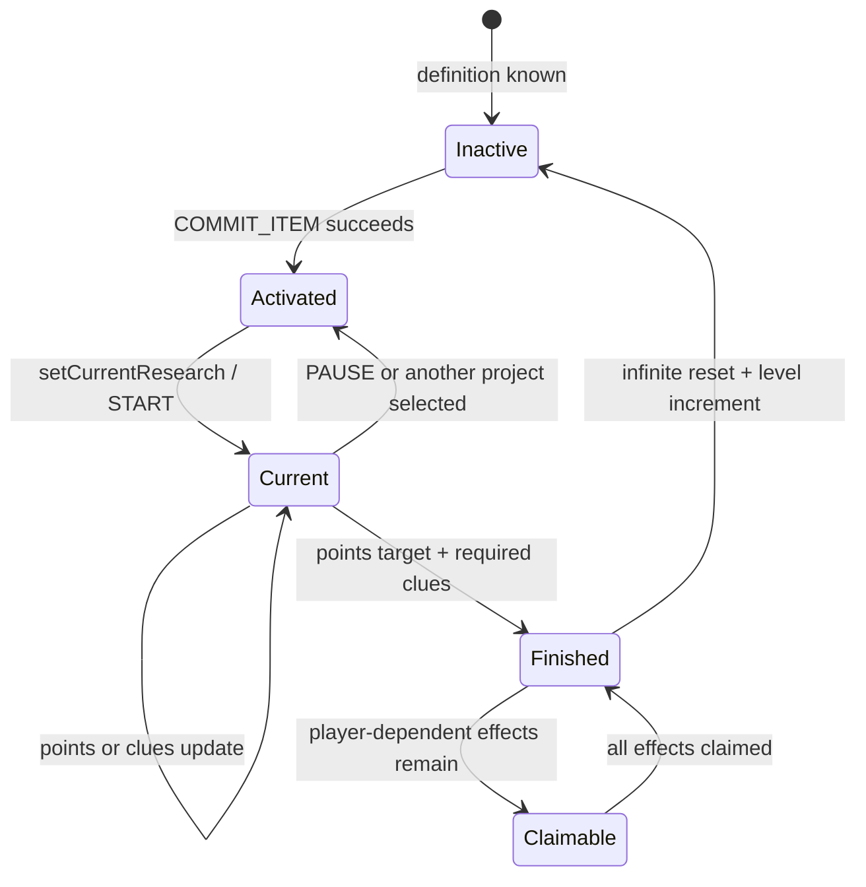

# Research State, Persistence, And Synchronization

- Status: `Current`
- Last verified: `2026-08-27`
- Scope: Legacy and V2 Phase 2 team structures, formulas, transitions, saved files, full/delta packet models, and reload behavior
- Code anchors: [`TeamResearchData`](../../src/main/java/com/teammoeg/frostedresearch/data/TeamResearchData.java), [`TeamKnowledgeData`](../../src/main/java/com/teammoeg/frostedresearch/data/TeamKnowledgeData.java), [`KnowledgeRecord`](../../src/main/java/com/teammoeg/frostedresearch/knowledge/KnowledgeRecord.java), [`PersonKnowledgeOverlay`](../../src/main/java/com/teammoeg/frostedresearch/knowledge/PersonKnowledgeOverlay.java), [`KnowledgeSyncSnapshot`](../../src/main/java/com/teammoeg/frostedresearch/knowledge/KnowledgeSyncSnapshot.java), [`FHKnowledgeDataSyncPacket`](../../src/main/java/com/teammoeg/frostedresearch/network/FHKnowledgeDataSyncPacket.java), [`ClientKnowledgeSnapshotHandler`](../../src/main/java/com/teammoeg/frostedresearch/network/client/ClientKnowledgeSnapshotHandler.java)

## State Hierarchy

Research progress is team data:

```text
TeamDataHolder
├── data.research: TeamResearchData
    ├── schemaVersion: 2
    ├── variants: CompoundTag
    ├── researches: Map<research string ID, ResearchData>
    │   └── ResearchData
    │       ├── active / finished / level / committed
    │       ├── clueData: Map<clue nonce, ClueData>
    │       └── effectData: Map<effect nonce, boolean>
    ├── activeResearchId: research string ID, or absent/empty
    ├── insight / usedInsightLevel
    └── visitedArea: BitSet
└── data.frostedresearch:knowledge: TeamKnowledgeData
    ├── schemaVersion: 2
    ├── acquiredFindingIds
    ├── acquiredDesignIds
    ├── acquiredConstructionIds
    ├── acquiredProcedureIds
    ├── observations: semantic-keyed KnowledgeRecord values
    ├── ideas: stable IdeaRecord values with merged sources/evidence
    └── comparisons: persistent FieldComparisonArtifact reports
```

It is not stored in a player capability. `ResearchDataAPI.getData(Player)` resolves the player's current Chorda team, so team joins/leaves change which saved research state a player observes.

`TeamKnowledgeData` is deliberately independent of `TeamResearchData`: legacy effect history remains authoritative for legacy grants, while V2 records, ideas, reports, and acquired result IDs remain stable even if a topic/result definition is temporarily absent. Deleted/unknown result IDs persist as orphans but do not project. An Idea recorded while its topic/Idea declaration is missing receives `IdeaRecord.State.ORPHAN`, compiles no actions, and can be revived by idempotently recording the same stable Idea after the definition returns. Prototype identity is stored only on the physical ItemStack and never in an acquired-ID set.

Schema 2 observation persistence indexes `KnowledgeRecord` values by their provider-selected `semanticKey`. Records now also retain an extensible string map named `context` without a schema-version bump. Current keys cover target kind, selected location, game/day time and derived period, biome, weather, optional temperature, and entity UUID. The generic block provider keys by observation kind, dimension, exact position, subject block ID, and retained visible state. Generic entity records use subject entity type, entity UUID, and capture time. Frosted Heart's geology provider instead uses kind, dimension, `16×16×16` cell, and subject so repeated regional samples merge. A merge unions observer UUIDs, public facets, and channels, keeps the earliest time, advances `lastObserved`, and prefers the newer public context and sealed fact when present. `KnowledgeRecord.Type` remains a compatibility view for the first geology slice; new matching uses `kindId`, `publicFacets`, `channels`, and context subsets.

The persistence codec retains `sealed_facts`; `TeamKnowledgeData.NETWORK_CODEC` replaces observations, ideas, and reports with empty collections. `KnowledgeProjection` carries the small ambient gameplay summary, while `KnowledgeLabProjection` carries the complete client-safe observation, Idea, artifact, and acquired-result archive used by the three laboratory pages. The laboratory result summary includes orphan IDs and public target descriptors. `OreProspectingModel.Snapshot.mineralCounts` never enters either client model.

`PersonKnowledgeOverlay` is person-owned rather than team-owned. Refugees serialize it in entity NBT and `Resident.CODEC` serializes it with simulated town residents. The `initialized` flag, stable `backgroundRoll`, and package-ID set preserve empty and nonempty outcomes across reload and recruitment without rerolling.

When FTB Teams is absent, `SinglePlayerTeam#getOnlineMembers` returns the associated `ServerPlayer` as a single-member collection while online and an empty collection while offline. This allows the same `TeamDataHolder#sendToOnline` incremental-sync path to serve fallback teams.

## `ResearchData`: One Project

| Field | Type | Default | Meaning |
|---|---|---|---|
| `active` | boolean | `false` | activation cost has been paid; the project can be selected/resumed |
| `finished` | boolean | `false` | completion was reached |
| `level` | integer | `0` | repeat count for infinite research |
| `committed` | signed 64-bit integer in codec | `0` | direct experiment points; negative legacy values normalize to zero |
| `clueData` | map by clue nonce | empty | completed flag plus optional custom NBT |
| `effectData` | map by effect nonce | empty | whether each effect has been granted/claimed |

`ResearchData.EMPTY` is a defensive sentinel returned for absent data in some read paths. It must not be treated as a mutable project record.

`ClueData` persists and synchronizes both `completed` and its optional full `CompoundTag data`; custom clue payloads therefore round-trip without a server/client format split.

## `TeamResearchData`: One Team

| Field | Persisted | Full client sync | Meaning |
|---|---:|---:|---|
| `schemaVersion` | yes | yes | current value `2`; distinguishes the string-active format |
| `variants` | yes | yes | arbitrary typed NBT attributes written mainly by `EffectStats` |
| `researches` | yes, string-key map | yes, string-key map | all materialized per-project states, including preserved orphans |
| `activeResearchId` | yes, string | yes, string | current formal research ID; empty means none |
| `insight` | yes | yes | total insight points earned |
| `usedInsightLevel` | yes | yes | levels already spent on activation |
| `insightLevel` | no | no | calculated from `insight` |
| `visitedArea` | yes | **no** | server-only exploration-sector bitset |

The full network codec uses the same stable string-keyed project, clue-nonce, and effect-nonce maps as persistence. It intentionally omits `visitedArea`.

## Experiment-Point Formula

Define:

- `P`: research `points`, positive integer required experiment points;
- `D`: `ResearchData.committed`, nonnegative 64-bit directly submitted points;
- `c_i`: dimensionless `Clue.value` for each completed clue;
- `C = Σ c_i`: total completed clue contribution.

`ResearchData#getTotalCommitted` computes:

```text
if C >= 0.999:
    effective = P
else:
    effective = min(D + trunc(C * P), P)
```

For validated nonnegative contributions, Java's integer conversion is equivalent to `floor`. The `0.999` threshold avoids floating-point error when contributions are intended to sum to one. Intermediate addition saturates instead of overflowing, and the final effective value is clamped to `[0,P]`.

`ResearchData#getProgress` returns a finite fraction in `[0,1]`. Catalogue installation guarantees `P > 0`; the method still defensively returns zero for a non-positive target. Historical progress greater than a newly reduced `P` remains stored and reports `1.0` rather than being truncated.

`ResearchData#commitPoints` and `TeamResearchData#doResearch` throw `IllegalArgumentException` for negative input. Zero is a no-op. Positive input uses subtraction-before-addition to avoid overflow and returns the unused remainder.

## Completion Rule

`TeamResearchData#checkResearchComplete` finishes a project only when both are true:

1. `getTotalCommitted(research) >= research.getRequiredPoints()`;
2. every clue whose `required` flag is true has completed `ClueData`.

The second test is exposed by `ResearchData#canComplete`. A required clue is a Boolean gate even when its contribution value is zero. A clue with a contribution is not automatically required.

Completion then:

- marks the project finished;
- attempts every ungranted effect;
- sends project/effect updates and posts research status events;
- clears `activeResearchId` when this was the current project;
- leaves player-dependent item/command/experience effects ungranted for later claim.

For `infinite` research, once every effect is granted, the project state is reset and `level` is incremented. This means a player-dependent reward must be claimed before the next repeat begins.

## Activation And Current Selection



`FHResearchControlPacket` routes three actions:

| Action | Server conditions | Result |
|---|---|---|
| `COMMIT_ITEM` | definition exists; not `locked`; all resolvable parents finished; enough unused insight levels; activation ingredients available | consumes ingredients/levels, marks project active, selects it, starts listeners |
| `START` | project's `ResearchData.active` is true and it is unfinished | selects it as current and starts non-always listeners |
| `PAUSE` | current selection matches | ends non-always listeners and clears current selection |

There can be many activated/paused projects but only one `activeResearchId` current target. Item clues, the drawing-desk theory game, and most non-always listeners route through that current target.

## Reset Semantics

`TeamResearchData#resetData` is the administrative rollback path. It:

- invokes `Effect#revoke` for every effect whose current grant flag is recorded and for every completed infinite iteration represented by `level`; additive `EffectStats` reversal is multiplied by that application count;
- clears active/finished/committed state and clue/effect maps;
- clears `activeResearchId` when it selects the reset project and ends its non-always listeners;
- resets the infinite `level` counter to `0`;
- replays every other completed-and-granted research into the derived unlock lists, restoring overlapping unlocks after the target effect removes its entries without clearing unrelated retained rewards;
- sends effect revocations, an exact variants snapshot when needed, and the reset project state to online team members.

`EffectStats` and research-derived recipe/block/multiblock/category unlocks are reversible. Set-like effects need only one removal even after repeated infinite iterations; additive effects override `Effect#revoke(TeamResearchData, int)` to reverse every recorded application. Item stacks, experience already awarded, and command side effects cannot be recovered reliably and their `revoke` implementations are intentionally no-ops. Reset also does not infer refunds for activation ingredients or `usedInsightLevel`; those costs are aggregate team state rather than per-iteration ledgers. Clearing an effect flag permits the effect to be granted again if the project is recompleted.

Infinite-research iteration rollover deliberately uses `TeamResearchData#resetForRepeat`, not the administrative path. It clears the just-finished iteration's progress/grant flags while retaining its awarded effects and current repeat level so `grantEffects` can increment that level. `ResearchData#setFinished(false)` remains a lower-level partial mutation and is not equivalent to either reset workflow.

## Insight Model

Let `I` be total insight points and `L` the derived insight level:

```text
L(I) = floor(sqrt(8I + 9) - 3)
I_required(L) = ceil(((L + 3)^2 - 9) / 8)
available levels = L(I) - usedInsightLevel
```

Research activation consumes levels by increasing `usedInsightLevel`; it does not subtract insight points. The used value is clamped by its setter to the calculated level, while low-level APIs can still supply negative total insight.

Insight sources are:

- exploration via `InsightHandler`;
- `InspireRecipe` item submission at the drawing desk;
- FTB Quests' insight reward when that integration is loaded;
- permission-level-2 commands or API calls.

### Exploration Sector Mapping

Every 20 ticks, `InsightHandler` maps the player's horizontal position into a radial sector:

```text
R = server config insightAreaRange, default 128 blocks, minimum 1
n = floor(sqrt(x^2 + z^2) / R)
sector count on ring n = 2n + 1
ring rotation = 7 degrees * n
visited index = n^2 + angular sector m
```

The team's `visitedArea` bitset awards one insight on first entry. The key does not include dimension, so equal mapped coordinates in different dimensions share the same visited bit.

## Persistence Files

Two independent persistence systems must remain consistent:

| File/data | Typical location | Contents |
|---|---|---|
| definition config | `<server>/config/fhresearches/*.json` | complete current research catalogue; supplied only by the companion pack in production |
| registry snapshot | `<world>/fhregistries.dat` | historical NBT string list used only to migrate old integer `active` values |
| editor state | `<world>/fheditor.dat` | global editor flag |
| team state | `<world>/chorda_data/<internal-team-UUID>.nbt` | compressed Chorda holder with legacy `data.research` and, once materialized, schema-2 `data.frostedresearch:knowledge` |

The registry snapshot does not store definitions. Restoring a world without the complete config catalogue aborts startup. Current saves and packets no longer depend on registry order; losing the snapshot only prevents translation of a schema-0/1 integer active selection and does not remove any other progress.

## Schema And Alias Migration

`TeamResearchData.CURRENT_SCHEMA_VERSION` is `2`. Decode accepts both old integer and new string `active` values; new saves write only a string. An old integer resolves through the historical `fhregistries.dat` order. A missing snapshot, invalid slot, or deleted target clears the selection and logs a warning while preserving every research record.

Definitions can declare `legacyIds` for a renamed research, clue, or effect. `TeamResearchData#reconcileDefinitions` moves a legacy record only when the new formal key does not already exist. If both keys exist, the formal value remains authoritative and the old value is preserved as an orphan with a warning. Unknown/deleted research, clue, and effect entries continue to serialize unchanged but do not unlock, listen, complete, or grant effects.

## Team Load Reconstruction

On `TeamLoadedEvent` and `TeamCreatedEvent`, `TeamResearchData#initResearch`:

1. walks saved project/effect state;
2. replays already-granted effects in load mode so team unlock lists are reconstructed without giving player rewards or adding stats again;
3. restarts the current research's unfinished clue listeners when its string ID still resolves;
4. clears an unresolvable current ID without deleting other records;
5. posts `ResearchDataLoadedEvent`.

Global lock declarations are separately rebuilt from every loaded effect during catalogue indexing. Therefore lock lists are best understood as derived indices:

```text
definition has EffectUse/Recipe/Building/Category
        -> global object is research-restricted
saved effectData says team received effect
        -> team's matching unlock list contains object
```

## Definition Synchronization

Login/reload sends definitions before progress:

1. `FHResearchRegistrtySyncPacket` (`research_registry`) starts a staged definition transfer and carries the legacy slot snapshot;
2. one `FHResearchSyncPacket` (`research_sync`) sends each bounded NBT `Research.CODEC` body and formal string key;
3. `FHResearchSyncEndPacket` (`research_sync_end`) validates the complete staged candidate, atomically replaces/reindexes it only on success, and notifies definition listeners;
4. `FHResearchDataSyncPacket` (`research_data`) sends the string-keyed full team mirror.

This ordering ensures UI definitions are complete before state is applied. Team/network meaning itself no longer depends on definition ordering.

## Runtime Packets

`FRNetwork` registers these semantic flows:

| Message ID | Direction by use | Payload/purpose |
|---|---|---|
| `research_registry` | S2C | begin staged definitions plus legacy slot names |
| `research_sync` | S2C | one definition by bounded formal string ID |
| `research_sync_end` | S2C | finish definition indexing |
| `research_data` | S2C | full string/nonce-keyed `TeamResearchData.NETWORK_CODEC` |
| `knowledge_data` | S2C | schema-2 acquired sets plus safe record/idea/report/action/Finding summaries, catalogue revision, and technology projection; sealed mineral counts are omitted |
| `research_data_update` | S2C | one `ResearchData` by research string ID |
| `research_clue` | S2C | one clue Boolean by research string ID and clue nonce |
| `research_effect` | S2C | one effect Boolean by research string ID and effect nonce |
| `research_attribute` | S2C | variants NBT |
| `research_select` | S2C | current research string ID or empty |
| `research_insight` | S2C | insight/used-level values |
| `research_control` | C2S | activate, start, or pause research |
| `effect_trigger` | C2S | claim pending player effects |
| `research_drawdesk` | C2S | drawing-desk game/item operation at a block position |

Handlers enqueue work onto the game thread. Research IDs and nonces are bounded to `128` UTF-8 characters. Codec payloads use bounded NBT envelopes; decoders validate enum ordinals, nonnegative numeric state, target existence, truncation, and malformed/oversized input. Unknown or stale targets are discarded with rate-limited diagnostics rather than dereferenced. This protocol is intentionally binary-incompatible with older clients; the network channel's exact-version handshake rejects those clients before play.

## Full Versus Incremental Client Refresh

Incremental progress, active, clue, and effect handlers call the corresponding `ResearchUtils.notify...` hook used by the open archive. Definition-sync completion also notifies it.

`FHResearchDataSyncPacket#handle` atomically replaces the complete client team value, rebuilds derived unlocks/JEI, and emits `ResearchUtils#notifyResearchDataReplaced`. An open archive then rebuilds its visible-definition set, layout, and presentation caches; valid category/filter/camera state is retained, while a removed or newly hidden selection is reconciled to a valid target.

`FHKnowledgeDataSyncPacket` remains a full-replacement protocol. Login, team change, field-record/Idea/report mutation, V2 acquisition/revoke, relevant legacy grant/reset, and V2 catalogue reload send one `KnowledgeSyncSnapshot`. The packet crosses the physical-side boundary with `DistExecutor.unsafeRunWhenOn` and invokes the client-only `ClientKnowledgeSnapshotHandler`; the previous safe-referent lambda caused the development client to reject the handler before installation. The handler resets and installs the `ClientKnowledgeDataAPI` snapshot, logs the received observation count, and then refreshes JEI.

The client-side team copy contains result IDs only. `KnowledgeProjection` carries visible observation summaries, Idea state/source/evidence counts, comparison outcomes, at most three ordered `ActionCard` values, and published Finding views/annotations. `KnowledgeLabProjection` separately preserves every safe archive row, including orphan results, and the same `KnowledgeSyncSnapshot` carries `TechnologyAccessProjection`. None carries `OreProspectingModel.Snapshot.mineralCounts`. Removing a topic definition alone never removes observation, Idea, report, or acquired-result history.

## Compatibility Rules For Saved Worlds

- Move the complete `config/fhresearches` catalogue and Chorda team data together when migrating a world; also move `fhregistries.dat` until every old integer active selection has been resaved as schema `2`.
- Never reuse a deleted formal ID for a different meaning.
- Preserve research string IDs and clue/effect nonces, or declare explicit, conflict-free `legacyIds` for one migration.
- Definition, clue, and effect ordering may change without changing saved/network identity.
- Back up before editor rename/delete, reset, complete-all, or data transfer commands.
- Test both login and `/reload`, including players whose archive is already open.
