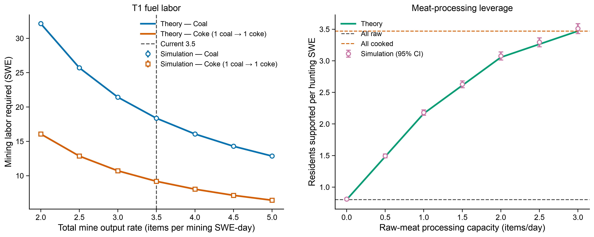
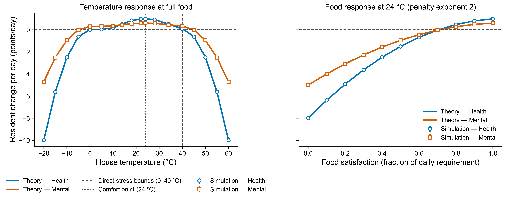
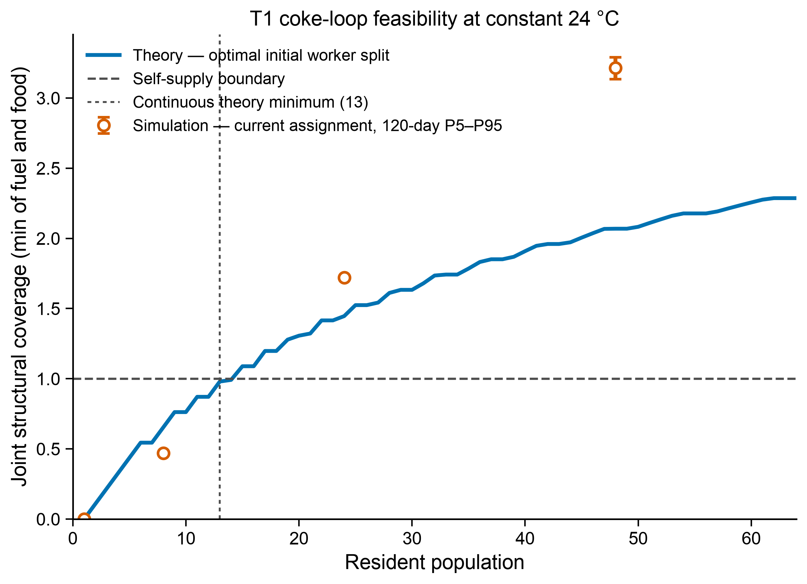
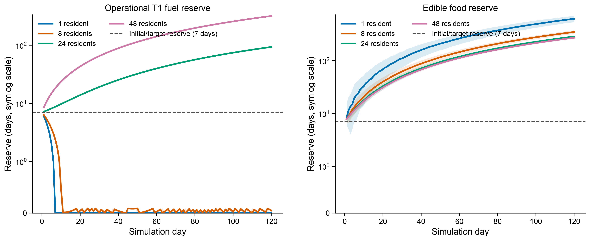

# 城镇临界自给数值模型

> 状态：阶段 0–4 已实现；阶段 5 及之后尚未开始。2026-08-12 已把 T1、气候、居民、住宅、采矿和狩猎的 FH 自有参数统一到单一默认值来源，并加入凸缺粮损失与 `[0,40]°C` 外的独立温度压力。阶段 4 直接复用游戏的普通长期气候事件、方块温度、T1 半径/温升、整数球体判定以及居民年龄/初始属性分布，把建筑内部体素平均温度送入阶段 3 多日闭环；T2、加热器、热惯性与 T1 随机爬升仍不进入模拟。
>
> 目标：把 FH/TWR 当前代码和数据中的城镇数值关系整理为一套可调用、可审计、可模拟的 Java 数学模型。本文是后续实现时的上下文基准。

## 1. 设计原则

### 1.1 代码是模型的起点

模型首先回答“当前代码实际算了什么”，再讨论应该怎样调数值。不能先发明一套热学或生产系统，再把当前代码勉强映射进去。

当前最重要的事实是：

- 城镇建筑使用离散内部体素的平均方块温度。
- 能量塔和加热器产生恒定值的球形热场；多个热场重叠时只取最大值。
- 当前供暖成本不取决于热场体积、表面积、环境温差或建筑保温。
- 采矿基地当前没有温度工作条件。
- 狩猎基地和住宅有温度条件，但还保留着已经过时的直接热网消费者端点。
- 城镇生产与居民结算每日一次；建筑温度不是全天平均值。

因此首版不引入热容、热惯性、传热系数、热源爬升、`U/L/C` 或“每立方米每升高一度消耗多少燃料”等当前代码不存在的量。

### 1.2 参数必须分层

所有数值分为三类：

1. **模型参数 `TownModelParameters`**：决定数学公式形状或生产率，可在模拟中覆盖。当前纳入范围内所有由 FH Java 控制的默认值只在 `TownModelParameters.Defaults` 定义一次；模拟器由此构造参数，`FHConfig` 的对应配置项也只引用这些默认值。
2. **场景参数 `TownScenario`**：描述某一座玩家城镇，例如人口、岗位、建筑体素、塔和加热器位置、初始库存、每日加工能力。这些不进入 `FHConfig`。
3. **派生统计量**：由前两类计算，例如每 SWE 日产煤、每居民需要的猎人 SWE、塔的每日焦煤消耗。派生量不能与底层参数同时成为相互独立的配置，否则会产生矛盾。

不过，最核心的派生量必须成为命令行工具的一等输出和一等扫描目标。数值策划可以直接要求“把每采矿 SWE 日产煤调到 2.0”，工具再唯一地换算为需要修改的底层参数。

源码默认值、运行时值和外部数据的关系固定为：

- 调整模组源码默认数值：只修改 `TownModelParameters.Defaults`。
- 模拟器默认输入：调用 `TownModelParameters.currentDefaults()`，不读取 `FHConfig`，也不复制常量。
- 游戏运行时：只读取 `FHConfig`；其默认值来自 `TownModelParameters.Defaults`，服务器 TOML 可以有意覆盖默认值。
- 已生成的服务器 TOML 不会因模组默认值变化而覆盖服主的显式配置；测试新默认值时需要使用新世界配置或删除对应旧键。
- FH/TWR recipe、loot table、tag、研究 JSON 和 KubeJS 权重属于外部数据输入，由 `audit` 单独解析，不能伪装成 Java 配置默认值。
- `24000 game ticks/day` 等 Minecraft 单位换算放在 `TownModelParameters.GameUnits`，不是可调玩法参数。

### 1.3 每个符号都必须有定义

本文约定：

- `i`：居民索引。
- `j`：热源索引。
- `v`：一个整数坐标的建筑内部空气体素。
- `h`：模拟中的游戏小时索引。
- `d`：模拟中的游戏日索引。
- `floor(x)`：向下取整。
- \(\operatorname{clamp}(x,a,b)=\min(\max(x,a),b)\)。
- 指示函数 \(\mathbf 1[condition]\)：条件成立时为 1，否则为 0。

任何后续实现新增数学符号时，都必须在首次出现前给出名称、单位、取值范围和数据来源。

## 2. 首版范围与有意省略

首版包含：

- 当前随机气候事件产生的逐小时气候温度。
- 能量塔、T2 热网和加热器产生的球形热场。
- 住宅、采矿基地、狩猎基地的结构、容量、温度和居民公式。
- TWR `fossil_deposits` 采矿配方；煤是唯一燃料原料。
- 煤到焦煤的抽象加工能力上限，不模拟具体焦炉。
- 当前狩猎掉落表中的原版生肉。
- 生肉到熟肉的抽象加工能力上限，不模拟具体风扇或烟熏设备。
- 显式岗位分配；保留居民属性、熟练度、健康和精神反馈。
- 确定性理论计算、固定种子模拟和蒙特卡洛统计。

首版有意省略：

- 开局脚本暴风雪。气候样本视为无限长随机气候序列中的一段。
- 地下城镇、地热梯度和高海拔降温。
- 热惯性、围护传热、换气和热源爬升。
- 泥炭、生物质、木炭、木炭坑和其他燃料线。
- 非肉类食物和复杂烹饪链。
- 具体焦炉、Create 风扇、物品管道、槽位、流体罐和副产物堵塞。
- 人口老化、难民生成和自动岗位分配。
- 热网管道路径与距离损耗。
- 自动布局优化。

矿井资源在模拟中视为无限：一个矿井区块耗尽后，玩家立即把矿井迁移到相同矿层的新区块，不产生额外时间或劳动成本。模型仍记录累计开采的矿物单位、完整耗尽的区块数和进入过的区块数，用于判断城镇对外围矿区的占用速度。

HUNT 地形资源首版也不作为瓶颈。当前默认总量约为数百万次掉落，在参考人口规模下远大于食物产能；`audit` 仍记录其当前配置，但第一阶段模拟不做耗尽与恢复。

## 3. 当前代码的真实时间顺序

### 3.1 游戏时钟

- `20 game ticks = 1 real second`
- `1000 game ticks = 1 game hour`
- `24000 game ticks = 1 game day`
- 城镇早晨结算发生在 `dayTime % 24000 == 1000` 附近，而不是一天结束时。

### 3.2 能量塔、建筑扫描与城镇结算不是同一种频率

| 系统 | 当前频率 | 当前行为 |
|---|---:|---|
| 能量塔城镇接管 | 默认每 20 tick | 调度间隔读取 `FHConfig.SERVER.TOWN.townUpdateIntervalGameTicks`；`TeamTownData.tickSecond` 调用 `GeneratorData.townTick` 批量处理同样数量的 tick |
| 方块实体普通 tick | 每 tick | 住宅/狩猎基地只更新旧热网温度修正，并把自己登记进全局扫描队列 |
| 建筑结构与温度扫描 | 默认整个维度每 tick 执行 1 个已登记任务 | `SchedulerQueue` 轮询建筑；每栋建筑的实际扫描间隔约为“登记建筑数 / 每 tick 任务数” |
| 气候缓存 | 每秒检查，数据按小时生成 | 气候温度在一个游戏小时内保持同一小时值 |
| 城镇生产与居民结算 | 每游戏日一次 | 早晨读取建筑最近一次扫描保存的温度，随后生产、吃饭和更新居民 |

住宅和狩猎基地不会对一天内的温度积分，也不会在早晨计算 24 小时平均温度。扫描器每次扫描时对当前内部空气体素求一次空间平均，并覆盖建筑保存的温度；早晨结算读到的是最近一次扫描的快照。

因此模拟器的时间分辨率分开处理：

- 气候和风险报告：每游戏小时更新。
- 建筑实际日结算：只计算早晨时点的体素温度。
- T1 燃料：按可配置的城镇更新间隔批处理，默认 20 tick；剩余燃料过程 tick 会跨燃料物品和批次结转，长期速率与逐 tick 解析值一致。
- T2 热网：只有网络燃料与缓冲状态需要保留当前每 20 tick 的取整语义；不需要每 20 tick 重算建筑体素。

## 4. 气候、地点与方块温度

### 4.1 场景输入与默认地点

建筑内部体素直接保存三维整数坐标 `(x, y, z)`；`y` 已经是高度，场景中不再重复保存一个“建筑高度”参数。

地点相关的两个可调模型参数是：

- `dimensionTemperatureCelsius`：维度温度修正，单位 °C；默认主世界当前值 `-10`。
- `biomeTemperatureCelsius`：群系温度修正，单位 °C；默认 `minecraft:snowy_plains` 当前 FH 数据值 `0`。

首版参考城镇满足：

- 所有内部体素都在海平面 `y=63` 以上，因此气候影响系数恒为 `0.5`。
- 不计算海拔温度修正，固定为 `0°C`。
- 不考虑不同建筑跨越不同群系。

完整高度函数仍必须实现和测试，为以后导入真实城镇保留接口：

\[
\alpha(y)=
\begin{cases}
0, & y\le 0\\
0.5\dfrac{y}{63}, & 0<y\le63\\
0.5, & y>63
\end{cases}
\]

其中：

- `y`：体素的世界纵坐标，单位方块。
- \(\alpha(y)\)：气候温度作用到方块温度的无量纲比例。

### 4.2 随机气候片段

模拟不添加 `WorldClimate.addInitTempEvent` 的开局暴风雪。每个种子先生成并丢弃固定 `365` 游戏日作为 burn-in，然后取其后的连续片段进行实验。这样保留当前三条气候轨道和事件生成逻辑，又避免前 15 日特殊分支和开局剧情天气污染长期平衡。

当前长期气候默认值如下，全部进入 `ClimateParameters`，模拟时可以覆盖：

| 参数 | 默认值 | 定义 |
|---|---:|---|
| `coldEventProbability` | `0.8` | 第 15 日以后新事件为寒冷事件的概率 |
| `warmEventProbability` | `0.2` | 新事件为暖事件的概率 |
| `coldBottomCelsius` | `[-10,-20,-30,-40]` | 四档寒冷事件基础谷值 |
| `coldBottomWeights` | `[4,3,2,1]` | 四档谷值的相对权重 |
| `eventDurationDays` | `[2,7)` | 冷/暖事件持续天数范围 |
| `eventPaddingHours` | `[8,24)` | 事件开始到首个峰值的小时范围 |
| `calmDurationDays` | `[2,7)` | 普通事件后的平静期范围 |
| `coldPreludePeakCelsius` | `-5` | 寒冷事件正式降温前的基础峰值 |
| `warmPeakCelsius` | `8` | 暖事件基础峰值 |
| `temperatureNoiseStdDev` | `1` | 寒潮谷值和前导峰值使用的高斯噪声标准差 |
| `warmPeakNoiseScale` | `2` | 暖峰使用 `8 - 2·|Gaussian|` 中的系数 |
| `climateTrackCount` | `3` | 同时运行的气候事件轨道数 |

每小时从三条轨道中取最大正温度贡献和最小负温度贡献，再相加为该小时气候温度。插值继续使用当前 `InterpolationClimateEvent` 的三次 Hermite 公式，不重新设计曲线。

### 4.3 自然温度、热场与方块温度

定义：

- \(T_{climate,h}\)：第 `h` 个游戏小时的气候温度，单位 °C。
- \(T_{dimension}\)：场景的维度温度修正，默认 `-10°C`。
- \(T_{biome}\)：场景的群系温度修正，默认 `0°C`。
- \(T_{natural,v,h}\)：体素 `v` 在第 `h` 小时、不考虑人工热源时的方块温度。

首版不计海拔修正，因此：

\[
T_{natural,v,h}=T_{dimension}+T_{biome}+\alpha(y_v)T_{climate,h}
\]

对热源 `j`：

- \(c_j=(x_j,y_j,z_j)\)：球心整数坐标。
- \(r_j\)：球形热场半径，单位方块。
- \(q_j\)：球内热场值，单位 °C；球内恒定，球外为零。

体素 `v` 处的有效热场只取最大值：

\[
T_{heat,v,h}=\max_j\left(q_j\mathbf 1[\|v-c_j\|^2\le r_j^2]\right)
\]

最后复用当前 `WorldTemperature.blockWithHeat`：

\[
T_{block,v,h}=
\begin{cases}
T_{natural,v,h}, & T_{natural,v,h}>T_{heat,v,h}\\
\min(T_{natural,v,h}+2T_{heat,v,h},T_{heat,v,h}), & T_{natural,v,h}\le T_{heat,v,h}
\end{cases}
\]

结果最低为 `-273°C`。

建筑 `b` 的内部体素集合记为 \(V_b\)。建筑当次扫描温度为：

\[
T_{building,b,h}=\frac{1}{|V_b|}\sum_{v\in V_b}T_{block,v,h}
\]

这里的 \(|V_b|\) 就是扫描器记录的内部体积。它是离散空气方块数量，不是连续几何球体积。

## 5. 能量塔、燃料过程 tick 与 T2 热网

### 5.1 热场等级

取消热源爬升后，塔或加热器在有供能时立即达到目标等级。

定义：

- \(l_T\)：温度等级，无量纲。
- \(l_R\)：范围等级，无量纲。
- `generatorBaseRadiusBlocks`：塔在范围等级 1 时的半径，当前 `16`。
- `generatorAdditionalRadiusPerLevelBlocks`：塔在等级 1 以上每级增加的半径，当前 `8`。
- `radiatorBaseRadiusBlocks`：加热器在范围等级 1 时的半径，当前 `8`。
- `radiatorAdditionalRadiusPerLevelBlocks`：加热器在等级 1 以上每级增加的半径，当前 `8`。
- `temperaturePerHeatLevelCelsius`：每温度等级对应的热场值，当前 `10°C`。

\[
R_{tower}(l_R)=
\begin{cases}
\lfloor16l_R\rfloor, & l_R\le1\\
\lfloor16+8(l_R-1)\rfloor, & l_R>1
\end{cases}
\]

\[
R_{radiator}(l_R)=
\begin{cases}
\lfloor8l_R\rfloor, & l_R\le1\\
\lfloor8+8(l_R-1)\rfloor, & l_R>1
\end{cases}
\]

\[
Q_{heat}(l_T)=\lfloor10l_T\rfloor
\]

当前稳态结果：

| 热源模式 | \(l_T\) | \(l_R\) | 半径 | 球内热场值 |
|---|---:|---:|---:|---:|
| T1 普通 | 1 | 1 | 16 | 10°C |
| T1 超载 | 2 | 1 | 16 | 20°C |
| T2 普通，蒸汽等级 1 | 2 | 2 | 24 | 20°C |
| T2 超载，蒸汽等级 1 | 3 | 2 | 24 | 30°C |
| 获得温度等级 2 的加热器 | 2 | 2 | 16 | 20°C |

### 5.2 燃料时长与 `E_generator`

`GeneratorData` 不使用统一 FV，而是把每件燃料转化为一个“剩余燃料过程 tick”计数器。

定义：

- \(D_{recipe,f}\)：燃料 `f` 在 FH generator recipe 中的基础时长，单位燃料过程 tick。当前煤为 `1600`，焦煤为 `3200`。
- \(m_{base}\)：代码中硬编码的基础燃料时长倍率，当前 `0.7`。它没有进一步物理意义；数值上意味着无研究时只获得配方时长的 70%。后续命名为 `baseFuelDurationMultiplier` 并暴露。
- \(e_{generator}\)：`ResearchVariant.GENERATOR_EFFICIENCY` 的累计研究加成，无量纲。TWR 当前取值为 `0`、完成一级后 `0.1`、完成两级后 `0.2`。
- \(D_{effective,f}\)：一件燃料实际加入的燃料过程 tick。

\[
D_{effective,f}=\left\lfloor D_{recipe,f}(m_{base}+e_{generator})\right\rfloor
\]

普通运行每个游戏 tick 消耗 `baseFuelProcessTicksPerGameTick=1` 个燃料过程 tick；超载额外消耗 `overdriveExtraFuelProcessTicksPerGameTick=1` 个。若假设一件燃料的全部有效时长都被用完，在没有 T2 网络附加消耗时：

\[
N_{fuel/day}=\frac{24000(c_{base}+c_{overdrive})}{D_{effective,f}}
\]

其中：

- \(N_{fuel/day}\)：塔每天消耗的燃料物品期望值。
- \(c_{base}=1\)：普通运行每游戏 tick 的过程 tick 消耗。
- 普通模式 \(c_{overdrive}=0\)，超载模式 \(c_{overdrive}=1\)。

无研究、普通 T1 的长期配方时长理论值：

- 煤有效时长 `floor(1600×0.7)=1120`，消耗 `21.4286 coal/day`。
- 焦煤有效时长 `floor(3200×0.7)=2240`，消耗 `10.7143 coke/day`。

设城镇能量塔更新间隔为 \(\Delta t_{town}\)，单位 game tick，默认值为 `20`。调度器和 `GeneratorData.townTick` 都读取 `FHConfig.SERVER.TOWN.townUpdateIntervalGameTicks`。一次批处理需要的燃料过程 tick 为

\[
b=\Delta t_{town}(c_{base}+c_{overdrive})
\]

修复后的 `GeneratorData` 把 `process` 严格定义为剩余燃料过程 tick 余额。设批次开始时余额为 \(R\)，其状态转移为：

\[
\text{while }R<b:\quad R\leftarrow R+D_{effective,f}
\]

\[
R\leftarrow R-b
\]

判断条件使用严格小于号：余额刚好等于批次需求时直接消费，不提前装入下一份燃料。装入新燃料使用加法，因此不足一个批次的旧燃料余量也不会被覆盖。由此逐 tick 更新与任意合法批处理间隔的长期燃料率相同：

- 煤：`D_effective=1120`，消耗 `21.4286 coal/day`。
- 焦煤：`D_effective=2240`，消耗 `10.7143 coke/day`。

某一个有限日内实际从仓库取出的燃料物品数仍为整数，并受日初余额影响；上述值表示无限长运行的平均消耗率。阶段 1 推进库存时必须保存 \(R\)，不能每天独立对平均值取整。

有效时长使用显式十进制计算，再执行向下取整。这样既保留公式中的 `floor` 语义，也不会因二进制浮点误差少一个 tick。完成两级燃烧效率研究后倍率为 `0.9`：

- 煤有效时长 `1440`。
- 焦煤有效时长 `2880`。

上述补燃状态转移和十进制时长计算均位于 `GeneratorFuelModel`，由 `GeneratorData` 和模拟器共同调用。`audit` 继续同时报告解析速率和 20-tick 批处理速率；两者不相等时应视为回归错误。

### 5.3 T2 网络参数的意义

当前代码中的网络公式需要拆成有明确意义的参数，不能继续依赖几个无名常数：

| 新参数名 | 当前值 | 代码中的意义 |
|---|---:|---|
| `heatBufferPerSteamLevel` | `25` | 每 1.0 蒸汽等级对应的目标网络热缓冲 |
| `networkHeatPerFuelBatch` | `25` | 一批网络燃料换算所生成的热量；当前恰好与上一参数共用常数 25，但逻辑意义不同 |
| `networkFuelProcessTicksPerBatch` | `8` | 生成上一批热量所需的燃料过程 tick |
| `generatorHeatResearchBonus` | `0` 或 `0.2` | `ResearchVariant.GENERATOR_HEAT` 累计研究加成 |
| `generatorEndpointMaxOutputPerTick` | `2000` | 塔热端点每 tick 最大输出 |
| `generatorEndpointCapacity` | `8000` | 当前 provider 端点内部容量 |
| `radiatorHeatIntakePerTick` | `4` | 加热器端点每 tick 最大输入，也是激活时尝试消耗量 |
| `radiatorEndpointCapacity` | `16` | 加热器端点热缓冲容量 |
| `radiatorPriority` | `100` | 热网消费者优先级；高值先获得热 |

公式中的变量定义：

- \(s\)：T2 当前蒸汽等级，代码中是 `0..1` 的浮点值。
- \(P_{target}\)：塔希望维持的热缓冲目标，单位 heat。
- \(P_{before}\)：本次补充前，塔认为仍剩余的热缓冲，单位 heat。
- \(e_{heat}\)：`generatorHeatResearchBonus`，TWR 当前为 `0` 或 `0.2`。
- \(C_{network}\)：本次补充需要额外消耗的燃料过程 tick。

\[
P_{target}=s\cdot heatBufferPerSteamLevel
\]

\[
C_{network}=\left\lfloor
\frac{\max(0,P_{target}-P_{before})}{1+e_{heat}}
\cdot
\frac{networkFuelProcessTicksPerBatch}{networkHeatPerFuelBatch}
\right\rfloor
\]

研究加成的效果是：同样的缓冲缺口需要更少燃料过程 tick。

### 5.4 当前 T2 实现必须先验证的问题

设计意图上，\(P_{before}\) 应当是热网消费者取走热量后，塔端点真实剩余的热缓冲。但当前代码存在两条状态同步路径：

- `GeneratorState.tickData` 把端点剩余热量写入 `GeneratorData.lastPower`。
- `GeneratorData.townTick` 随后又执行 `lastPower = power`，可能用上次生成值覆盖端点消费后的余量。

如果确实如此，城镇每秒接管期间的网络补充燃料可能低估，甚至在第一次填充后接近免费。首版文档不把这一点猜成既定公式。

实现顺序必须是：先写一个只包含 `GeneratorData`、provider 端点、热网和若干加热器的 Java 夹具，记录每 tick 的 `endpoint.heat`、`power`、`lastPower`、加热器取得热量和燃料过程 tick；确认实际时序后，再确定 T2 模拟器使用“忠实复现当前行为”还是修正后的目标行为。T2 蒙特卡洛在该验证完成前不进入平衡结论。

## 6. SWE：标准工人当量

### 6.1 精确定义

SWE 是 Standard Worker Equivalent，即“标准工人当量”。它不是人数，也不是居民固定属性，而是某位居民在某一职业、某一天提供的相对生产力。

一名该职业的**标准工人**定义为：

- 健康 `50`
- 精神 `50`
- 力量 `50`
- 智力 `50`
- 该职业熟练度 `0`

在当前默认线性参数下，这名居民恰好贡献 `1 SWE`。同一个居民可以在采矿职业贡献一个 SWE 值，在狩猎职业贡献另一个 SWE 值，因为两种职业的属性权重和熟练度奖励不同。

对居民 `i` 定义：

- \(H_i\)：健康，范围 `0..100`。
- \(M_i\)：精神，范围 `0..100`。
- \(S_i\)：力量，范围 `0..100`。
- \(I_i\)：智力，范围 `0..100`。
- \(P_i\)：当前职业熟练度，范围 `0..P_max`。这里的 \(P_i\) 只表示熟练度，不表示人口。
- \(P_{max}\)：该职业满熟练度的数值，当前采矿和狩猎都为 `100`。
- \(w_H,w_M,w_S,w_I\)：该职业的四项属性权重。
- \(W=w_H+w_M+w_S+w_I\)：正权重之和。
- \(A_i\)：按职业权重计算的综合属性，范围 `0..100`。

当至少一个权重为正时：

\[
A_i=\frac{w_HH_i+w_MM_i+w_SS_i+w_II_i}{W}
\]

如果所有权重都不为正，则和当前 `TownMathFunctions.weightedAttributeAverage` 一样，退化为四项属性的算术平均。

再定义：

- \(p_0\)：综合属性为 0、熟练度为 0 时的生产力。
- \(p_{100}\)：综合属性为 100、熟练度为 0 时的生产力。
- \(b_P\)：满熟练度提供的加法生产力奖励。
- \(p_{min},p_{max}\)：最终生产力上下限。

居民 `i` 的职业 SWE：

\[
SWE_i=\operatorname{clamp}\left(
p_0+(p_{100}-p_0)\frac{A_i}{100}
+b_P\frac{\operatorname{clamp}(P_i,0,P_{max})}{P_{max}},
p_{min},p_{max}
\right)
\]

建筑当天总 SWE 是所有具备工作资格且已分配到该建筑的居民 SWE 之和。

### 6.2 工作资格

首版只创建成年居民并显式定岗。当前工作资格为：

- 有住宅。
- 健康严格大于 `10`。
- 精神严格大于 `5`。
- 不是婴儿；首版不存在婴儿。

这些条件现已进入 `ResidentParameters`，游戏侧由 `FHConfig.SERVER.TOWN.RESIDENT_RULES` 传给同一个纯函数 `ResidentDailyModel.canWork`。`minimumWorkingHealthExclusive` 和 `minimumWorkingMentalExclusive` 名称中的 `Exclusive` 表示居民属性必须**严格大于**阈值；默认值分别是 `10` 与 `5`。是否必须有住宅由 `workRequiresHousing=true` 控制，最低工作年龄组由 `minimumWorkingAge=1` 控制。

## 7. 采矿与煤炭

### 7.1 采矿 SWE 参数

当前默认采矿参数：

| 参数 | 当前值 | 意义 |
|---|---:|---|
| `healthWeight` | `30` | 健康在综合属性中的权重 |
| `mentalWeight` | `10` | 精神权重 |
| `strengthWeight` | `45` | 力量权重 |
| `intelligenceWeight` | `15` | 智力权重 |
| `productivityAtAttributeZero` | `0.5` | 综合属性 0 时生产力 |
| `productivityAtAttributeHundred` | `1.5` | 综合属性 100 时生产力 |
| `maximumProficiency` | `100` | 满熟练度值 |
| `bonusAtMaximumProficiency` | `0.5` | 满熟练度加法奖励 |
| `minimumResidentProductivity` | `0.5` | 单人最小采矿 SWE |
| `maximumResidentProductivity` | `2.0` | 单人最大采矿 SWE |
| `baseOutputPerStandardWorkerDay` | `3.5` | 每采矿 SWE 每日产生的全部矿物物品单位 |

这些值目前已经位于 `FHConfig.SERVER.TOWN.MINING`，模拟场景可以覆盖，但默认必须从配置快照读取，不能在模拟器里再写一份常量。

### 7.2 TWR 矿层权重

TWR `kubejs/server_scripts/src/recipes_types/frostedheart/biome_mine.js` 中 `the_winter_rescue:fossil_deposits` 当前权重为：

| 产物 | 权重 | 产物占比 |
|---|---:|---:|
| 煤 | 8 | `1/3` |
| 骨块 | 4 | `1/6` |
| 生物质 | 2 | `1/12` |
| 石头 | 10 | `5/12` |

定义：

- \(SWE_{mine,d}\)：第 `d` 日全部矿工的采矿 SWE 总和。
- \(q_{mine}\)：`baseOutputPerStandardWorkerDay`，默认 `3.5 item/SWE/day`。
- \(f_{coal}\)：全部矿物产出中煤的权重占比，默认 `1/3`。
- \(Q_{ore,d}\)：第 `d` 日全部矿物物品单位。
- \(Q_{coal,d}\)：第 `d` 日煤产量。

\[
Q_{ore,d}=q_{mine}\cdot SWE_{mine,d}
\]

\[
Q_{coal,d}=Q_{ore,d}\cdot f_{coal}
\]

因此当前标准值：

\[
Y_{coal}=3.5\times\frac13=1.1666667\ coal/SWE/day
\]

其中 \(Y_{coal}\) 称为“采矿 SWE 煤产率”，是最核心的平衡统计量之一。

### 7.3 无限迁矿与区块统计

定义：

- \(R_{chunk}\)：一个矿井区块可开采的总矿物单位，当前默认 `1000`。
- \(Q_{ore,total}\)：模拟至今累计开采的全部矿物单位。

\[
N_{chunks,exhausted}=\left\lfloor\frac{Q_{ore,total}}{R_{chunk}}\right\rfloor
\]

\[
N_{chunks,entered}=
\begin{cases}
0,&Q_{ore,total}=0\\
\left\lceil\dfrac{Q_{ore,total}}{R_{chunk}}\right\rceil,&Q_{ore,total}>0
\end{cases}
\]

区块耗尽后立刻迁移，所以不会降低当日产量，也不存在“矿井寿命导致城镇永久停摆”。

### 7.4 煤到焦煤

不模拟 IE 焦炉。`TownScenario` 只定义：

- `coalToCokeCapacityPerDay`：每天最多能把多少个煤转化为焦煤，单位 `coal/day`；`null` 表示不设上限。

每日实际加工量：

\[
Q_{coked,d}=\min(Q_{rawCoalAvailable,d},K_{coke,d})
\]

其中：

- \(Q_{rawCoalAvailable,d}\)：加工前可用原煤库存。
- \(K_{coke,d}\)：场景给出的当日加工能力。
- \(Q_{coked,d}\)：当日加工的煤数，也是新增焦煤数；首版固定 `1 coal → 1 coke`。

不读取、模拟或审计具体焦炉时间、杂酚油和机器槽位。

## 8. 狩猎、肉与食物

### 8.1 狩猎 SWE 参数

当前默认狩猎参数：

| 参数 | 当前值 | 意义 |
|---|---:|---|
| `healthWeight` | `25` | 健康权重 |
| `mentalWeight` | `20` | 精神权重 |
| `strengthWeight` | `25` | 力量权重 |
| `intelligenceWeight` | `30` | 智力权重 |
| `productivityAtAttributeZero` | `0.5` | 综合属性 0 时生产力 |
| `productivityAtAttributeHundred` | `1.5` | 综合属性 100 时生产力 |
| `maximumProficiency` | `100` | 满熟练度值 |
| `bonusAtMaximumProficiency` | `1.0` | 满熟练度加法奖励 |
| `minimumResidentProductivity` | `0.5` | 单人最小狩猎 SWE |
| `maximumResidentProductivity` | `2.5` | 单人最大狩猎 SWE |
| `expectedLootRollsPerStandardWorkerDay` | `7/6` | 每狩猎 SWE 每日的长期期望掉落次数 |
| `passiveExpectedLootRollsPerBaseDay` | `0` | 无人工作时的每日期望掉落次数 |

这些值目前已位于 `FHConfig.SERVER.TOWN.HUNTING`。

定义：

- \(SWE_{hunt,d}\)：第 `d` 日全部猎人的狩猎 SWE 总和。
- \(r_{hunt}\)：每狩猎 SWE 每日期望掉落次数，默认 `7/6 roll/SWE/day`。
- \(C_d\)：狩猎基地从前一日保留的小数掉落 carry，范围 `[0,1)`。
- \(R_d\)：第 `d` 日真正执行的整数掉落次数。

\[
R_d=\left\lfloor r_{hunt}SWE_{hunt,d}+C_d\right\rfloor
\]

\[
C_{d+1}=r_{hunt}SWE_{hunt,d}+C_d-R_d
\]

### 8.2 当前肉产率

当前 FH 狩猎掉落表每次只选择一个条目。按物品权重和数量区间计算：

\[
E[meat/roll]=\frac{19.5}{19}=1.0263158
\]

这里的 `meat` 只包括牛肉、猪肉、鸡肉和羊肉；皮革、骨头、羽毛和兔皮不是食物。

因此标准狩猎 SWE 的理论肉产率：

\[
Y_{meat}=\frac76\times\frac{19.5}{19}=1.1973684\ meat/SWE/day
\]

蒙特卡洛必须按真实掉落表抽样；`audit` 同时从掉落表解析期望值和方差，用于检查样本均值是否收敛到该理论值。

### 8.3 生肉到熟肉

不模拟 Create 风扇或其他烟熏机器。`TownScenario` 只定义：

- `rawMeatProcessingCapacityPerDay`：每天最多能把多少个生肉转化为对应熟肉，单位 `meat/day`；`null` 表示不设上限。

首版固定 `1 raw meat → 1 cooked meat`。具体肉类保持不变，以便查找各自的营养值。

居民食物资源量不再默认恒为 `1`。对没有显式 `ItemResourceAmountRecipe` 覆盖的可食用物品，定义：

- \(H_x\)：食物 `x` 的原版饥饿值，即 `FoodProperties.getNutrition()`。
- \(m_x\)：食物 `x` 的原版饱和度系数，即 `FoodProperties.getSaturationModifier()`。
- \(S_x=2H_xm_x\)：食物的名义饱和度恢复量。
- \(F_x=H_x+S_x=H_x(1+2m_x)\)：一件食物转换出的居民食物资源单位。

显式 item-resource amount 配方优先于此公式。没有正数原版食物值的居民食物 Tag 物品暂时保持历史回退值 `1`，避免零换算量导致资源扣除除零；这些非食物条目应由后续 `audit` 单独报告。

当前狩猎肉类的换算如下：

| 肉类 | 生肉 \(H,m\) | 生肉 \(F_x\) | 熟肉 \(H,m\) | 熟肉 \(F_x\) |
|---|---:|---:|---:|---:|
| 牛肉、猪肉 | `3, 0.3` | `4.8` | `8, 0.8` | `20.8` |
| 鸡肉 | `2, 0.3` | `3.2` | `6, 0.6` | `13.2` |
| 羊肉 | `2, 0.3` | `3.2` | `6, 0.8` | `15.6` |

因此烟熏同时提高食物资源量和营养质量，而不仅是营养质量。

### 8.4 每居民食物需求

定义：

- \(n_d\)：第 `d` 日存活居民数量。
- \(c_{food}\)：每居民每日所需食物资源单位，当前 `6.5 food units/resident/day`。
- \(Q_{food,required,d}=n_dc_{food}\)：当日理论食物需求。

狩猎仍然每 SWE 期望产出 `1.1973684` 件肉，但不同肉类不能再按“每件等于一个食物单位”聚合。若所有肉都保持生肉状态，则每次掉落的期望食物资源量为：

\[
E[F_{raw}/roll]
=\frac{4\times2\times4.8+3\times2\times4.8+2\times2\times3.2+1\times1.5\times3.2}{19}
=4.4631579
\]

\[
Y_{food,raw}=\frac76\times4.4631579=5.2070175\ food\ units/SWE/day
\]

若加工能力足以把当天全部肉做熟，则：

\[
E[F_{cooked}/roll]
=\frac{4\times2\times20.8+3\times2\times20.8+2\times2\times13.2+1\times1.5\times15.6}{19}
=19.3368421
\]

\[
Y_{food,cooked}=\frac76\times19.3368421=22.5596491\ food\ units/SWE/day
\]

所以每居民的狩猎劳动需求存在两个清晰边界：

\[
SWE_{raw|required\ per\ resident}=\frac{6.5}{5.2070175}=1.2483154
\]

\[
SWE_{cooked|required\ per\ resident}=\frac{6.5}{22.5596491}=0.2881250
\]

这说明肉加工吞吐不只是营养恢复参数，而是食物闭环的强杠杆。标准 `1 SWE` 猎人若只供应生肉，仍略微养不活一名居民；全部做熟时则理论上可供应约 `3.47` 名居民。蒙特卡洛需要按实际肉类分别记账，并在 `rawMeatProcessingCapacityPerDay` 限制下得到两条边界之间的真实产率。

### 8.5 居民食物等级与消耗顺序

住宅按 `RESIDENT_FOOD_LEVEL` 从 level 4 向 level 0 消耗。五级的首轮语义如下：

| 等级 | 设计语义 | 代表食物 |
|---:|---|---|
| 4 | 完整军粮或稀有强化食物 | 军用口粮、金胡萝卜、金苹果 |
| 3 | 复合餐食、高密度保存食物或特别高能熟食 | 汤、粥、兔肉煲、压缩饼干、熟鲸肉 |
| 2 | 普通安全熟食、主食和加工零食 | 熟肉、熟鱼、面包、烤马铃薯、巧克力 |
| 1 | 可直接吃但未经充分加工的基础食物 | 生肉、生鱼、根茎、浆果、含锯末的应急餐 |
| 0 | 危险食物、不可直接食用原料或城镇尚未正确建模的食物 | 生鸡肉、河豚、蜘蛛眼、面团、锯末、骨头、蛋糕物品 |

精确成员由 `town_resource_resident_food_level_0.json` 到 `level_4.json` 定义。FH 与原版的内置成员必须互斥；外部数据包仍可追加，但 `audit` 应报告跨级重复。蛋糕放在 level 0 是因为蛋糕物品本身没有 `FoodProperties`，城镇也未建模放置后的七片食用过程，暂时不应优先消耗。

等级是第一排序键，因此 level 4 始终先于 level 3，依次直到 level 0。对同一等级内的食物 `x`，定义：

- \(N_x\)：一件物品提供的 FH 营养标量。其值为所有匹配 `NutritionRecipe` 的 `getNutritionValue()/4` 之和，与住宅结算累计营养时使用的口径相同。
- \(F_x\)：一件物品换算出的居民食物资源单位；显式 `ItemResourceAmountRecipe` 优先，否则使用 \(H_x(1+2m_x)\)。
- \(q_x=N_x/F_x\)：每一个居民食物资源单位提供的营养质量。

同等级内按 \(q_x\) 从高到低消耗。这不是新增的综合评分，而是直接最大化 9.6 节中住宅实际得到的 \(N_{sum}/F_{consumed}\)。仅按单件总营养 \(N_x\) 排序会偏爱食物单位同样很高的大份食物，不能保证居民在满足同样食物需求时得到更高营养，所以不采用。无营养配方、非有限数值或 \(F_x\le 1/8192\) 时令 \(q_x=0\)。质量相同则按 `物品注册名|NBT` 升序作为稳定平局规则，消除原先 `HashMap` 迭代顺序造成的随机性。

## 9. 住宅、空间、舒适与居民状态

### 9.1 住宅空间评分

定义：

- \(A_b\)：住宅 `b` 的有效地板方块数。
- \(V_b\)：住宅内部空气体素数。
- \(h_b=V_b/A_b\)：平均内部高度。
- \(S_{space,b}\)：空间评分。

当前公式拆成三步：

\[
h_b=\frac{V_b}{A_b}
\]

\[
X_b=A_b\left(a_0+a_{log}\ln(h_b-h_0)\right)
\]

\[
S_{space,b}=1-\exp\left(-k_{space}X_b^{p_{space}}\right)
\]

当前系数：

| 参数 | 当前值 | 数学意义 |
|---|---:|---|
| `spaceBaseScore` \(a_0\) | `1.55` | 每单位地板面积的基础空间分 |
| `spaceHeightLogWeight` \(a_{log}\) | `0.6` | 额外层高对空间分的对数权重 |
| `spaceHeightOffset` \(h_0\) | `1.6` | 层高进入对数前扣除的偏移 |
| `spaceSaturationRate` \(k_{space}\) | `0.024` | 空间评分趋近 1 的速度 |
| `spaceScoreExponent` \(p_{space}\) | `1.11` | 放大大房屋空间分的指数 |

数学含义：

- 面积是近似线性基础，房屋越大，评分越容易饱和到 1。
- 层高只有对数收益，继续加高的边际收益快速下降。
- 当平均层高接近 `1.6` 时公式非常敏感；若不大于 `1.6`，对数无定义。当前扫描器通常要求至少两格可通行空气，但模型必须显式校验输入，不能让 `NaN` 静默传播。
- 最后的 `1-exp(-x)` 使评分有上限，但它与人口容量相乘后仍会奖励大面积建筑。

### 9.2 住宅容量

定义：

- \(B_b\)：住宅床位数。
- \(a_{resident}\)：每个居民所需的有效地板面积，当前 `4 block²/resident`。
- \(N_{capacity,b}\)：住宅容量。

\[
N_{space,b}=\left\lfloor\frac{S_{space,b}A_b}{a_{resident}}\right\rfloor
\]

\[
N_{capacity,b}=\min(N_{space,b},B_b)
\]

住宅还要求最小地板面积 `4`、最小内部体积 `8`。它们现为 `HousingParameters.minimumFloorAreaBlocks` 与 `minimumInteriorVolumeBlocks`，运行时分别读取同名 Housing 配置项。

### 9.3 装饰评分

对住宅中第 `k` 种装饰，数量记为 \(n_k\)。当前装饰分：

\[
X_{decor}=\sum_k\left[a_{decor}\ln(n_k+n_0)+b_{decor}\right]
\]

\[
S_{decor}=\min\left(1,\frac{X_{decor}}{d_0+A_b/d_A}\right)
\]

当前系数：

| 参数 | 当前值 | 数学意义 |
|---|---:|---|
| `decorationCountOffset` \(n_0\) | `0.32` | 保证对数输入为正并调整第一件装饰价值 |
| `decorationLogWeight` \(a_{decor}\) | `1.75` | 同类装饰数量的对数收益 |
| `decorationTypeBaseScore` \(b_{decor}\) | `0.9` | 每种装饰类型的基础奖励 |
| `decorationBaseRequirement` \(d_0\) | `6` | 小房屋达到满装饰分的基础门槛 |
| `decorationAreaDivisor` \(d_A\) | `16` | 面积每增加 16 格，提高 1 点装饰需求 |

数学含义：同类装饰快速边际递减，而增加装饰种类会重复获得基础奖励，因此该公式强烈鼓励多样性；大房屋需要更多装饰，但需求只随面积缓慢增长。

### 9.4 温度评分

定义：

- \(T_b\)：住宅早晨最近一次扫描的有效温度。
- \(T_{comfort}\)：舒适温度，当前 `24°C`。
- \(d_T=|T_b-T_{comfort}|\)：偏离舒适温度的绝对值。
- \(S_T\)：温度评分。

\[
S_T=s_{floor}+\frac{1}{1+\exp(k_T(d_T-d_{mid}))}
\]

当前参数：

| 参数 | 当前值 | 数学意义 |
|---|---:|---|
| `comfortableTemperatureCelsius` \(T_{comfort}\) | `24` | 评分最高的中心温度 |
| `temperatureRatingFloor` \(s_{floor}\) | `0.017` | 极端温度下仍保留的评分底值 |
| `temperatureRatingSteepness` \(k_T\) | `0.4` | 舒适区边缘下降的陡峭程度 |
| `temperatureRatingMidpointDeltaCelsius` \(d_{mid}\) | `10` | 偏离舒适温度 10°C 时进入曲线中点 |

住宅可工作与无直接温度压力的范围当前统一为 `[0,40]°C`。范围之外住宅仍被视为不可工作，因此不会分配新居民；但已有居民的每日食物和状态结算仍会执行。极端温度既通过 \(S_T\) 压低健康恢复和综合舒适度，也通过 9.7 节的独立温度压力直接损伤健康和精神，不再暂停整栋住宅。

### 9.5 综合舒适度

定义：

- \(w_T,w_S,w_D\)：温度、空间、装饰的相对权重，当前分别为 `0.4,0.3,0.3`。
- \(C_b\)：住宅综合舒适度。

\[
C_b=\frac{w_TS_T+w_SS_{space,b}+w_DS_{decor,b}}{w_T+w_S+w_D}
\]

当三个权重之和为零时，当前纯函数退化为三项评分的算术平均。

### 9.6 食物满足度与营养质量

对住宅 `b` 的一次日结算定义：

- \(n_b\)：住宅内居民数。
- \(c_{food}\)：每居民每日食物需求，当前 `6.5`。
- \(F_{required}=n_bc_{food}\)：住宅理论食物需求。
- \(F_{consumed}\)：实际从城镇库存扣除的食物单位。
- \(S_F\)：食物满足度。

\[
S_F=
\begin{cases}
1,&F_{required}=0\\
\operatorname{clamp}(F_{consumed}/F_{required},0,1),&F_{required}>0
\end{cases}
\]

再定义：

- \(N_{sum}\)：被消费食物的营养值总和；每件食物的值来自 FH `NutritionRecipe.getNutritionValue()/4`。
- \(n_{reference}\)：每食物单位达到满质量所需营养，当前 `7000`。
- \(Q_N\)：营养质量，范围 `0..1`。
- \(m_{nutrition,min}\)：零营养质量仍保留的恢复倍率，当前 `0.5`。
- \(M_N\)：最终营养恢复倍率。

\[
Q_N=
\begin{cases}
0,&F_{consumed}=0\\
\operatorname{clamp}\left(\dfrac{N_{sum}/F_{consumed}}{n_{reference}},0,1\right),&F_{consumed}>0
\end{cases}
\]

\[
M_N=m_{nutrition,min}+(1-m_{nutrition,min})Q_N
\]

熟肉相对生肉既会通过 \(F_x=H_x(1+2m_x)\) 提高食物单位产量，也可能通过营养配方提高 \(Q_N\) 和恢复速度。食物能量与营养质量仍是两条独立的轴。

### 9.7 健康和精神变化

对居民 `i`：

- \(health_i\)：结算前健康，范围 `0..100`。
- \(mental_i\)：结算前精神，范围 `0..100`。
- \(L_H\)：完全缺粮时每日健康损失，当前 `8`。
- \(L_M\)：完全缺粮时每日精神损失，当前 `5`。
- \(p_F\)：缺粮压力指数，当前 `2`。
- \(T\)：住宅有效温度，单位 °C。
- \(T_{min},T_{max}\)：不产生直接温度压力的闭区间，当前 `[0,40]°C`。
- \(D_T\)：从安全区间边界到满温度压力的距离，当前 `20°C`。
- \(p_T\)：温度压力指数，当前 `2`。
- \(L_{HT}\)：满温度压力时每日健康损失，当前 `10`。
- \(L_{MT}\)：满温度压力时每日精神损失，当前 `5`。
- \(R_H\)：健康为 0、其他条件完美时的最大每日恢复，当前 `2`。
- \(R_M\)：精神为 0、其他条件完美时的最大每日恢复，当前 `1.5`。

缺粮压力与温度压力分别定义为：

\[
S_F^{loss}=(1-S_F)^{p_F}
\]

\[
d_T=\max(T_{min}-T,\ T-T_{max},\ 0)
\]

\[
S_T^{loss}=\left[\min\left(\frac{d_T}{D_T},1\right)\right]^{p_T}
\]

\[
\Delta health_i=-L_HS_F^{loss}-L_{HT}S_T^{loss}
+R_HS_FM_NS_T\left(1-\frac{health_i}{100}\right)
\]

\[
\Delta mental_i=-L_MS_F^{loss}-L_{MT}S_T^{loss}
+R_MS_FM_NC_b\left(1-\frac{mental_i}{100}\right)
\]

结果限制在 `[0,100]`。

数学含义：

- 缺粮惩罚是缺口的凸函数：默认平方曲线让小缺口较温和、严重缺粮迅速恶化；恢复仍被食物满足度线性缩放。
- 高健康/高精神居民因 `(1-current/100)` 接近零，很难继续恢复。
- 温度在 `[0,40]°C` 内没有独立惩罚；越界后按边界距离的平方增加，并在越界 `20°C` 时封顶。`-10°C` 与 `50°C` 都对应 `0.25` 温度压力，`-20°C` 与 `60°C` 达到满压力。
- 原有温度评分仍影响健康恢复；精神恢复仍使用包含温度、空间和装饰的综合舒适度。独立温度损失不会与缺粮相乘，避免一个交叉项掩盖两个旋钮各自的意义。
- 低营养不会加重饥饿损失，只会降低恢复。
- `ResidentEffects` 同时报告食物压力、温度压力、两类健康/精神分项惩罚、总惩罚、恢复和净变化；游戏只应用净变化，模拟器把全部分项写入 JSON/CSV。

### 9.8 早晨死亡、无家可归与冷住宅结算

当前每日顺序是先处理居民死亡，再重新分配住宅和工作，最后执行住宅结算：

- 早晨开始时没有住宅：先损失 `10` 健康。
- 健康 `<=5`：居民死亡并移除。
- 精神 `<=5`：居民离开并从城镇移除。
- 健康 `<=10` 或精神 `<=5`：不能工作。

这些阈值和无家可归伤害现已进入 `ResidentParameters` 与 `FHConfig.SERVER.TOWN.RESIDENT_RULES`。`ResidentDailyModel.settleMorning` 固定执行“先扣无家可归健康，再按包含等号的阈值移除”，模拟器不再另写一份判断。

每日调度现在区分两个判定：

- `isBuildingWorkable()`：住宅结构有效、已初始化、未重叠、面积至少 `4`、体积至少 `8`，且温度在 `[0,40]°C`；用于分房和 UI 工作状态。
- `shouldRunDailySettlement()`：只要求上述结构条件，不检查温度；用于已有居民的食物、健康和精神日结算。

因此冷住宅不再“免费静止”。已有居民仍会消耗食物并运行连续状态公式，但冷住宅不会接收新居民。当前修复有意只剥离温度门槛；无效、重叠或过小住宅仍不参与日结算，模拟 `current` 语义时必须保持这一边界并检查是否还存在关联残留问题。

### 9.9 熟练度与年龄增长

居民职业熟练度的保存上限为 `P_resident,max`，默认 `100`。一次有效工作日的熟练度增长为：

\[
\Delta P=\min\left(
\max\left(g_0\left(1-\frac{P}{P_{resident,max}}\right),g_{min}\right),
P_{resident,max}-P
\right)
\]

- `maximumWorkProficiency` \(P_{resident,max}\)：居民可保存的职业熟练度上限，默认 `100`。
- `proficiencyGrowthAtZeroPerWorkday` \(g_0\)：熟练度为零时每有效工作日增长量，默认 `2.4`。
- `minimumProficiencyGrowthPerWorkday` \(g_{min}\)：未满级时的每日增长下限，默认 `0.25`。

年龄增长仍按日结算，现有全部 `ResidentAging` 配置也已进入 `ResidentAgingParameters`：幼儿在第 `10` 日变为儿童、儿童在第 `30` 日变为青壮年；幼儿每日力量/智力各 `+0.2`、封顶 `40`；儿童每日力量 `+0.3`、智力 `+0.4`、分别封顶 `80/85`；青壮年每日两项各 `+0.05`、封顶 `60`；老人力量每日 `-0.1`、最低 `25`。这些参数已被快照记录，但阶段 1 的固定成年人口模拟不会立刻启用年龄变化。

### 9.10 招募居民的异质性

阶段 4 的 `gameGenerated` 人口不再用场景里的固定 `50/50` 标准成人。游戏和模拟共同调用 `ResidentGenerationModel`，差别仅是游戏传入 Minecraft 随机源，模拟传入固定种子的 `SplittableRandom`。年龄组 (a_i\in\{0,1,2,3\}) 的默认权重为：

```text
infant : child : adult : elder = 10 : 20 : 60 : 10
```

若四项运行配置全部为零，则精确保留旧代码回退权重 `10:20:50:20`。年龄日数的条件分布为：

```text
infant: U_integer[0, infantToChildDays)
child:  U_integer[infantToChildDays, childToAdultDays)
adult/elder: childToAdultDays + U_integer[0, adultAgeRangeDaysExclusive)
```

默认 `infantToChildDays=10`、`childToAdultDays=30`、`adultAgeRangeDaysExclusive=3650`。每个初始属性独立取 `n=4` 个 `[0,1]` 均匀样本的均值 \(\bar u\)，再映射为：

```text
attribute = clamp[0,100](center + 100 × spread × (mean(u)-0.5))
```

年龄组的 `(strength center, intelligence center, spread)` 默认分别为幼儿 `(20,30,0.8)`、儿童 `(40,40,0.8)`、成人 `(50,50,1.0)`、老人 `(35,65,0.8)`。普通新居民健康/精神均为 `50`。每个职业分别抽取初始熟练度：幼儿固定 `0`；儿童 `25u²`；成人 `50u²`；老人 `50+50u`。因此一个人的采矿和狩猎熟练度不同，但服从相同年龄条件分布。

这些生成参数、全零年龄权重的回退值以及寒流优质难民的 `20–40` 健康、`+15` 属性、`×1.5` 熟练度都已进入 `TownModelParameters.Defaults`。游戏侧只读新增的 `FHConfig.SERVER.TOWN.RESIDENT_GENERATION` 与原有 `REFUGEE_SPAWN`，模拟侧只读 `TownModelParameters`；更改 Defaults 仍是默认平衡值的唯一入口。阶段 4 的固定初始城镇只使用普通难民分布，不额外假定多少人来自寒流。

## 10. 参数目录与配置归属

### 10.1 已在 `FHConfig` 中的参数

游戏实现只读取 `FHConfig`，模拟器只读取 `TownModelParameters`。当前已经完成单一默认值接线的参数组是：

- `BuildingScoringParameters`：住宅、采矿和狩猎共用的空间评分五参数及温度评分四参数。
- `HousingParameters`：食物与营养结算、凸缺粮压力、健康/精神恢复与损失、安全温度范围、温度压力曲线、最小面积/体积、每居民有效面积、三项舒适权重及装饰评分五参数。
- `ResidentParameters`：无家可归损伤、移除阈值、工作资格、熟练度上限与增长；其中 `ResidentAgingParameters` 包含全部 14 个年龄增长参数。
- `MiningParameters`：每 SWE 产量、工位、连接半径、居民生产力和岗位分配参数。
- `HuntingParameters`：每 SWE 掉落、被动掉落、carry、结构/温度门槛、工位、居民生产力、建筑评分权重和岗位分配参数。
- `TerrainResourceParameters`：矿井区块矿物储量/恢复与 HUNT 面积储量/恢复。树木、研究点和废料资源不参与当前煤—肉闭环，暂未进入模型参数。
- `GeneratorT1Parameters`：基础燃料时长倍率、普通/超载过程 tick 耗速、球形热场半径、每级温度和城镇更新间隔。

当前共有 `110` 个可配置的 FH 默认常量进入 `TownModelParameters.Defaults`；另有 `24000 game ticks/day` 保留为不可调的 `GameUnits`。

### 10.2 当前硬编码、需要提取的模型参数

本轮完成后仍未提取的量只属于明确推迟的系统：

- 加热器的基础半径、额外等级半径和每级热场温度。
- T2 热缓冲、热量换算、燃料换算、provider 输出/容量。
- 加热器消耗、容量和优先级。
- 长期气候事件概率、寒潮档位、持续时间、平静期、峰值和噪声参数。

狩猎基地和住宅现存的旧直接热网消费者字段也故意不进入 `TownModelParameters`；它们要等 T2 时序与目标架构一起处理，不能成为 T1 自给结论的输入。

### 10.3 只属于 `TownScenario` 的参数

- 模拟天数、运行次数和随机种子。
- 人口及每位居民的属性、熟练度、住宅和岗位。
- 建筑内部体素、地板面积、床位和装饰数量。
- 塔、加热器的位置、等级和控制时间表。
- 维度温度与群系温度；默认主世界 `-10°C` 和雪原 `0°C`。
- 初始原煤、焦煤、生肉、熟肉和其他库存。
- `coalToCokeCapacityPerDay`。
- `rawMeatProcessingCapacityPerDay`。
- 可选仓库容量；默认不设上限。
- 每日建筑结算顺序。参考场景固定顺序，另做顺序对照实验。

### 10.4 数值策划直接操作的核心轴

以下值虽然由底层参数推导，但必须可以被 `sweep` 直接指定：

| 核心轴 | 当前默认 | 工具如何映射到底层参数 |
|---|---:|---|
| `coalPerMiningSweDay` | `1.1666667` | 固定煤权重占比时，反解 `baseOutputPerStandardWorkerDay` |
| `meatPerHuntingSweDay` | `1.1973684` | 固定掉落表时，反解 `expectedLootRollsPerStandardWorkerDay` |
| `foodPerResidentDay` | `6.5` | 直接映射现有住宅食物需求配置 |
| `towerCoalPerActiveDay` | `21.4286` | 固定燃料 recipe 时，反解基础燃料消耗倍率或燃料时长倍率 |
| `towerCokePerActiveDay` | `10.7143` | 同上，但以焦煤 recipe 为基准 |

这些是“设计别名”，不是额外保存的独立配置。一次扫描必须说明它实际修改了哪个底层参数，防止多个入口相互矛盾。

## 11. Java 模型接口

阶段 0–2 已建立不依赖 `Level`、NBT、方块实体或 Forge 注册表的纯 Java API：

- `TownModelParameters`：目前聚合 T1、公共建筑评分、居民、住宅、采矿、狩猎、矿物/HUNT 地形资源与肉类食物参数。`Defaults` 是纳入范围内 FH Java 参数的唯一源码默认值来源，`GameUnits` 只保存不可调的 Minecraft 单位换算。
- `TownStageZeroModel.analyze(...)`：接受参数 records 和从数据文件解析出的矿权重、掉落条目、燃料时长，返回纯代数统计量。
- `GeneratorFuelModel`：同时被 `GeneratorData` 与审计调用，包含有效时长、当前补料判定、理想燃料率和 20-tick 批处理燃料率。
- `GeneratorHeatFieldModel`：同时被 `GeneratorData` 与审计调用，包含塔等级到球形半径和热场温度的映射。
- `TownFoodResourceAmount` 与 `TownMathFunctions`：食物换算、SWE、空间、温度和装饰公式由游戏与模拟共用；评分函数的所有系数都必须由调用者传入。
- `HouseDailyModel`：住宅结构门槛、食物/营养、舒适、凸缺粮压力、独立温度压力和居民净变化公式；游戏传 `FHConfig`，模拟器传 `TownModelParameters`。
- `ResidentDailyModel`：晨间无家可归/移除与工作资格的唯一纯函数实现。
- `MiningDailyModel`：采矿 SWE 到总产量、矿物权重分配及无限迁矿区块计数；`MineBaseBuilding` 已直接调用。
- `HuntingDailyModel`：期望掉落、整数结算、carry 和 HUNT 上限；`HuntingBaseBuilding.work/getForecast` 已直接调用。
- `TownFoodProcessingModel`：场景层的 `1 raw meat -> 1 cooked meat` 抽象吞吐；它不表示任何具体机器。
- `TownFoodInventoryModel`：五级食物优先级、同级营养质量排序和小数物品消费；游戏侧 `TownFoodNutritionModel` 复用同一个质量函数。
- `HouseDailyModel.evaluateSettlement`：一次住宅结算的需求、食物满足度、营养、温度、空间和舒适度；`HouseBuilding` 已直接调用。住宅容量也由该模型提供并由 `HouseBlockEntity` 调用。
- `TownStageOneTwoData/Scenario/Theory/Simulator`：读取当前 FH/TWR 数据、载入单日场景、生成解析基线和固定种子样本。
- `TownInventoryModel`：游戏和模拟共用的 `ATTEMPT` 全有或全无、`MAXIMIZE` 尽量执行语义；采矿/狩猎的仓储差异不再由模拟器复制条件分支。
- `ResidentAgingModel`：游戏和模拟共用的年龄日数、年龄组转换、属性成长/衰减；游戏传 `FHConfig` 快照，模拟传 `TownModelParameters` 快照。
- `TownAssignmentModel`：只填补空缺、不重排既有岗位的粘性分配算法；建筑和居民的 encounter order 是精确平局的稳定 tie-breaker。
- `TownStageThreeScenario/State/Model/Theory/Simulator`：恒温 T1 多日闭环。状态显式保存居民、岗位、库存、狩猎 carry/HUNT、塔过程 tick 余额和结构性累计量；每日推进直接调用上述共享内核。

后续阶段再按需增加气候、空间热场和 T2 状态：

- `TownScenario`：描述一场实验。
- `TownState`：描述某个时间点的居民、库存、燃料过程、加工 carry 和累计开采量。
- `TownDayResult`：一天的输入、生产、消费和状态变化账本。
- `TownSimulationResult`：完整时间序列与汇总统计。
- `TownNumericalModel.simulate(parameters, scenario)`：统一模拟入口。

纯函数按领域拆分：

- `ClimateModel`
- `BlockTemperatureModel`
- `SphereHeatFieldModel`
- `GeneratorFuelModel`
- `HeatNetworkModel`
- `ResidentProductivityModel`
- `MiningDailyModel`
- `HuntingDailyModel`
- `HouseGeometryModel`
- 复用并扩展现有 `HouseDailyModel`

游戏代码逐步改为调用这些函数，而不是让模拟器复制一份公式。每次提取先写相同输入的前后对照测试，确保默认参数下行为不漂移。

## 12. 数据审计 `audit`

### 12.1 读取范围

当前 `audit` 读取阶段 0–2 代数和单日模拟确实使用的来源：

- FH `TownModelParameters.Defaults` 及其对应的 `FHConfig` 配置路径。
- FH 煤和焦煤 generator recipes。
- FH 狩猎掉落表。
- TWR `biome_mine.js` 中 `fossil_deposits` 权重。
- TWR `generator_efficiency_1/2.json` 研究加成。
- 对 Java 控制的参数，记录 `TownModelParameters.Defaults -> FHConfig` 的完整映射；固定游戏单位单独标为 `minecraft-unit`。
- FH 五个居民食物等级 Tag，以及八个生/熟肉 `diet_override` 营养 recipe。

群系温度在阶段 4 读取；`generator_heat_1` 与所有 T2 端点数据在阶段 5 读取。工具仍不读取 IE 焦炉和 Create 风扇配方，因为具体机器由场景中的每日加工能力替代。快照输入总数以每次 `audit` 输出为准，避免文档数字随数据文件变化而失真。

### 12.2 输出

`audit` 默认在终端输出适合人工阅读的表格，同时在指定报告目录生成两个 JSON：

1. `source-snapshot.json`
   - 每个输入参数的规范名称、数值、单位、来源类型和来源文件。
   - 数据文件的内容哈希，用于判断 TWR/FH 更新后场景是否基于旧快照。
   - 不包含模拟结果。
2. `audit-report.json`
   - 由快照推导出的核心系数和代数预测。
   - 数据漂移、重复定义、未暴露硬编码和已知代码漏洞。
   - 理论值与固定基准模拟的差值。

默认输出目录为 `build/reports/town-model/audit/<timestamp>/`，不污染源码目录。命令允许 `--output` 指定其他目录。

### 12.3 必须给出的理论基线

当前默认快照必须推导出：

- `1 mining SWE = 1.1666667 coal/day`
- `1 hunting SWE = 1.1973684 meat/day`
- `1 hunting SWE = 5.2070175 raw food units/day`
- `1 hunting SWE = 22.5596491 cooked food units/day`，前提是加工吞吐足够
- `1 resident = 6.5 food units/day`
- T1、无研究、普通运行、直接烧煤：`21.4286 coal/day`
- T1、无研究、普通运行、烧焦煤：`10.7143 coke/day`，即至少 `10.7143 raw coal/day`
- 维持 T1 直接烧煤所需采矿劳动：`18.3673 mining SWE`
- 维持 T1 焦煤路线所需采矿劳动：`9.1837 mining SWE`
- 仅供应生肉时维持一个居民所需劳动：`1.2483154 hunting SWE/resident`
- 全部肉做熟时维持一个居民所需劳动：`0.2881250 hunting SWE/resident`

这些理论预测必须在进行复杂场景模拟之前显示。蒙特卡洛不能用随机结果掩盖明显的代数不可行性。

上述 `21.4286/10.7143` 和 `18.3673/9.1837` 既是完整使用燃料配方时长的解析基线，也是当前 20-tick 批处理代码的长期速率。`audit` 保留两组指标用于持续验证批处理等价性。

## 13. 场景文件

所有可复现实验放在：

```text
Scripts/town_scenarios/
├── baseline/       # 当前默认参数与 1/8/24/48 人基准
├── experiments/    # 数值策划主动创建的参数实验
└── regression/     # 固定种子、固定预期结果的回归场景
```

模拟结果不写回该目录，而进入 `build/reports/town-model/simulations/<run-id>/`。

场景 JSON 至少包含：

```json
{
  "metadata": {
    "name": "8-resident-t1-baseline",
    "description": "当前参数下的八人 T1 城镇",
    "sourceSnapshot": "optional-audit-hash"
  },
  "simulation": {
    "days": 120,
    "seed": 1,
    "climateBurnInDays": 365
  },
  "location": {
    "dimensionTemperatureCelsius": -10.0,
    "biomeTemperatureCelsius": 0.0,
    "ignoreAltitudeTemperature": true
  },
  "residents": [],
  "buildings": [],
  "heatSources": [],
  "initialInventory": {},
  "processing": {
    "coalToCokeCapacityPerDay": null,
    "rawMeatProcessingCapacityPerDay": null
  },
  "control": {},
  "parameterOverrides": {}
}
```

`parameterOverrides` 中的每个键必须是 `TownModelParameters` 的规范路径。运行结果要同时写出覆盖前值、覆盖后值和来源，避免实验 JSON 中的数字失去语义。

## 14. 命令行工具

Java `TownSimulationMain` 和 Gradle 入口 `runTownSimulation` 已建立。审计调用方式为：

```bash
./gradlew runTownSimulation -PtownArgs='audit --pack-root "<TWR .minecraft>" --output build/reports/town-model/audit/my-run'
```

阶段 1–2 单日模拟调用方式为：

```bash
./gradlew runTownSimulation -PtownArgs='simulate --pack-root "<TWR .minecraft>" --scenario Scripts/town_scenarios/baseline/stage12-one-day.json --output build/reports/town-model/simulations/stage12-baseline'
```

已实现命令：

- `audit --pack-root <TWR .minecraft> --output <dir>`：阶段 0 已实现。
- `simulate --pack-root <TWR .minecraft> --scenario <json> [--runs <N>] [--seed <S>] [--output <dir>]`：阶段 1–2 已实现。

`simulate` 已按场景的 `modelStage` 分派：缺省保持阶段 1–2 独立单日实验，`modelStage=3` 运行多日模型。通用参数 `sweep`、气候策略蒙特卡洛和布局搜索仍属于阶段 4 或之后，没有提前实现。

输出：

- JSON：完整参数、来源、解析理论、理论—模拟对照、运行汇总和失败事件。
- CSV：阶段 1–2 保持原有四组独立内核诊断。阶段 3 输出 `runs.csv`（每种子最终结果）、`daily.csv`（每日跨种子 P5/P50/P95 与均值）、`resources.csv`（首个种子的逐动作账本）、`frontier.csv`（整数矿工/猎人解析前沿）和可选的 `order-comparison.csv`（六种建筑顺序）。
- 终端摘要：核心代数系数、成功概率、P5/P50/P95 和最先发生的瓶颈。

Java 模拟不生成 HTML，也不依赖 Python、Pandas、SciPy 或绘图库。独立的 `Scripts/plot_town_stage12.py` 只读取上述 CSV，并在 Conda `standard` 中用 Matplotlib 生成 PNG。

## 15. 统计量及其精确定义

### 15.1 核心闭环系数

| 名称 | 定义 |
|---|---|
| 采矿 SWE 煤产率 | `累计产煤 / 累计采矿SWE日` |
| 狩猎 SWE 肉产率 | `累计获得的生肉物品 / 累计狩猎SWE日` |
| 居民食物需求 | `理论食物需求 / 存活居民日` |
| 塔每日煤耗 | `塔消耗煤 / 塔以煤为燃料的激活日` |
| 塔每日焦煤耗 | `塔消耗焦煤 / 塔以焦煤为燃料的激活日` |
| 每居民所需狩猎 SWE | `居民食物需求 / 狩猎SWE肉产率` |
| 塔所需采矿 SWE | `塔每日原煤当量需求 / 采矿SWE煤产率` |

这里的“SWE 日”是某位居民一天贡献的 SWE 与天数的乘积。例如某猎人当天贡献 `1.4 SWE`，则计为 `1.4 hunting-SWE-day`。

### 15.2 资源和加工

| 名称 | 定义 |
|---|---|
| 潜在燃料自给率 | `采矿请求中的累计产煤 / 累计 T1 原煤当量需求`；不受仓库拒收和初始库存影响 |
| 可用燃料自给率 | `仓库实际接收的累计新增煤 / 累计 T1 原煤当量需求`；不计初始库存 |
| 潜在食物自给率 | `狩猎掉落在当前加工吞吐下可形成的累计新增食物单位 / 累计居民理论食物单位需求` |
| 可用食物自给率 | `仓库实际接收且经当前加工吞吐处理的累计新增食物单位 / 累计居民理论食物单位需求`；不计初始库存 |
| 原煤库存变化率 | 最近 30 日原煤库存的日均净变化 |
| 焦煤库存变化率 | 最近 30 日焦煤库存的日均净变化 |
| 熟肉库存变化率 | 最近 30 日熟肉库存的日均净变化 |
| 食物储备日 | `当前可食用物品数 / (当前居民数 × 每居民每日需求)` |
| 供热续航小时 | 冻结所有新生产后，按当前控制运行到塔首次缺燃料的时间 |
| 煤加工利用率 | `累计煤转焦煤量 / 累计煤转焦煤能力`；能力无上限时不报告 |
| 肉加工利用率 | `累计烟熏肉量 / 累计烟熏能力`；能力无上限时不报告 |
| 累计矿物单位 | 采矿基地生产的全部矿物物品单位，包括非煤副产物 |
| 完整耗尽区块数 | `floor(累计矿物单位 / 每区块矿物单位)` |
| 进入矿井区块数 | 累计矿物大于零时 `ceil(累计矿物单位 / 每区块矿物单位)` |

### 15.3 热场和建筑

| 名称 | 定义 |
|---|---|
| 建筑体素覆盖率 | `位于至少一个有效球形热场内的建筑内部体素 / 建筑内部体素总数` |
| 热场有效利用率 | `球形热场并集内属于目标建筑内部的体素 / 球形热场并集体素数` |
| 热场重叠率 | `(各球体体素数之和 - 球体并集体素数) / 各球体体素数之和` |
| 最低室温裕量 | `模拟期最低建筑温度 - 该建筑最低工作温度` |
| 小时工作温度满足率 | 逐小时温度满足阈值的小时数占比；只作风险观察，不参与当前生产结算 |
| 早晨可工作率 | 每日结算时通过实际工作温度条件的天数占比 |
| 塔缺燃小时 | 控制要求开启、但塔因燃料不足未提供热场的游戏小时数 |
| 加热器断供时间 | 控制要求开启、但加热器无法获得所需热量的 tick 或秒数 |

### 15.4 居民压力和失败

| 名称 | 定义 |
|---|---|
| 缺粮居民日 | 每日对所有居民累加 `1 - 食物满足度` |
| 冷住宅静止居民日 | 因住宅温度非法而整日跳过食物、健康和精神结算的居民数量累计 |
| 失能工人日 | 因健康或精神不满足工作阈值而无法工作的居民数量累计 |
| 死亡/离开数 | 因健康 `<=5` 或精神 `<=5` 被移除的居民数 |
| 生存成功 | 规定模拟期内死亡和离开总数为零 |
| 阶段自给成功 | 无死亡/离开，且模拟末期原煤当量和食物库存均不低于初始值 |
| 恢复时间 | 一次库存或温度软失稳结束后，恢复到场景目标储备所需天数 |

### 15.5 蒙特卡洛统计

对布尔事件，报告：

- `事件发生次数 / 总运行数`
- 95% Wilson 二项比例区间

对连续统计量，报告：

- 均值
- 中位数 P50
- P5
- P95

每个结果保存完整种子，任何异常样本都必须可以用 `--runs 1 --seed <seed>` 重放。

理论与蒙特卡洛必须互相校验：

- 采矿在无库存上限、无限迁矿时是确定性的，样本值必须与理论值在浮点容差内完全一致。
- 狩猎样本均值与理论值的误差必须不超过由掉落表方差计算的 `3 × 标准误`；不能写死一个随样本量失真的百分比容差。
- T1 燃料消耗必须与解析公式一致。
- T2 只有在网络时序夹具通过后，才建立对应的理论预测。

## 16. 分阶段实现与验收

不能一次实现完整模拟器。每一阶段都必须形成一个可运行、可审计的小闭环，再进入下一阶段。

### 阶段 0：参数快照与纯代数审计

状态：**已完成并扩展（2026-08-11）**。

- 建立参数 records 和 `audit`。
- 读取 FH/TWR 数据并生成两个 JSON 报告。
- 输出 SWE、煤产率、肉件数产率、生肉/全熟食物单位产率、居民食物需求和 T1 每日燃料消耗。
- 完成居民、住宅、公共建筑评分、采矿/狩猎工作与矿物/HUNT 资源的共享参数快照；这些参数先进入 audit，按后续阶段逐步进入时间模拟。
- 不运行多日模拟。

验收：本文件第 12.3 节的理论基线全部精确出现，并且每个值能追溯到源码或数据文件。

实际结果：全部基线通过回归测试并出现在报告中；阶段 0 随后识别并修复了 20-tick 补料尾数损失和二级燃烧效率浮点截断，解析值与当前批处理值现在一致。报告保存在 `build/reports/town-model/audit/<run-id>/`，不提交生成物。

### 阶段 1：单日确定性生产

状态：**已完成（2026-08-11）**。

- 实现 SWE、采矿、无限迁矿、抽象煤加工和 T1 燃料。
- 使用一个标准矿工和一个固定属性矿工验证公式。
- 暂不加入气候、住宅和随机狩猎。

验收：逐项资源守恒；修改 `3.5`、属性权重或煤占比后，理论与程序结果同步变化。

实际结果：标准矿工为 `1 SWE`，当前 TWR 权重下日产 `3.5` 总矿物和 `1.1666667` 煤。T1 煤/焦煤的有限精确燃烧周期都回到零过程 tick 余额，并与解析长期率完全一致。煤、焦煤的加工只结算本日输入和吞吐，不建立跨日库存。

### 阶段 2：狩猎、食物和住宅日结算

状态：**已完成（2026-08-11）**。

- 加入真实掉落表随机、carry、抽象肉加工、食物和营养。
- 加入住宅容量、舒适度、健康和精神。
- 先用恒定合法温度，不加入气候。

验收：确定性住宅公式精确；狩猎长期均值满足 `3 × 标准误`；冷住宅仍消费食物并执行状态结算；生肉、熟肉和部分加工三种理论食物产率与模拟一致。

实际结果：基准使用 `10000` 个固定种子的独立单日样本。标准猎人执行 `1` 次掉落并留下 `1/6` carry；每次掉落肉件数的样本均值 `1.0233`，理论 `1.0263158`，误差小于 `3 × SE`。全熟食物单位样本均值 `19.22036`，理论 `19.3368421`，同样通过 `3 × SE`。部分加工诊断使用恰好产生 `1 roll/day` 的 `6/7 hunting SWE` 归一化实验，因此每个容量点都有可精确枚举的单次掉落理论值，而没有推进多日库存。

### 阶段 3：多日库存与岗位反馈

状态：**已完成（2026-08-12）**。

- 加入显式岗位、工作资格、熟练度和库存变化。
- 加入每日建筑结算顺序的对照实验。
- 建立 1、8、24、48 人基准场景。

验收：资源账本逐日闭合；理论上不可行的配置不会因结算顺序或初始库存被误判为长期自给。

实际实现按当前 `TeamTownData.tickMorning` 顺序推进：晨间无家可归/死亡、年龄成长、恢复粘性住宅/岗位、填补空缺、按场景中的稳定建筑顺序结算住宅/采矿/狩猎、场景层加工、随后用当天可用燃料运行到下一次早晨。采矿 `ADD ATTEMPT` 与狩猎 `ADD MAXIMIZE` 的不同仓储行为被精确保留；塔使用有限整数燃料、20-tick 批次和跨日过程 tick 余额。初始七日食物/焦煤只影响运营存活，从不进入结构性自给率分子。

基准均固定 `24°C`、T1 焦煤路线、无研究、无限迁矿、足够 HUNT、理想外部物流和无限加工吞吐。每档运行 `120` 日、`1000` 个固定种子。1/8 人的燃料潜在自给率分别为 `0`、`0.4694`，两者均在初始焦煤耗尽后持续缺燃；24/48 人分别为 `1.7211`、`3.5987`，所有样本无缺燃。四档均无死亡；这是因为阶段 3 明确把住宅固定在 `24°C`，塔断燃尚不反馈到建筑温度，不能把“存活”误读为“供热闭环成功”。

解析的最优连续分工仍给出最小人口 `13`。当前自动分配不是需求驱动：24 人基准首日固定为 `11` 名矿工、`13` 名猎人，并且后续不会主动转岗；熟练度和成年属性成长又使 120 日累计产率高于初始标准工人的解析前沿。这解释了图中“长期模拟点高于日一理论线”，不是公式冲突。六种建筑顺序对 24 人基准的累计覆盖率影响小于 `0.2%`，但顺序模型仍保留，因为在库存临界、低健康或有限加工场景中会放大。

### 阶段 4：气候和球形热场

状态：**已完成（2026-08-12）**。

- 加入 365 日 burn-in 后的随机气候片段。
- 加入离散球体、重叠取最大值和建筑内部体素平均。
- 每小时记录风险，但只在早晨温度上执行城镇日结算。

验收：固定种子完全复现；球体边界、海平面以上 `alpha=0.5`、默认雪原温度和建筑平均温度通过测试。

实际实现没有另写一套近似气候/热场公式，而是先把运行时代码拆成共享纯函数：

- `ClimateEventModel`：普通长期冷/暖事件的整数选择、冷峰权重、持续时间、前置时间、平静期、Gaussian 扰动和零端点导数 Hermite 插值。`InterpolationClimateEvent` 直接调用它。
- `BlockTemperatureModel`：`alpha(y)`、自然方块温度和当前 `min(nature + k_heat H, H)` 热场上限；默认 `k_heat=2.0`。`WorldTemperature.block` 及其快速路径直接调用它。
- `SphericalHeatFieldModel`：整数坐标球体的边界包含判定和精确体素计数。`SphereHeatArea.isEffective` 直接调用它。
- `GeneratorHeatFieldModel`：阶段 0 已抽取的等级到半径/温升公式继续同时服务运行时和模拟器。
- `HuntingDailyModel.calculateCapacity`：狩猎基地扫描时的有效面积到岗位容量公式由游戏与模拟共享。

气候与方块温度参数遵守相同的单一来源规则：策划默认值只写在 `TownModelParameters.Defaults`；模拟器读取 `TownModelParameters.currentDefaults()`；游戏声明相应 `FHConfig.SERVER.CLIMATE` entry 并在运行时读取配置。`audit` 现在覆盖阶段 0–4 的这些参数、共享源码和 TWR `snowy_plains.json`，输出仍是 `source-snapshot.json` 与 `audit-report.json`。

阶段 4 场景新增：

- `simulation.climateBurnInDays` 与 `simulation.morningHour`；默认分别为 `365 day` 和 `1 game-hour`。
- `location.dimensionTemperatureCelsius`、`biomeTemperatureCelsius` 与 `ignoreAltitudeTemperature`。首版强制城镇体素全部位于 `y>63` 且忽略高度温度，所以使用 `alpha=0.5`；`alpha(y)` 的完整分段函数仍已实现。
- `thermalLayout.towerCenter=[x,y,z]`：唯一 T1 球心。
- `thermalLayout.buildings[]`：每座聚合建筑的 `id`、`role`、`floorAreaBlocks` 与一个或多个整数内部体素盒 `min/size`。三维坐标自身已经包含高度，没有额外建筑高度参数。

阶段 4 每个游戏小时依次计算气候温度、自然方块温度、T1 是否有燃料服务、各体素是否在球内和建筑空间平均温度。小时温度只产生风险统计；每日 `morningHour` 快照才进入当前城镇结算：住宅内已有居民继续吃饭并承受温度压力，住宅温度非法时不接收新居民；狩猎基地低于最低工作温度时停止当日生产且不填新岗位；矿井仍不受温度限制。这个边界与当前游戏的日结算语义一致，不把小时低温虚构成 24 次居民结算。

暂不模拟的边界被显式保留：初始剧情暴风雪、T2/加热器、热惯性、T1 随机升降温等级和精确日内燃料耗尽时刻。阶段 3 只能返回一个日服务比例，因此阶段 4 将该服务放在下一日最前面的连续小时；它可准确表示日服务总量和早晨是否供热，但不能解释断燃发生在某个具体 tick。这个误差必须在以后抽取更细的 T1 状态机时再消除。

#### 阶段 4 的 T1 空间—温度约束

当前默认 T1 正常档为半径 `r=16 block`、热场值 `H=10°C`。整数格点球（边界计入）包含：

```text
V_sphere = sum[dx²+dy²+dz² <= 16²] 1 = 17,077 voxel
```

若只问几何上限，在球心附近放置连续三层内部空间，同时要求三层的每一个体素都在球内，可用地面投影上限为 `793 floor block`，即 `2,379 interior voxel`。以当前 `4 floor-block/resident` 容量公式、足够床位和接近 1 的空间评分计算，几何住宅上限约为 `198 resident`。这只是纯几何上界：没有扣除塔本体、墙、道路、出入口、床和工作建筑，绝不能解释为实际可建 198 人城镇。

真正更紧的约束是温度。在默认主世界 `D=-10°C`、TWR 雪原 `B=0°C`、`y>63`、忽略高度温度时：

```text
N = D + B + 0.5 climate = -10 + 0.5 climate
T_covered = min(N + 2H, H), H = 10°C
T_building = f_cover T_covered + (1-f_cover) N
```

在未触及 `H` 上限的寒冷区间，建筑达到当前住宅/狩猎 `0°C` 阈值所需气候温度为：

```text
climate_min(f_cover) = 20 - 40 f_cover
```

所以全覆盖也只能抵抗到 `climate=-20°C`；覆盖 `88.45%` 的参考住宅只能抵抗到约 `-15.38°C`；覆盖 `83.16%` 的参考狩猎基地只能抵抗到约 `-13.26°C`。因此 T1 的主要承载约束不是 `17,077` 个球体体素，而是 `10°C` 热场值与气候分布共同形成的温度可服务时段。

#### 首轮 8/24/48 人耦合基准

三个基准均为 `120 day × 1,000 fixed seed`、七日初始食物/焦煤、正常 T1、紧凑双层参考布局。它们是布局诊断，不是推荐建筑蓝图：建筑体积仍沿用阶段 3 的每人 `48 interior voxel` 参考值，因此人口越多，几何覆盖自然下降。

| 人口 | 住宅/狩猎覆盖率 | 热场有效利用率 | 可工作小时 P50（P5–P95） | 无死亡概率 |
|---:|---:|---:|---:|---:|
| 8 | `100% / 100%` | `4.50%` | `55.87% (11.73%–60.52%)` | `85.0%` |
| 24 | `100% / 100%` | `13.49%` | `85.80% (26.00%–92.12%)` | `85.5%` |
| 48 | `88.45% / 83.16%` | `23.15%` | 住宅 `74.76% (39.47%–83.38%)`；狩猎 `71.16% (37.36%–80.73%)` | `71.0%` |

不同人口的可工作时段不是单调函数：8 人燃料闭环不足，P50 有 `1,003 h` 缺燃；24 人布局仍全覆盖且多数样本能维持燃料；48 人虽有更多劳动力，却开始越出球体，狩猎温度又比住宅更差。这正是阶段 4 要捕捉的资源自给与空间承载耦合。当前结果没有达到 95% 无死亡目标，但本阶段按要求不修改任何默认参数；调参属于完成布局/模型检查之后的后续工作。

单场景输出包括 `summary.json`、`runs.csv`、首种子的 `daily.csv`/`hourly.csv`、跨种子的 `daily-aggregate.csv` 和 `buildings.csv`。

#### 1–200 人紧凑容量扫描

`Scripts/town_scenarios/experiments/stage4-t1-population-sweep.json` 在同一 Java 模型内扫描 `1–200 resident` 的 `20` 个显式人口点，保留 `11–16` 人临界区和 `200` 人边界。所有人口点复用同一组 run seed，因此某一人口相对另一人口的差异是在相同气候样本下的配对比较。为避免把旧 8/24/48 参考场景中每人 `16 floor block` 的宽裕空间机械放大，扫描对每个人口分别构造满足**当前代码容量公式**的紧凑布局：

1. 住宅和狩猎建筑均为三格高整数内部空间；
2. 从面积 `1` 起递增，用当前 `calculateSpaceRating` 和 `HouseDailyModel.calculateCapacity` / `HuntingDailyModel.calculateCapacity` 找到容量不低于目标人口的最小面积；
3. 把该面积扩成面积不小于它、长宽尽量接近的整数矩形；
4. 住宅放在 `y=64..66`，狩猎放在 `y=67..69`，二者以 T1 球心为水平中心；
5. 初始可食用物品随人口线性缩放以保持七日食物储备，固定 T1 的 `75 coke` 不随人口缩放。

这里的“约 200 人”依然不是“200 人城镇可被完全加热”的承诺。200 人住宅为满足空间评分后的实际矩形面积是 `812 floor block`，已经超过 `793 floor block` 的任意形状三层全覆盖理论上限；还必须同时容纳狩猎建筑。当前紧凑矩形在 200 人时住宅/狩猎体素覆盖分别只有 `90.07% / 85.14%`，其正常 T1 的 `0°C` 气候下限分别退化为 `-16.03°C / -14.06°C`。

扫描输出的观测量定义为：

| 观测量 | 精确定义 |
|---|---|
| 燃料潜在自给率 | `累计采矿请求煤产量 / 累计 T1 原煤当量需求`；分子在仓储拒收前统计，初始库存不计入 |
| 食物潜在自给率 | `累计狩猎与场景肉类加工的可食用食物潜在产量 / 累计居民食物需求`；分子在仓储拒收前统计，初始库存不计入 |
| 缺燃概率 | 120 日中至少有一天 T1 实际服务比例 `<1` 的 run 比例 |
| 缺粮概率 | 120 日中至少有一天住宅食物满足度 `<1` 的 run 比例 |
| 生存概率 | 120 日结束时累计死亡数为 `0` 的 run 比例 |
| 无短缺概率 | 同时满足零死亡、从未缺粮、从未缺燃的 run 比例 |
| 储备天数 | 当日库存按当日人口食物需求或满负荷 T1 燃料需求可继续支持的天数；图中报告跨种子的 P5/P50/P95 |

旧版正式基准为每人口 `120 day × 1,000 fixed seed`；二项概率同时报告 Wilson 95% 区间。新版把人口曲线缩为 20 个显式点，仍额外保存 `1/8/11/12/13/14/16/24/48/200` 十组储备轨迹，并把省下的计算预算用于 24 人逐 trial 的居民异质性、时间线和事件 raster。下表是旧版同质标准成人基准，只保留作回归参照；不可与新版异质居民结果混称：

| 人口 | 住宅/狩猎覆盖 | 燃料/食物潜在自给率 P50 | 缺燃/缺粮概率 | 生存/无短缺概率 |
|---:|---:|---:|---:|---:|
| 1 | `100% / 100%` | `0 / 1.225` | `100% / 22.5%` | `0% / 0%` |
| 13 | `100% / 100%` | `0.887 / 2.650` | `100% / 15.0%` | `85.0% / 0%` |
| 15 | `100% / 100%` | `1.035 / 2.620` | `15.0% / 15.0%` | `85.0% / 85.0%` |
| 49 | `100% / 100%` | `3.549 / 2.510` | `15.0% / 15.0%` | `85.0% / 85.0%` |
| 99 | `100% / 100%` | `7.245 / 2.488` | `0.1% / 15.0%` | `85.0% / 85.0%` |
| 150 | `98.67% / 96.22%` | `11.067 / 2.336` | `0% / 18.7%` | `81.4% / 81.3%` |
| 200 | `90.07% / 85.14%` | `14.547 / 2.021` | `0% / 26.7%` | `74.0% / 73.3%` |

这组结果把两个瓶颈分开了：`13` 人连续理论临界值并不是当前整数粘性分工下的可靠闭环，实际扫描到 `15` 人才首次出现非零无短缺概率；人口增大后燃料迅速过量，食物自给率却随狩猎低温停工逐渐下降。约 `128` 人起住宅矩形不再全覆盖，狩猎则约 `106` 人起先越出热场；空间—温度问题最终把 200 人生存概率压到 `74%`。这仍是当前数值诊断，不是调参建议。

扫描输出为 `population.csv`、`reserve-trajectories.csv` 和包含全部定义/参数/来源的 `summary.json`。此外，`player-timeline-trials.csv` 保存 24 人每个 trial 每天的天气、建筑温度、塔服务、仓储、人口年龄构成、岗位、SWE、健康/精神低尾和退出风险；`event-raster.csv` 保存全部阈值事件；`initial-residents.csv` 保存每个 seeded trial 的初始年龄、年龄日数、力量、智力和两种熟练度。`Scripts/plot_town_stage4.py` 首先生成玩家历史、事件 raster 和初始居民分布，再生成空间、自给率、概率等策划分析图。

## 21. 24 人稳态张力实验

人口扫描回答了承载边界，却把玩家布局固定成“矿井和狩猎都能装下全体居民”，又让成功样本无限积累资源。新的 `stage4-t1-24-tension.json` 只研究一座 24 人城镇，并作四项收缩：

1. 气候先 burn-in 365 日，然后城镇状态与气候再共同推进 120 日；只有随后 120 日进入主统计。预热期已经退出的居民不重置，报告同时给出“到达观测窗”和“观测窗内继续存活”的概率。
2. 玩家建设的岗位容量成为场景输入。本轮扫描采矿 `5/6/7/8 resident slot` 与狩猎 `3/4/6/8 resident slot`。狩猎建筑由当前空间评分和容量公式构造恰好相应容量的三格高内部空间；矿井仍不受温度影响。
3. 每日城镇结算后，场景级发信器只把超过 `14 food-reserve-day` 和 `21 normal-T1-fuel-reserve-day` 的食物与煤/焦煤送出。该控制可由玩家外围自动化实现，不改变 FH 生产、消费或仓库公式，也不进入 `FHConfig`。
4. 只比较正常 T1 固定运行和一个最小预报策略。策略使用当前 `WeatherForecast` 的寒冷档位阈值；`forecastSensitivityCelsius=2°C` 已从旧硬常数提取到 `TownModelParameters.Defaults → FHConfig`。未来 24 小时的 3 小时分类样本达到强寒流（默认 `level=-2`，即严格低于 `-18°C`）时启用当前 T1 超载，除此之外恢复正常。

新的核心观测量是：

| 量 | 精确定义 |
|---|---|
| 预热生存概率 | 共同预热 120 日后仍保有全部 24 人的 run 比例 |
| 全程生存概率 | 预热加观测共 240 日都没有居民退出的 run 比例 |
| 条件观测生存概率 | 只在预热成功的 run 中，观测 120 日继续无退出的比例 |
| 3–7 日危险区占比 | 观测日中，食物或按当天正常/超载耗率换算的 T1 储备落在 `[3,7)` 日的天数比例 |
| 预警提前量 | 严寒预报、任一储备低于 7 日、住宅/狩猎停摆或次日退出风险首次出现，到首次退出的日数 |
| 恢复时间 | 仍沿用既有 episode：储备低于 3 日或关键服务失效开始，至两种储备均至少 7 日且服务/退出风险恢复的日数 |
| 策略代价 | 观测窗装入 T1 的燃料件数及超载天数；与固定策略使用同一 run seed 作配对比较 |

正式 `16 layout × 2 policy × 1,000 paired seed × (120 burn-in + 120 measured day)` 结果表明，岗位容量几乎形成一条由狩猎决定的硬边界：狩猎容量 3 时两种策略都长期不可行；容量 6/8 时固定策略已经 100% 全程无退出，属于明显过量；容量 4 是唯一有辨识度的边界。采矿 5–8 对退出概率影响很小，说明在当前熟练度成长和 240 日窗口中，主要张力不是初始 `9.1837 mining SWE` 理论值本身，而是狩猎停工引发的食物—健康—劳动级联。

选择 `mine=8, hunt=4` 作为详细时间线布局时：

| 观测量 | 固定 T1 | 预报超载 |
|---|---:|---:|
| 预热生存概率 | `79.2%` | `100%` |
| 全程无退出概率 | `63.2%` | `100%` |
| 预热成功后观测窗无退出 | `79.8%` | `100%` |
| 至少一次缺粮 | `31.7%` | `0%` |
| 至少一次 T1 缺燃 | `35.5%` | `1.1%` |
| 有任一软失稳 | `100%` | `46.3%` |
| 处于 3–7 日危险区的观测日均值 | `18.18%` | `6.50%` |
| 平均超载日数 | `0` | `36.643 / 120` |
| 平均装入 T1 燃料 | `980.531` | `1678.059` |

因此当前参数下，这个最小预报策略不是“免费正确答案”：它把退出和缺粮完全消除，把缺燃压到 `1.1%`，但观测期燃料装入量增加约 `71.1%`，且约 `30.5%` 的日子处于超载。它使软失稳概率落在最初希望的 `30%–70% run` 区间内（`46.3%`）；这是一个可继续调节的起点。固定策略的退出仍然经常是 24 人同步退出，旧的个体健康同质性问题没有被策略掩盖。

图表优先顺序保持玩家视角：`stage4-t1-24-player-history.png` 直接对照相同天气种子下的预报、住宅/狩猎温度、两种储备、居民状态和人口；`stage4-t1-24-event-raster.png` 每五个 trial 取一个可读样本展示预报、七日储备线、狩猎停摆、退出风险和退出；容量图与策略代价图仅供数值策划定位边界。所有 CSV 由 Java 输出，Matplotlib 不重新实现公式。

### 阶段 5：T2 网络专项

- 先实现并运行网络状态夹具，确认 `lastPower/power/endpoint heat` 的真实时序。
- 明确当前行为与目标行为是否不同。
- 仅对网络状态使用每 20 tick 步进；建筑温度仍按小时和早晨计算。

验收：T2 理论燃料预测与逐步模拟一致；若发现免费网络热等漏洞，单独列出，不能悄悄修正后仍称为“当前模型”。

### 阶段 6：蒙特卡洛和数值建议

- 复用阶段 3 已建立的 8、24、48 人 120 日 × 1000 种子基准，加入阶段 4–5 的气候/供热失效与控制策略。
- 扫描煤/SWE、肉/SWE、肉加工吞吐、食物/居民日、塔燃料/激活日五个核心轴。
- 再扫描热场半径、温升和住宅阈值。
- 输出达到给定生存概率和阶段自给概率所需的最小调整。

验收：所有蒙特卡洛结果都附理论基线、置信区间、固定种子和实际覆盖参数；最终才提出写入 `FHConfig` 或数据包的数值建议。

## 17. 当前已经确认的关键结论

在任何完整模拟之前，当前默认值已经给出一条决定性燃料约束和一条食物加工约束：

1. T1 使用焦煤且无研究时需要约 `9.1837 mining SWE`；20-tick 批处理与该解析值一致。8 名标准居民即使全部采矿仍不足。
2. 每名居民若只吃生肉，需要约 `1.2483 hunting SWE`；若肉全部做熟，只需要约 `0.2881 hunting SWE`。因此 `rawMeatProcessingCapacityPerDay` 会强烈决定食物闭环位置。

阶段 3 已进一步确认：燃料约束确实主导 8 人基准，七日初始焦煤只把首次缺燃推迟到第 `11` 个日结算（CSV 的零基 `day=10`），无法改变 `0.4694` 的长期潜在自给率；24 人在当前自动分工下已经明显过量生产燃料和食物。食物侧不能从“肉件数”直接断言不可行，必须把肉类构成、原版食物值、加工吞吐和随机空窗一起纳入。下一阶段的第一职责，是让塔断燃通过真实球形热场反馈到建筑温度；在那之前，阶段 3 的“无死亡”只说明恒温居民闭环稳定，不说明城镇供热可行。

## 18. 阶段 1–2 观测量与图

阶段 1–2 固定输出以下最重要的理论—模拟对照量：

| 观测量 | 精确定义 | 当前结果 |
|---|---|---:|
| 采矿 SWE 煤产率 | `单日煤产量 / 单日采矿 SWE` | `1.1666667 coal/SWE-day` |
| T1 煤路线劳动 | `T1 理论煤耗 / 采矿 SWE 煤产率` | `18.3673469 SWE` |
| T1 焦煤路线劳动 | `T1 理论焦煤耗 / 采矿 SWE 煤产率`，按 `1 coal -> 1 coke` | `9.1836735 SWE` |
| 每执行掉落肉件数 | `每个独立单日样本的肉件数均值` | 理论 `1.0263158`；模拟 `1.0233 ± 0.01130 SE` |
| 每执行掉落全熟食物量 | `每个独立单日样本全部肉做熟后的食物单位均值` | 理论 `19.3368421`；模拟 `19.22036 ± 0.21923 SE` |
| 住宅容量 | `min(floor(spaceRating × area / floorBlocksPerResident), beds)` | 基准住宅 `2 residents` |
| 住宅食物满足度 | `consumedFood / requiredFood`，限制在 `[0,1]` | 基准 `1.0` |
| 住宅营养质量 | `(nutrition / consumedFood) / nutritionReference`，限制在 `[0,1]` | 基准熟鸡肉 `0.0649351` |
| 居民日变化 | 第 9.7 节健康/精神公式 | 基准 `+0.53194 health`、`+0.32386 mental` |
| 80% 食物控制响应 | `24°C`、满营养、健康/精神各 `50` | 食物压力 `0.04`；`+0.47921 health`、`+0.28657 mental` |
| -10°C 温度控制响应 | 满食物/营养、健康/精神各 `50` | 温度压力 `0.25`；`-2.48293 health`、`-0.93637 mental` |

这里必须区分“每执行一次掉落”和“每 hunting SWE-day 长期期望”。标准猎人的单日整数结算是 `1 roll` 并留下 `1/6 carry`；长期代数仍是 `7/6 roll/SWE-day`，所以长期肉产率仍为 `1.1973684 meat/SWE-day`。阶段 2 不通过推进六日库存来伪造这个长期值。



肉加工图的横轴实验把猎人固定为 `6/7 SWE`，因此恰好得到 `1 roll/day`。处理容量是该单次掉落中最多做熟的肉件数；纵轴再除以 `6/7 SWE`，得到每 hunting SWE 能供养的居民数。这样部分加工的理论值可以逐条目、逐整数数量精确枚举。当前从不加工的 `0.8011 resident/SWE` 上升到容量 `3 meat/day` 时的全熟上界 `3.4707 resident/SWE`。



住宅图现在验证了两项新规则，并保留一个尚未处理的营养结论：

1. `[0,40]°C` 是无直接温度压力区间。默认满压力距离 `20°C`、指数 `2`，所以 `-10°C` 和 `50°C` 都是 `0.25` 压力；在满食物、满营养、健康/精神各 `50` 的控制实验中，`-10°C` 变为 `-2.48293 health/day`、`-0.93637 mental/day`。`-20°C` 与 `60°C` 达到封顶压力，健康直接损失不再随更极端温度继续增长。
2. 缺粮损失改为平方曲线后，净变化零点下降到健康满足度约 `0.70359`、精神满足度约 `0.70678`。同一控制实验中，`0.8` 食物满足度已是 `+0.47921 health/day`、`+0.28657 mental/day`；`0.4` 则迅速恶化为 `-2.48039 health/day`、`-1.55671 mental/day`。这实现了“小缺口可承受、严重缺粮很危险”，且完全缺粮的最大损失仍保持 `8/5`。
3. 肉类营养质量远低于 `nutritionReferencePerFoodUnit=7000`。基准库存中熟鸡肉在同级内先于熟牛肉消耗，但仍只有 `Q_N=0.06494`，恢复倍率主要由最低保底 `0.5` 决定。这说明后续调参时必须同时检查“食物单位”和“营养参考值”，不能只提高肉产量。

图表数据来自 Java 输出的 `mining-t1-sweep.csv`、`hunting-processing-sweep.csv`、`house-temperature-sweep.csv` 和 `house-food-sweep.csv`。后两者同时保存食物/温度压力、分项惩罚、总惩罚和恢复；Matplotlib 只负责展示，不重新计算游戏公式。

## 19. 阶段 3 观测量与图

阶段 3 把“库存还能撑多久”和“生产结构是否闭合”严格分开：

| 观测量 | 精确定义 | 1 / 8 / 24 / 48 人结果 |
|---|---|---|
| 燃料潜在自给率 | `累计采矿请求煤 / 累计 T1 原煤当量需求` | `0 / 0.4694 / 1.7211 / 3.5987` |
| 食物潜在自给率 | `累计狩猎新增食物单位（含实际加工增益） / 累计理论食物需求` | `6.1469 / 3.8636 / 3.3393 / 3.2139` |
| 缺燃概率 | `首次出现 T1 当日 serviceFraction < 1 的样本数 / 1000` | `1 / 1 / 0 / 0` |
| 缺粮概率 | `首次出现住宅 foodSatisfaction < 1 的样本数 / 1000` | `0.002 / 0 / 0 / 0` |
| 生存概率 | `120 日内死亡数为零的样本数 / 1000` | 四档均为 `1`；恒温假设下不代表供热成功 |
| 无短缺概率 | 同时无死亡、缺粮和缺燃 | `0 / 0 / 1 / 1` |



蓝线在每个人口下枚举所有整数矿工/猎人分配，取燃料与食物覆盖率较小者的最大值；它使用初始标准属性和熟练度。橙点是当前粘性自动分工下的 120 日累计 P5–P95。`13` 人是连续劳动公式的下界；整数分工、自动岗位优先级、熟练度成长和所有居民必须被分配到某岗位，使实际曲线不会与这条下界完全重合。



储备图使用对数—零点兼容的 `symlog` 纵轴，实线为 P50、浅色带为 P5–P95。1 人没有矿工，8 人只有约一半人口采矿，两者耗尽七日燃料储备后在零附近只保留燃料过程 tick 尾数；24/48 人储备持续上升。食物四档都上升，1 人基准仍有 `0.2%` 样本出现至少一次短缺，来自离散狩猎掉落的早期极端空窗，但没有造成死亡。

图表只读取 Java 生成的 `frontier.csv`、`runs.csv` 和 `daily.csv`。`Scripts/plot_town_stage3.py` 不重新计算游戏公式；正式数据保存在 `build/reports/town-model/simulations/stage3-t1-*/`，生成物不作为模型输入。

## 20. 玩家可感知观测量、阈值事件与危机 episode

阶段 4 在不改变居民、生产、气候或 T1 结算的前提下增加一层共享观测模型。它解决的不是“再给策划一组抽象比值”，而是把玩家实际可能知道的连续信号与不可逆事件用同一套 Java 定义联系起来。游戏的 30 日 `TownHistoryEntry` 与模拟器都调用 `TownObservationModel`；Python 只读取 Java 结果画图。

### 20.1 每日连续观测量

设当日结算后仍在城镇的居民数为 `N_d`，居民 `j` 的健康和精神分别为 `H_{j,d}`、`M_{j,d}`：

| 量 | 定义 | 主要使用者 |
|---|---|---|
| 平均健康/精神 | `mean(H_{j,d})`、`mean(M_{j,d})` | 玩家现有镇长印章 |
| P10 健康/精神 | 对当日居民排序后线性插值得到第 10 百分位 | 建议玩家 UI；暴露平均值掩盖的低尾 |
| 最低健康/精神 | `min(H_{j,d})`、`min(M_{j,d})` | 详细诊断，不建议占据主 UI |
| 不能工作人数 | 按当前 `ResidentDailyModel.canWork` 判定为假的居民数；严格使用年龄、健康、精神、住房及 `FHConfig` 阈值 | 建议玩家 UI 显示人数和变化 |
| 次日退出风险人数 | 把无家可归健康惩罚先应用一次后，健康或精神达到当前移除阈值的居民数 | 建议玩家 UI 显示明确警告 |
| 食物/燃料储备 | 当前库存除以当前人口的每日食物需求或满负荷 T1 每日燃料需求，单位 `reserve-day` | 玩家可从仓库/发信器获得 |
| 储备趋势 | `R_d - R_{d-1}`，单位 `reserve-day/day` | 建议发信器或镇长印章使用上升/平/下降箭头 |
| 线性耗尽时间 | 当趋势 `<0` 时为 `R_d / -(R_d-R_{d-1})`；趋势非负时为无穷 | 仅作短期警告，不能当长期理论预测 |

P10 的必要性来自代码本身：工作和退出判定逐居民执行，平均值不是任何阈值的输入。因此可能出现平均健康仍高、少数矿工已经不能工作或将在次日退出的状态。后者会沿 `低尾恶化 → 劳动下降 → 库存下降 → 塔或食物失效 → 更多低尾恶化` 形成级联。

### 20.2 `TownSignalEvent`

事件只记录**阈值穿越**，不把持续 10 日的同一种低温算成 10 个独立事件。每条事件有 `day/hour/type/severity/affectedCount/episodeId/detail`。当前类型覆盖：气候冷警告、塔服务丢失、住宅温度越界、狩猎停工、三日食物/燃料警告、实际缺粮/缺燃、工作能力丢失、进入次日退出风险、按健康/精神原因区分的居民退出，以及对应恢复事件。

游戏内每日历史目前实际写入居民退出、工作/退出风险人数穿越、塔开停和天气类别穿越；模拟器还拥有精确储备与建筑温度，所以能写入完整事件集合。此阶段不修改镇长印章布局，先用数据决定哪些信号值得呈现。

### 20.3 危机 episode 与事件统计

模拟中，当满足下列任一条件时开始一个 episode：食物或燃料储备低于 `3 day`、食物或塔服务不足、住宅/狩猎温度规则失败、存在次日退出风险、或已经发生居民退出。episode 只有在食物和燃料都恢复到至少 `7 day`、食物与塔服务完整、住宅与狩猎温度可工作且退出风险为零时结束。三日是软失稳警告线，七日是恢复线；二者目前是观测定义，不改变玩法参数。

| 统计量 | 精确定义 |
|---|---|
| 不利事件率 | `warning/critical/irreversible` 阈值穿越记录数除以模拟天数再乘 30；受影响人数由独立的 episode 规模表达 |
| 居民退出率 | `居民退出总数 / 模拟天数 × 30`，单位 `resident exit / 30 day` |
| Fano factor | 每日阈值穿越事件数的样本方差除以均值；`>1` 表示超泊松成簇，`0` 表示没有事件 |
| 退出间隔 CV | 至少三个退出事件日时，相邻正间隔的样本标准差除以均值；样本不足时为 `0` 并不得解释为稳定周期 |
| episode 规模 | 该 episode 内曾新失去工作能力或退出的居民 ID 并集；同一人只计一次，最大规模再除以初始人口 |
| 首次退出预警提前量 | 包含首次退出的 episode 开始日至首次退出的天数；`0` 表示没有提前警告，无退出 run 从条件分布排除 |
| 恢复时间 | episode 开始至首次满足七日储备和全部关键服务恢复的天数，首尾日都计入 |
| 未恢复概率 | 第 120 日结束仍有活动 episode 的 run 比例 |

`Fano factor`、退出间隔 CV 和 episode 规模主要供数值策划判断系统是否出现不可读的随机成簇；不应直接把这些术语展示给普通玩家。玩家层优先候选仍是：储备天数及趋势、不能工作/次日退出风险人数、最近 30 日事件时间线。

### 20.4 输出与图

单场景 Stage 4 新增 `observations.csv` 和 `events.csv`；人口扫描在 `population.csv` 与 `reserve-trajectories.csv` 中加入上述量的 P5/P50/P95 或概率。`summary.json` 保存同样的定义。扫描同时输出玩家优先的逐 trial 时间线、事件 raster 和初始居民表。时间线的四层顺序是：天气/室温、仓库储备、平均与 P10 健康精神、人口/不能工作/次日退出风险；它对应玩家从预报、热场、仓库/发信器和镇长印章实际能获得的信息。raster 的横轴为日、纵轴为 trial，颜色/点形只区分气候热力、资源、居民阈值和不可逆退出。策划层人口关系图排在这两类具体展示之后。所有数值由 Java 生成，Matplotlib 不重新实现模型。

正式 `1–200 population × 1,000 paired seed × 120 day` 扫描给出四条需要谨慎解释的结果：

1. 所有人口的 120 日样本都会至少进入一次软 episode，因此“120 日是否发生过 episode”过于宽泛，不适合作为玩家主指标；当前是否处于 episode、触发原因与恢复进度更有意义。
2. 不利阈值穿越的 P50 为 `4.75–11 event/30 day`，Fano P50 为 `1.417–2.798`，全范围均大于泊松基线 `1`。当前风险信号确实成簇出现，而不是均匀独立噪声。
3. `11/13` 人的 episode 在第 120 日仍未恢复的概率为 `100%`；`15–99` 人代表点为 `27.8%`；200 人因热场覆盖退化升至 `45.8%`。15 人的条件恢复时间 P50 为 `29 day`，49/99 人约 `2.73 day`，200 人约 `3.18 day`。这比单看生存概率更清楚地区分“活下来”和“回到健康储备”。
4. 旧基准把每个居民初始化成完全相同的标准成年人。新版 `population.initialization="gameGenerated"` 已正式替换该限制：每名居民按当前难民权重 `10%/20%/60%/10%` 生成幼儿/儿童/成人/老人，年龄天数落入对应代码区间；力量/智力仍使用四次均匀采样的均值映射，初始熟练度仍使用儿童/成人平方低值偏置和老人 `[50,100]` 均匀分布。所有数值来自 `TownModelParameters.Defaults → TownModelParameters/FHConfig → ResidentGenerationModel`，没有额外添加“模拟噪声”。

所有发生退出的 run 都在 episode 定义下至少提前一天发出警告，首次退出的条件预警提前量 P50 为 `13 day`。但这只证明当前软 episode 定义能回溯捕获风险，不等于现有 UI 已把警告有效传达给玩家；UI 仍需优先验证“三日储备/趋势、不能工作人数、次日退出风险人数、最近事件原因”。

### 20.5 异质居民的玩家历史与事件 raster

新版正式运行使用 `20 population point × 1,000 paired seed × 120 day`，详细时间线人口为 `24`。24,000 名初始居民的实际年龄比例为 `9.871% infant / 20.054% child / 59.692% adult / 10.383% elder`，与配置的 `10/20/60/10` 一致；力量、智力和两个职业熟练度也呈现代码规定的连续分布。

24 人档的居民退出概率为 `14.9%`，退出 run 中 `100%` 先出现 episode 警告，首次退出预警提前量 P50 为 `15 day`；episode 条件恢复时间 P50 为 `2.727 day`，到第 120 日仍未恢复的概率为 `27.7%`。但 149 个退出 run 都一次退出全部 24 人，共 `3,576` 人。这不是随机生成没有生效：年龄、力量、智力、熟练度确实不同；同步退出来自普通新居民健康/精神都固定为 `50`，同一住宅又给所有居民施加完全相同的食物和温度变化。它是新的数值事实：当前异质性会改变劳动产能和岗位分配，却几乎不打散健康阈值事件。若希望玩家看到少量脆弱居民先出现风险，未来应从居民个体恢复/抗性或住宅暴露差异入手，不能在模拟器里凭空加入健康噪声。

玩家历史图采用明确、可复现的代表样本规则：若存在退出 run，选首次退出日最接近所有退出 run 中位数的最小 trial 编号；否则选不利事件数最接近中位数的最小 trial 编号。本次选中 `trial 42`。该样本先出现可见的熟食储备下降，约第 10 日归零；随后健康和精神持续下降，第 15 日 24 人全部进入次日退出风险，第 16 日全部离开。塔燃料约到第 46 日才耗尽，证明本次崩溃首先是食物/狩猎劳动闭环，而非塔断燃。事件 raster 则不挑样本：它逐点展示全部 1,000 个 trial 的气候/热力、资源、居民阈值和不可逆退出。
