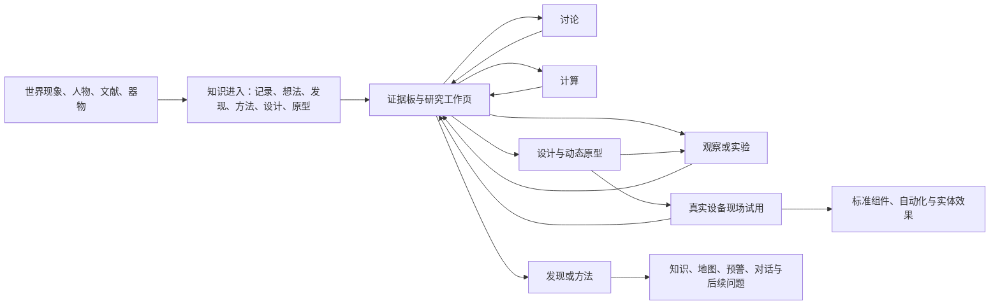
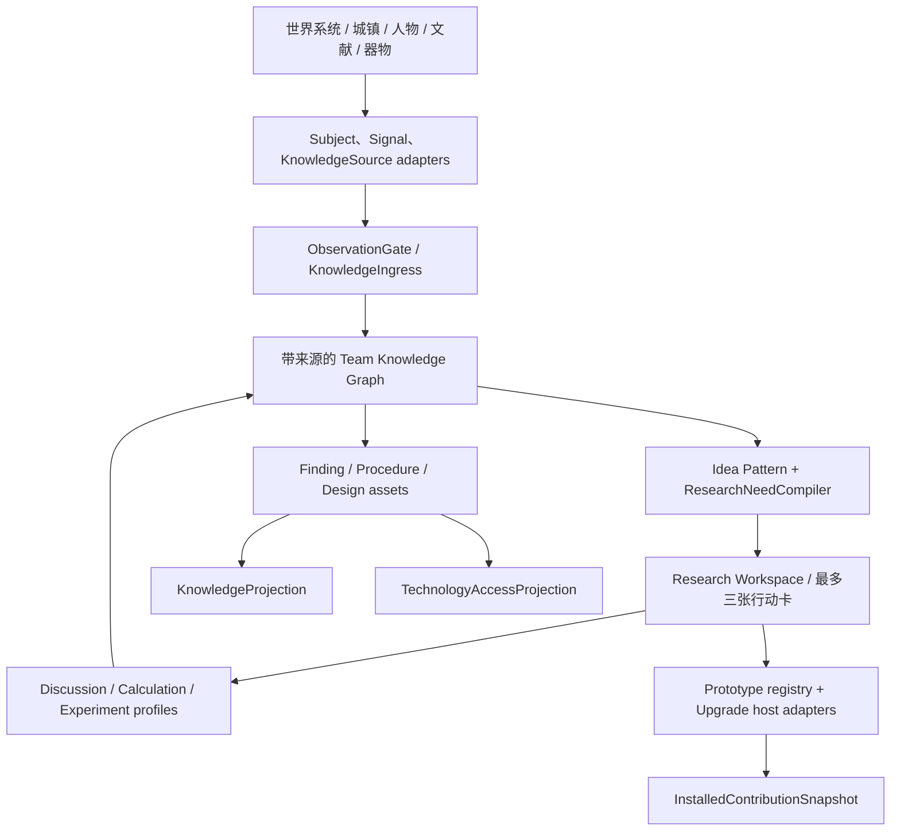

# 生成式研究系统 V2：知识生态、实验空间与居民科研

- Time: `2026-08-25 16:17:39 +0800`
- Authors: `Codex（OpenAI，系统、玩法与内容架构）；项目所有者提供目标、批评与取舍`
- Status: `draft；作为 V0/V1 的建议继任方案，等待三个首发切片的纸面与游戏内验证`
- Scope: `FrostedResearch、自然观察与温度系统、难民/居民知识、研究所、实验台、通用研究升级、数据包创作、知识与技术投影、旧研究兼容`
- Related: [`discussion/research_conversation.md`](../discussion/research_conversation.md), [`V0`](2026-08-25_10-30-52_player-interactive-generative-research-system-v0.md), [`V1`](2026-08-25_10-30-52_player-interactive-generative-research-system-v1.md), [`design/creative-principles.md`](../design/creative-principles.md), [`design/lore.md`](../design/lore.md), [`design/world-design.md`](../design/world-design.md), [`docs/climate/world-climate-and-temperature.md`](../docs/climate/world-climate-and-temperature.md), [`docs/climate/heat-production-and-network.md`](../docs/climate/heat-production-and-network.md), [`docs/research/README.md`](../docs/research/README.md)

## 这次重新设计的结论

V2 不在 V1 上补回几个按钮，也不把 V0 的科研表单重新搬回来。它采用一套新的中心模型：

> **研究系统首先是一套散布在世界、人物、文献和器物中的知识生态；玩家可以亲自发现，也可以继承、听闻、购买、实践、复现、验证或逆向知识。研究所负责把知识加工成可复用能力，实验台负责让验证重新成为 Minecraft 世界里的搭建与运行活动。**

V0 和 V1 各自抓住了一半问题：

| 来源 | V2 保留的精华 | V2 不再采用的部分 |
|---|---|---|
| V0 | 世界事实与玩家认知分离；来源图；动态研究缺口；讨论、计算、实验平级；真实装置；Finding / Procedure / Design 分离 | 四种问题框架、完整义务 DAG、玩家填写变量/单位/对照/统计表、过细的实验与原型认证状态机 |
| V1 | 证据板与现有纸牌小游戏；少量玩家词汇；隐藏量化；通用升级工具与动态原型物品；窄而类型化的数据包契约 | 两条固定 Flow、单一 ActionProfile、删除实验台、默认一切必须先由玩家产生 Idea、把居民缩减成讨论与资料处理 |

最重要的架构判断是：

> **保留非线性的后台认识结构，但只把它编译成一个主行动和至多两个并行动作。路线可以涌现，玩家学习的交互语法必须稳定。**

因此 V2 既不是科技树，也不是科研软件。它希望玩家反复经历几种熟悉动作：亲历或收到一件事、把证据连起来、问人、委托计算、搭一个合适的实验空间、看真实结果、决定相信什么或做什么。

## 不可变的设计原则

1. **世界机制先于科学结论。** Finding 只能描述当前世界里真实存在、能够观察或干预的机制。`design/` 中的设定是未来内容方向，不是当前玩法事实；若机制尚不存在，就先实现世界机制，或把内容明确写成传说、证词、旧文明主张或工程目标。
2. **自然探索不是工程研究的前置材料。** 气候学、生态学、地质学、胞体分类和历史考据可以只产生知识、地图、识别、预警和剧情后果，不必最终解锁配方。
3. **研究不强制从 Idea 开始。** 世界和人物可以直接带来 Observation、Idea、Finding、Procedure、Design 或 Prototype；证据板是玩家主动产生 Idea 的重要玩法，但不是知识进入系统的唯一门。
4. **涌现是受约束的组合，不是随机生成真理。** 世界接口提供事实，作者提供语义模式、方法和稳定成果，运行时根据实际来源、居民知识和世界条件组合不同路线。路线可以不同，世界答案不能靠暗骰改变。
5. **玩家不做数学表单，但必须做有意义的选择和世界行动。** 玩家选择关注什么、采用哪种解释、搭什么空间、使用哪条实验路线、需要哪些人员角色和资源、接受什么结论、采用什么设计；居民、计算器和 profile 处理公式、采样、误差和判读。
6. **讨论、计算、实验是研究所三种平级基础劳动。** 三者都占用居民班次、设施、材料、能源与时间，都会生成有来源、等待审阅的制品，不生成通用研究点。
7. **实验必须有世界锚点。** 验证性实验和工程台架试验以专属实验台为中心；房间、环境、装置、样品、供给和人员都必须在世界中实际成立。不能用纯菜单倒计时替代实验。
8. **知识掌握与知识制度化分离。** 一名难民会做，不等于全城会做；找到一台样机，不等于拥有配方；但在必要工具、持有人和兼容对象齐备时可以立即应用，不强迫玩家重新发现它。
9. **认识成果与部署效果分离。** Finding 改变理解；Procedure 使动作可复做、可教学；Design 描述改法；Prototype 是实体试作品；标准化后才开放稳定制造和自动化。机器效果来自实际安装或明确的知识投影，不来自模糊的“研究完成”。
10. **内容数据比运行时架构更窄。** 普通作者组合稳定 ID、来源、方法和成果；只有集成作者实现世界采样、判读器、装置适配器和升级 effect。数据包不能读取任意 Java/NBT 路径，也不能直接修改 team 知识或 variant。

## 玩家需要学会的对象

前台只固定使用以下词。后台可以保留 Claim、EvidenceLink、Run、revision 和 provenance，但不要求普通玩家掌握它们。

| 玩家用语 | 玩家理解 | 常见动作 |
|---|---|---|
| 记录 | 一件亲眼所见、别人所说或资料所写的事情 | 归档、忽略、追问、钉到证据板 |
| 证据 | 当前思考时拿来互相比较的记录、样品或报告 | 连线、找重复、找反例、换角度 |
| 想法 | 一个值得继续追问的联系、解释或改进方向 | 记下、讨论、计算、观察、实验、搁置 |
| 研究 | 围绕一个想法、外来结论或实际问题打开的工作页 | 选择下一件具体行动 |
| 实验 | 在合适空间里，用真实装置、样品和人执行的一次试验 | 搭建、装载、值守、修正条件、封存结果 |
| 发现 | 带来源和适用范围、现在可拿来理解世界的结论 | 使用、引用、本地复看、修订 |
| 方法 | 某个人或团队能够重复执行的测量、试验、操作或维护办法 | 示范、抄录、教学、委托执行 |
| 设计 / 原型 | 一个改法及其可拿在手里、可安装的试作品 | 制作、台架测试、安装、返工、定型 |

“问题框架”“义务”“实验计划”“DesignStandard”不作为一级玩家名词。它们仍可存在于后台或高级详情中，但主界面只说“我们现在想弄明白什么”“还缺哪件具体事情”“下一步可以怎么做”。

### 渐进教学，而不是一次展示八个概念

这些词不会在开局同时出现：

```text
第一次亲历显著现象：只出现“记下来”
第二份可比较记录：才出现“放在一起看看”，教学证据板
第一个 Idea：工作页只显示一张现场行动卡
第一次实验建议：只教学“准备—运行—结果”，高级检查默认折叠
建成城镇：行动卡上的“委托居民”才打开研究所工作板
第一次获得 Procedure：教学“谁会做—记录—教学”
第一次获得 Design/Prototype：才教学动态原型与通用升级工具
```

早期真正需要记住的资产词只有“记录—想法—发现”；“证据”和“研究”先作为普通界面语言。实验阶段再增加“实验—方法”，工程阶段再增加“设计—原型”。

## 总体玩家循环不是一条固定流程

V2 允许玩家从任意成熟度进入。总循环是一个可反复回流的网络：



系统不预存“第 1 步讨论、第 2 步计算、第 3 步实验”。它根据当前知识状态生成一个主行动和至多两个可选行动。例如：

```text
主要建议：在两个地点记录白幕到达时间
也可以：询问见过这种天气的难民
也可以：把现有三份气温记录交给居民比较
```

新结果进入后，建议会重新计算。描述性发现可能完全不需要实验；探索性实验可能先发生、再产生 Idea；一份完整旧论文可以直接带来 Finding；一个残缺设计可能先做原型，再倒推出问题。

## 知识怎样从世界进入

### KnowledgeOffer 与 KnowledgeIngress

所有来源先产生一个玩家可感知的 `KnowledgeOffer`；玩家亲历、阅读、交谈、交易、拾取或归档后，服务端写入不可变 `KnowledgeIngress` 事件。载荷可以是：

```text
Observation / Testimony / Idea / Finding / Procedure / Design / Prototype
```

它至少保留：

- 来源人物、地点、文献、任务或器物；
- 获得时间、地点和上下文；
- 亲见、口述、抄录、交易、教学还是实体持有；
- 当前由谁掌握、是否已进入 team 档案；
- 能否立即应用，以及应用依赖什么人、文档或实体；
- 是否在本地复现或验证过。

玩家只看到人话徽标，例如“亲眼记录”“阿列克谢的经验”“科考团残卷”“未经本地复看”“只有持有人会操作”“仅存样机”。

### 八种首要来源

| 来源 | 玩家实际经历 | 常见载荷 |
|---|---|---|
| 亲历显著现象 | 玩家处在感知范围内时，HUD 出现“这件事值得记住”；玩家可当场记下或稍后整理 | 未整理记录、异常、Idea seed |
| 主动测量与采样 | 使用温度探针、土壤温度计、样品袋、观察工具，或与具体世界对象交互 | Observation、specimen |
| 遗迹、档案与器物 | 阅读日志、地图、论文、图纸，拆出残件，找到还能工作的旧设备 | Testimony、Finding、Procedure、Design、Prototype |
| 未招募难民 | 交谈、帮助、交换或展示相关物品；知识在难民生成时确定并持久化 | 经验、Idea、Finding、Procedure、Design、实物 |
| 已招募居民 | 在相关岗位看到现象、被访谈、参加讨论、亲自示范或教学 | 工作报告、私人知识、方法 |
| 城镇日常工作 | 狩猎、矿场、物流、住宅照护、生产和城镇结算形成压缩报告 | Observation、异常、需求 |
| 研究所与实验台 | 完成讨论、计算、实验、复核或教学 | WorkArtifact、Evidence、Finding candidate、Procedure |
| 剧情、势力与任务 | NPC 传授、任务交付档案、势力共享标准、剧情事件暴露世界事实 | 任意成熟度知识，但必须保留来源 |

普通机器仍只产生 `ResearchSignal`，不会全知地自动写入知识图。显著现象也只有在玩家实际在场、居民当班、仪器被布置或观察任务已被委托时，才会成为 Offer。

其中现有可直接复用的玩家工具是 `TemperatureProbe` 和 `SoilThermometer`；研究笔记、样品容器、salient-event provider、遗迹知识、难民知识包和各类 `KnowledgeProjection` 都是 V2 新增能力，不能在实施计划中当成已存在入口。

### 直接知识可以直接应用

V2 明确允许“先会用，后理解”。这不是绕过研究，而是知识传播本身的玩法。

| 得到的东西 | 立即能力 | 后续研究或制度化价值 |
|---|---|---|
| 外来 Finding | 立即用于识别、对话、预测和派生新问题；内容政策可直接开放对应知识投影 | 本地复看可以扩大适用范围、发现当地例外或判断旧资料是否过时 |
| 难民掌握的 Procedure | 该人物可以亲自执行，也可以现场指导玩家 | 抄成手册和教学后，普通居民才可稳定执行 |
| 完整 Design | 可立即制作规定数量或一件原型 | 台架与现场试用后开放稳定制造、材料替代和普通维护 |
| 残缺 Design | 直接给出一个设计方向、部分 BOM 或实验建议 | 需要讨论、计算或逆向补齐缺口 |
| 实体 Prototype | 持有基础升级工具且 host 兼容时即可安装试用 | 逆向后才获得制造能力；长期使用可揭示维护与副作用 |
| 完整标准或图纸 | 可按内容政策直接开放制造 | 不强制“重新发明”；本地材料替代可成为新 Innovation |

外来知识必须以“来源声称/来源掌握”的身份进入，不伪装成玩家原创结论；但也不强迫玩家用一遍固定研究流程重新证明它。居民和机器不能自动发布团队自己的新 Finding，然而 NPC、文献和器物可以转交已经存在的语义资产。

每个来源另有类型化 `SourceAuthorityPolicy` 和 `ApplicationPolicy`：普通难民对自然规律的陈述默认是可据此行动的“外来主张”，不是自动成为本地真理；完整科考档案、正式标准或剧情中的权威传授可以直接成为已接受外来资产。地点相关知识在应用前必须匹配 scope：另一地区的白幕记录可以教会观察方法，却不能直接在本地地图上画出路线。Procedure、Design 和 Prototype 只要 policy、持有人/文档、安装工具及 host 条件满足就能立即应用；是否本地复看是后续选择。

### 知识保管与制度化

同一知识可以处于不同保管状态：

```text
个人掌握 → 可由持有人应用 → 已记录进队伍档案 → 已教学/制度化
实体持有 → 可试用 → 已逆向 → 可制造 → 已标准化
```

私人知识放在以人物 UUID 为键的 `PersonKnowledgeOverlay`，不继续膨胀 `Resident.CODEC`，也不滥用以 `Class#getSimpleName()` 为键的工作熟练度。未招募难民的知识包在实体生成时确定；招募后转移同一个包，不能重新抽取。入队时可以主动说出一条最显著经历，其余知识仍通过交谈、相关岗位、讨论、示范或教学被唤起。

## 无城镇与有城镇都能研究

### 无城镇阶段

新档不应先遇到“请建研究所”。玩家可以：

1. 在亲历寒潮、白幕、相变、生物反应或异常地点时获得待整理记录；
2. 用现有温度工具、笔记和样品容器主动记录；
3. 与未招募难民交换证词、方法、图纸或实物；
4. 在遗迹中找到档案、残缺设计或旧样机；
5. 使用绘图台和证据板形成自己的 Idea；
6. 建造一张基础实验台，亲自完成短时探索实验；
7. 直接使用已获得的 Procedure、Design 或 Prototype。

研究权威仍属于 Chorda team，而不是个人 capability，因此建立城镇前后不需要迁移两份真相。

### 城镇阶段

城镇不是研究的开关，而是把零散个人活动扩展成持续制度：

- 狩猎、矿场、物流、住宅与生产岗位持续提交有上下文的报告；
- 研究所把讨论、计算、实验、复核和教学排进正常工作日；
- 档案使私人知识不再依赖某个人一直在场；
- 居民可以为长实验值班、处理数据、复做方法和训练普通操作者；
- 城镇必须为研究付出劳动力、纸墨、样品、试剂、燃料、动力和岗位机会成本。

### 设施可达性与自举边界

| 载体 | 首次可达条件 | 无城镇替代 | 不得依赖 |
|---|---|---|---|
| 基础笔记、炭笔、样品袋 | 开局物资或最基础手工合成 | 本身就是无城镇入口 | 任意研究完成状态 |
| 绘图台与证据板 | 基础建造材料；保留现有方块与小游戏 | 无居民也能独立使用 | 先拥有 Idea 或研究所 |
| 基础实验台 | 完成绘图台教学后即可用基础材料制造 | 玩家亲自值守 | 任何需要实验台才能得到的 Finding/Procedure |
| 基础温度测量与记录设施 | 与温度教学同步开放 | 玩家手持测量并手工记录 | 研究所或机械计算器 |
| 研究所 | 建立城镇并建成合格工作空间 | 讨论可用现场交谈；计算与实验由玩家亲自完成 | 某项后期工程标准 |
| 机械计算器 | Create 可用且达到对应工业材料层级 | 居民或玩家手工处理 profile | 作为任何基础 Finding 的唯一通路 |
| 通用升级工具 | 能制造或首次获得兼容 Prototype 时同步提供基础配方；遗迹/交易也可连同工具提供 | 找到的实体 Prototype 在持有工具且 host 兼容时即可安装 | 被它安装的具体 Design 已经标准化 |
| `upgrade_blank` | 进入基础工程材料层级后开放 | 找到的 Prototype 不要求先会制造 blank | 目标 Design 已经标准化 |

高级仪器、精密环境和自动记录当然可以由后续知识开放，但系统的基本观察、灵感、人工计算和短实验路径必须先可用。

## 自然世界是一级研究对象

`ResearchSubject` 不再默认等于机器。统一主体可带以下 facet：

```text
SpatialFacet      地点、区域、群系、海拔、房间
ClimateFacet      气温、天气、风、湿度、白幕
OrganismFacet     物种、生命阶段、行为、生存与繁殖
PopulationFacet   群落、居民群体、猎物分布
MaterialFacet     物质、方块状态、样品与相变
GeologyFacet      地层、深度、矿层与地热异常
PhenomenonFacet   风暴、胞体、磁极、共生与异常事件
NarrativeFacet    文献、势力、证词和历史来源
ProcessFacet      机器或城镇生产过程
```

机器只是 `ProcessFacet` 的一种组合。自然系统与机器系统通过同一个语义端口接入：主体是什么、能观察什么、能进行哪些真实干预、能否取得样品、当前上下文是什么。

### 当前即可依托的世界事实

| 方向 | 当前真实机制 | 可形成的研究内容 |
|---|---|---|
| 气候与白幕 | `WorldClimate` 的小时气候、冷热事件、风、湿度和有方向传播的局部白幕模型；当前白幕只有管理员命令创建，没有自然发生源 | 实现自然/剧情发生源后，可研究单次前沿到达次序和传播规律；不能先宣称存在永久走廊 |
| 环境温度 | `WorldTemperature.air/block` 的维度、群系、海拔、气候和正值局部热区；墙体/封闭本身不会改变该温度 | 地表/地下/高处温度剖面、群系/气候对比、正热区边界 |
| 玩家换热 | 环境温度、风暴露、身体部位、衣物、正在水中/细雪中与加热路径 | 风与遮蔽、浸水/细雪换热风险、装备适用范围 |
| 植物 | `PlantTempData` 的存活、成长、施肥与天气脆弱性 | 作物温区、温室方法、寒潮损伤观察 |
| 方块相变 | `ServerLevelMixin_TemperatureUpdate#frostedheart$freezeWater` 按真实方块温度把地表边缘水冻结为薄冰；通用 `StateTransitionData` 引擎存在，但当前没有已确认的薄冰自然融化定义 | 先研究冻结条件、储水方法和热区边界；融化研究必须等相应世界机制实际接入 |
| 动物 | 现有动物喂食与生存的温度判断 | 极寒下的畜牧行为与照护方法 |
| 城镇生活 | 建筑温度、居民状态、狩猎停工、气候与运营历史 | 寒潮、住房和工作能力的关系 |
| 世界遭遇 | 当前可确证的是 `CuriosityEntity` 纳米匍匐集群的阶段行为与火焰燃尽 | 该现象的行为记录与火焰驱散方法；通用胞体分类和采样属于未来机制 |

### 未来世界观接口

以下方向来自只读 `design/`，适合作为未来机制 provider，但当前不得假装已经实现：

- 火山口热庇护、地热异常、火山灰土壤与寒冷生态；
- 冰藻、嗜冷真菌、冰鱼和共生体生理；
- 胞体分类、繁殖、采样与热响应；采集应由对应任务或 Procedure 明确开放；
- 磁极电子耦合、纳米集群信号与气候尺度行为；
- 地层空洞、软流层活动、矿物异常和地质科考；
- 材料低温疲劳、黏度、真实热容、导热和守恒功率。

接入这些题材时，先实现可观察、可干预、可持久化的世界机制，再写 Finding。当前尤其不能宣称：负值 `ChunkHeatData` 已形成真实冷场、世界热区已有连续径向衰减、湿度已进入玩家风寒主路径、或 dormant 物理热学模型已成为玩法权威。

### 纯科学 Finding 的游戏价值

非工程发现通过 `KnowledgeProjection` 产生可感知回报：

- 给未知天气、物种、胞体或地质异常正式命名；
- 在地图上标出本次白幕已观察段、栖息地、温区或异常点；只有世界本身存在持久路线时才标永久走廊；
- 把模糊警报升级成可解释预警，例如方向、类型和可能到达顺序；
- 解锁新的观察动作、取样方法、对话选项和档案关联；
- 让居民能在岗位中识别同类现象，并提交更精确的报告；
- 开启势力判断、剧情分支、旧文献真伪判断和新的探索地点；
- 形成气候志、物种志和地质志，让认识世界本身成为长期收集目标；
- 为未来工程提供原理，但不强迫每项 Finding 都导向配方。

## 证据板与“汇聚灵感”

绘图台继续承载 V1 最成功的前台玩法，并复用现有 `ResearchGame` 的 9×9 棋盘、可动牌、配对消除、顺序收束、纸墨消耗和局中保存。

### 开局

玩家钉上 2–5 份记录、证词、样品、旧资料或失败结果。界面只在需要时询问一句自然语言意图：

- `我想弄明白它`：寻找规律、矛盾、解释或新问题；
- `我想改变它`：寻找用途、改法、材料替代或工程目标。

如果当前证据只支持一个方向，则直接开始，不额外让玩家选框架。没有可关联候选时不扣纸墨，并提示缺少的是共同对象、不同条件、重复来源还是一座“桥”。

### 牌面语义

基础牌显示 `对象 / 条件 / 变化 / 结果`，跨来源配对时亮起来源连线并揭示人话关系，例如“同一地点、不同时间”“不同对象、共同变化”“证词与亲见矛盾”。万能牌是“换个角度”，顺序牌最后把若干关系收束成候选 Idea。

后台只在当前团队公开知识和已钉来源中匹配少量通用规则：

- 同一对象在不同条件下表现不同；
- 不同对象在同一条件下重复相同变化；
- 多个独立来源重复同一现象；
- 新记录与已有 Finding 或证词矛盾；
- 某个领域的方法或规律可能迁移到另一个 facet；
- 异常或失败暴露了一个原先没有的问题。

它不会读取隐藏世界答案。纸牌局完成只展示 1–3 张作者定义或模式解析出的 Idea 卡；玩家点“记下这个想法”后才打开研究工作页。若难民、文献或器物已经直接带来 Idea、Finding、Design 或 Prototype，玩家可以完全跳过纸牌局。

Idea 按规范化语义与 scope 去重。同一个 Idea 已经存在时，新一局或新来源只会显示“为旧想法补充了 2 条来源”“出现了范围不同的修订”或“换一个角度”，不会要求玩家为同一内容重复清盘。

## 研究工作页与轻量缺口编译

### 后台保留动态结构

涌现路线依赖四个最小语义对象，而不是 topic 内的一串 action：

```text
ClaimCandidate
  类型化说法、scope、来源，以及若它成立时可观察到的预测；

MechanismSchema
  居民、文献或既有知识可以怎样把当前现象实例化成候选解释；

ResearchNeed
  当前 ClaimCandidate 或 FindingPolicy 还缺哪一种带 target/scope 的语义制品；

MethodContract
  一项观察、讨论、计算、实验或复核方法需要什么输入/能力，
  会产出什么 ArtifactContract 或 EvidenceRelation。
```

`FindingResolver` 与 Claim 的可观察预测只返回类型化 `EvidenceNeed`，例如“需要同一次现象在两个地点的有序到达记录”“需要在相同暴露时间下比较两处水体状态”。`ResearchNeedCompiler` 再从全局可用 `MethodContract` 中匹配能产出该制品的方法；team 已掌握的 Procedure、居民私人方法、文献方法和新仪器都可以因此改变候选路线。topic 的 `method_hints` 只能影响人话提示和推荐顺序，不能封闭可用方法集合。

第一版只支持固定的 typed EvidenceNeed/ArtifactContract 和显式 scope 匹配，不提供作者可编写的布尔表达式或通用任务 DAG。

每次知识变化后，`ResearchNeedCompiler` 从当前工作区邻域派生未满足需求：

```text
GATHER / DISCUSS / CALCULATE / PREPARE_EXPERIMENT / RUN_EXPERIMENT
/ INTERPRET / REVIEW / REPLICATE / PROTOTYPE / FIELD_TEST / PUBLISH
```

需求由 committed graph、当前 research focus、catalog revision 和方法 profile 重新计算；不持久化“完成百分比”，也不让作者编写任意 DAG。失效的旧建议进入时间线，保留“为什么消失/被谁替代”，但不继续当作当前状态。

### 玩家只见行动卡

工作页固定显示：

1. 一句“我们现在想弄明白或改变什么”；
2. 3–6 个关键来源和当前争议；
3. 一个推荐行动；
4. 至多两个平级替代行动；
5. 每张卡的“为什么建议、需要什么、会产出哪类记录/报告”，不得预告哪个解释会胜出；
6. 一个可折叠的来源、数值和方法详情页。

讨论或文献带来多个解释时，工作页增加一排普通语言卡，不增加“假设管理器”：

```text
可能的解释：局部温度决定水是否冻结
[追这条解释] [保留作比较] [暂不考虑]
```

玩家最多 pin 一条作为当前关注，但其他解释仍保留为比较对象。结果卡分别写“这份记录支持它”“与它相反”“仍无法和另一种解释区分”或“只在更小范围内成立”。玩家据此继续、换解释、缩小范围或形成 Finding；系统不自动选择获胜者。

`ActionResolver` 再实时检查人员、房间、装置、材料、能源和实际世界对象。居民换班或箱子材料变化只刷新“现在能不能做”，不重编整张知识图。

这种设计保留原始 discussion 的涌现哲学：观察、居民知识和世界条件会改变路线；但玩家不会面对十几张 obligation 卡或实验设计表。

## 研究所：讨论、计算、实验平级

### 研究所是普通城镇工作建筑

新增 `frostedheart:research_institute`，继承现有居民工作建筑语义，进入 `TownStaffingPlan`。调高研究所优先级就意味着少一个矿工、猎人或物流员；同一居民同一天不能既在物流岗工作，又在研究所开会或值实验班。

研究所不持有知识图。工作单权威元数据属于 `TeamKnowledgeData`；建筑只保存自身设施、当日 roster、结算状态和队列引用，并在 UI 中投影这些 team work orders。知识与工作制品由 `TeamResearchService` 协调写入 team 数据；拆除或重建研究所不会删除研究任务、来源或结果。

### 三种基础劳动

| 工作 | 玩家如何下达 | 世界与资源成本 | 产物 |
|---|---|---|---|
| 讨论 | 选择研究、资料、参与角色/知识要求和一个班次 | 居民班次、纸墨、相关岗位离岗 | 会议记录、证词、竞争解释、设计建议、具体实验建议 |
| 计算 | 选择人话行动卡和输入记录，再选居民或机械计算器执行 | 居民班次或 Create 动力、纸墨/计算介质 | 比较摘要、预测、规格、BOM、分析报告 |
| 实验 | 选择人话实验卡、实验台、现实路线和人员要求 | 实验空间、居民值班、样品、逐班耗材、真实能源和时间 | ExperimentRecord、事故、观察、支持/挑战/无法判断 |

复核和教学是建立在三者上的后期任务：复核由未参与居民检查范围和遗漏；教学把持有人 Procedure 转成普通居民可执行的制度化能力。

### 讨论不是随机吐出正确答案

玩家在工作页或研究所中选择当前研究、要带进会议的 2–5 份资料，以及需要的岗位/私人知识标签。当前 `TownStaffingPlan` 仍按建筑 target 和顺序自动分配居民，因此 V2 MVP 从研究所当天实际 roster 中选择满足条件的人，并在产物记录实际参与 UUID；不假装已有 task-level 指名预约。以后可以增加“首选顾问”，但它必须显式扩展 staffing planner。

一个讨论班次只读取：

- team 已公开的知识；
- 本次参与者愿意外化的私人知识与经历；
- 资料中实际出现的对象、条件、变化与争议；
- 内容作者注册的机制模式与设计类比。

结果是 2–5 张带发言人与来源的会议卡：新证词、另一种解释、反例、设计方向或一项具体观察/实验建议。玩家可以“记为候选”“钉回证据板”“追问”或“归档”，不会因为居民说了就自动成为 Finding。没有相关经验的居民会明确说不知道，并指出更适合询问的岗位或需要补看的现象；系统不读取隐藏世界答案来替 NPC 装作聪明。

居民的智力影响能同时组织多少来源，教育影响能否使用定量/正式方法，岗位经历和私人 knowledge tag 决定他能提出什么。讨论由谁参加因此会改变研究路线，但不会改变世界真相。

### 计算是有对象的劳动

计算工作单不让玩家选择公式符号，而是选择“要处理哪些记录”和“想得到哪类结果”：比较地点、整理到达次序、估计范围、核对物料、评估原型前后或检查异常区间。注册的 `CalculationProfile` 负责实际公式、单位、缺测与诊断。

输出先给一句人话摘要和异常提示，再允许展开数值、来源和方法。缺少必要输入时，产出的是“还缺哪份记录”的不完整报告，不会补造数值；玩家决定把报告附给哪个 Idea、Finding 或 Design。

### 统一工作单生命周期

```text
QUEUED
→ WAITING_STAFF / WAITING_SUPPLY / WAITING_FACILITY
→ WORKING
→ AWAITING_REVIEW
→ APPLIED / ARCHIVED / CANCELLED
```

讨论、计算和实验使用同一个 `ResearchWorkOrder` 外壳，但由三个固定 subtype codec 表示参数。`ResearchDailyLaborLedger(townDay, residentUUID -> workOrderId)` 保证一名 roster 居民一天最多贡献一个生产性研究班次；每次实际劳动形成 immutable `WorkShiftRecord`。复核者不能与被复核 Run 的参与者相同，也不能在同一天重复占用。

`WorkShiftRecord` 保存 `settlementOrigin=NATURAL|COMMAND|TEST`。标准研究劳动与现场证据默认只接受自然结算和实际 loaded/active 时间；管理命令或测试结算可以用于调试队列，但不能把多日复看或长实验瞬间刷完。

实验的不可替代 `inputs` 在 Prepare/Start 时锁定并按 protocol 消耗；`supplies_per_attempt` 或逐班物资在一次 staffed/player attempt 开始时就扣除，无论该段最终是否形成有效证据。停电、环境漂移或错误操作仍消耗人力和已用材料，并生成 incident；证据有效性不会倒退资源消费。资源不足时整个 bundle 保持等待，不吞掉半份材料；可返还容器或未使用物由 profile 明确声明。

居民计算/机械计算器与玩家值守/居民实验都使用 `WorkExecutorLease(orderId, executorKind, executorRef, expectedRevision)`，切换执行者时暂停并移交已完成工作，不能双推进或产两份结果。完成后产生不可变 `WorkArtifact`，不会自动排下一个任务，也不会直接发布团队自己的 Finding。

居民的智力、教育、相关岗位经历和私人知识只决定能否承担、耗时、能表达多少细节和能使用哪些方法，不决定观点真假，也不换算成研究点。

### 机械计算器的定位

`frostedresearch:mechanical_calculator` 与居民执行同一个 `CalculationProfile`：

- 工作页先签发人话计算单，研究所/计算器只接收该 work order；玩家不直接选择内部 profile 或公式符号；
- profile 负责单位、聚合、比较、拟合和诊断；
- 机械计算器消耗 Create 动力和介质，居民路径消耗班次；
- Create 缺席时居民路线完整可用；
- 输出永远是待审阅 CalculationReport，不是 points。

无城镇阶段仍有一组 `MANUAL` 基础计算方法：玩家在绘图台消耗纸墨，完成排序、分组或选择有效记录这类短交互，profile 在服务端生成摘要；它只处理简单比较，不能免费替代需要教育、长班次或机械计算器的高级方法。

默认研究所不进行“空闲时自动讨论”。没有具体 work order 时，居民只做档案维护或普通学习活动，不会凭空生成 Idea。生产内容的三种基础工作按玩家队列和设施执行，讨论不享有高于计算或实验的隐藏优先级。

## 专属实验台与真实实验空间

### 两个不同层级的实体

- `ResearchInstituteBuilding` 负责谁工作、先做什么、从仓库消耗什么；
- `frostedresearch:experiment_table` BlockEntity 负责一次实验的样品、房间、装置、启动、暂停和实际记录。

实验台可以在无城镇时由玩家亲自使用；注册进研究所后，居民可以值守长实验。多放实验台只增加物理并行位，仍受居民和物资限制。

实验台持久化 `stationIncarnation + ownerTeam + optional ResearchInstituteRef`。MVP 中，绑定研究所必须同队、同维度；由于现有 `BuildingBlockScanner` 只把空气写进 `OccupiedVolume`，判据不是“台方块本身在 volume 中”，而是实验台 facing 一侧的 `serviceAnchor` 属于研究所 `OccupiedVolume`，台本体作为与该内部空气相邻、被 `LabSpaceSnapshot.fixtureRefs` 明确记录的 fixture。任一 core/table 重建、anchor 脱离空间或 fixture 引用失效后，旧引用进入 `WAITING_FACILITY`，不会按相同坐标偷偷接到新实例。以后若要支持远程附属实验室，再增加显式 linker 与距离/加载规则。

### 实验不是蓝图，也不是任意拼装

实验方法给出有限、可读的能力要求，玩家自由决定房间形状和具体装置：

```text
空间事实：封闭实验室、面积、体积和占用；户外现场使用独立 FieldSiteResolver
环境事实：当前先支持实际温度和光照；以后按 provider 增加风、湿度、纳米浓度等
静态设施：工作面、机柜、被动遮蔽和样品位置等 block tag
动态装置：测量、加热、通风、搅拌、供能和控制等 ResearchApparatusAdapter
```

`LabSpaceResolver` 首先实现 `ENCLOSED_ROOM`：沿用现有 `BuildingBlockScanner`、`ConfinedSpaceScanner` 和各城镇建筑扫描器的做法，从实验台 facing 指向的 interior anchor 及其地板开始，返回 bounded `LabSpaceSnapshot`。`OUTDOOR_SITE` 使用有界 anchor/radius 的独立 resolver，不让封闭空间 flood-fill 假装理解露天现场；MVP 白幕观察走 field-observation method，不依赖实验台房间扫描。

完整扫描只在玩家“重新检查”、结构邻域脏标记或低频 scheduler 时发生，限制 loaded chunks、最大 block 数和 volume；运行 tick 只读取缓存 revision、少量注册采样点和 apparatus adapter，绝不逐 tick flood-fill。

现有 `lab_block_*`、屏幕和机柜可先通过 block tag 提供静态存在性能力，不把旧装饰方块原地迁成 BE。当前普通 `lab_vent`、控制板没有 powered/active 状态，因此不能凭静态 tag 提供真实通风、主动记录或控温；凡是结果依赖运行状态的能力都必须由 BE 或 apparatus adapter 提供。封闭墙体和“保温”标签也不会凭空改变 `WorldTemperature`。

方法可以提供 1–3 条现实路线，例如：

- 在自然低温背景下使用已实现的正热源形成两个真实温区，或等待不同自然时段；
- 在同一实验室做前后对照，或改用独立的现场观察方法；
- 亲自短时值守，或排入研究所连续两个班次。

这是有限的内容选项，不是让玩家填写通用 ExperimentPlan。

### 实验台 UI

MVP 默认不是五页科研软件，而是一张“准备”屏：顶部选择人话路线，中部三列显示 `空间 / 装置 / 人员与供给` 的要求和现场状态，底部是样品槽与启动按钮。开始后切到 `运行`，封存后切到 `结果`；数值、事故段和来源放在展开详情。页面和 tab 数由交互 mockup 决定，先冻结信息结构，不冻结五页导航。

实验台 MVP 固定硬上限为 `4` 个 sample、`4` 个 reagent、`1` 个 component 槽；method 只能给槽命名、过滤、启用或禁用，catalog 超限时给出诊断。首版不向漏斗等普通自动化暴露这些动态槽，研究所供给通过 service 事务进入，避免绕过 Run 的消耗与来源记录。它不要求每个目标设备修改自己的 GUI，也不接受客户端直接提交结果或 effect。

### 玩家实际流程

1. 从工作页、讨论或文献得到一张实验建议卡；探索性实验也可以从实验台直接选择已知方法；
2. 选择一条方法路线，不填写变量和公式；
3. 围绕实验台搭房间，放实际世界样品位置、测量装置、已实现热源、记录器和供给；
4. 点击“重新检查”，得到“房间当前 -8°C，要求 -25~-15°C”“记录器没有动力”这类世界反馈；
5. 放入独特样品与启动试剂，标准纸墨/燃料可由城镇仓库逐班提供；
6. 选择“亲自值守”或“排入研究所”；
7. 玩家路线由 profile 规定短时 `active_duration` 和若干真实操作检查点：玩家必须在实验空间内装载、切换条件、记录或处理事故，离开或漏掉必要操作时暂停；它不复用居民 `valid_shifts`，也不是打开 GUI 后等待；
8. 居民路线在晨间 staffing 与资源结算成功后签发 `ExperimentDutyLease(runId, residentUUIDs, validUntilTownDay)`；只有实验台 loaded、lease 有效且实际装置/环境满足时才积累 staffed segment，次日必须获得新 lease；
9. 条件漂移时只把该区间标为不可用或暂停，保留此前有效记录，但已开始班次的人力与物资照常消耗；
10. 达到 active duration、有效班次或真实停止条件后封存记录；
11. 回到工作页审阅结果，决定附入证据、形成 Finding、改写 Idea、继续实验或把异常钉回证据板。

### 三类实验

| 类型 | 是否要求已有 Idea | 主要产物 | 示例 |
|---|---|---|---|
| 探索性 | 否 | Observation、异常、Idea seed、样品描述 | 对不同温区中的同类样品进行观察 |
| 验证性 | 通常是 | 支持、挑战、无法区分、范围修订 | 比较相同暴露时间下两处水体的温度与相变 |
| 工程台架 | 要有 Design/Prototype | 性能、代价、副作用、适用范围 | 在受控空间测试 T1 升级原型 |

对于已加载的动态机器实验，世界真实 tick 是权威；区块卸载时暂停并说明原因。只有方法显式提供 `BatchExperimentProvider`，且能从持久化世界/城镇事实安全重建班次摘要时，才允许离线结算。普通菜单等待时间不能替代空间和装置条件。

Run 的语义生命周期与 work-order refs 只存在于 `TeamKnowledgeData`；TraceStore 拥有 sealed segments；实验台 BE 只保存 inventory、station/apparatus binding、active run ID 和可重建采样 checkpoint。拆台时产生 `STATION_REMOVED` incident 并暂停/封存，不能在 team 与 BE 各留下一个可继续推进的 Run。

## 研究成果与玩家可感知后果

### Finding：世界认识

Finding 可以是描述性、因果性、诊断性或性能性。不同 `FindingPolicy` 规定所需来源；不能把“真实干预比较”强制施加给所有自然发现。

Finding 保留适用对象、地点/环境范围、来源与反例。它可以是：

- 玩家团队发布的暂定或已复看结论；
- 文献或人物转交的外来结论；
- 与本地观察冲突、正在复核的旧结论。

外来与本地、暂定与已复看是来源/认可维度，不是一条必须逐格升级的科技进度。

### Procedure：可重复的方法

Procedure 表示测量、采样、实验、制造、操作、维护或应急处置方法。它可以由难民直接掌握、从文献抄得、由团队实验整理，或者只存在于一个旧设备的操作说明中。

持有人可以立即执行；记录和教学使其成为居民可分配的公共能力。Procedure 不直接增加机器效率，但可以开放新的观察动作、居民任务、实验路线和自动维护条件。

### Design、Prototype 与 DesignStandard

- Design 是一个具体改法、材料选择和适用 host；
- Prototype 是实际物品，可先来自玩家制作、难民赠予或遗迹发现；
- 台架与现场结果回到证据图，玩家可以返工、限定用途或采用；
- 采用设计时，后台创建不可变 `DesignStandard` revision，冻结 BOM、参数、适用范围、方法与来源；
- 标准化开放普通制造、自动化与可教学维护，但不会把旧原型从世界里抹掉。

### 三类投影

| 投影 | 回答的问题 | 玩家可见效果 |
|---|---|---|
| `KnowledgeProjection` | 团队能识别、预测、命名、对话或观察什么 | 地图、天气预警、物种/地质志、HUD 识别、剧情和居民报告 |
| `TechnologyAccessProjection` | 某个稳定 ActionKey 是否可见、可原型制造、可普通制造、可自动执行 | JEI、配方、机器成型、使用与自动化权限 |
| `InstalledContributionSnapshot` | 某个 host incarnation 上实际装了什么，并处于什么状态 | 只影响该实体设备的效率、模式、维护或副作用 |

投影是可重建缓存，不是事实源。纯科学 Finding 可以只有第一类投影；不必为了“给奖励”硬接一张配方。

## 通用研究升级与动态原型

V2 保留 V1 的工程接口，不恢复每台设备 GUI 的特殊槽位。

### 玩家交互

1. `frostedresearch:research_upgrade_tool` 对兼容设备使用；
2. 服务端把普通 BE 或 IE 多方块任意从属块解析到稳定 host；
3. 打开统一 `ResearchUpgradeMenu`，显示该 host 提供的研究升级位、当前安装物和兼容设计；
4. 玩家从服务端背包选择动态原型或标准组件并确认安装/拆除；
5. 真实 ItemStack 存在 host 的研究升级存储中，team registry 只保存 serial 到 placement 的索引；
6. 机器按 host incarnation 查询已安装贡献，不写入 team-wide 新 variant。

目标接口采用直接实现加 adapter registry：普通 BE 可实现 `ResearchUpgradeableDevice`，IE/第三方多方块由 `ResearchUpgradeHostAdapter` 规范化到主节点。host 身份至少是 `hostType + GlobalPos(master) + incarnation UUID`，不能只用坐标。

### 少量通用物品

| 物品 | 用途 |
|---|---|
| `upgrade_blank` | 按真实 BOM 合成、记录所选材料，但没有 effect |
| `upgrade_prototype` | team、design revision、serial、材料和外观 profile；不可堆叠 |
| `upgrade_component` | 已标准化、可重复制造的组件 |

外观使用同一物品基础材质、材料 tint 和白名单 overlay/profile；不为每个设计注册新 Item。原型可以先放进实验台的“待测部件”槽做台架试验，再取出同一个 stack，用升级工具安装到真实设备做现场试用。

安装事务仍由服务端重解 host、核对 team/距离/incarnation/revision、精确取出背包 stack、写入 host 与 placement registry、同步结果；客户端不提交 ItemStack、效果值或材料事实。

## 三个首发切片共同验证一套系统

V2 不再用一条 T1 工程项目证明整个研究系统。首发必须同时包含自然发现、实验室科学和工程应用。

### 切片 A：白幕前沿并非同时到达——无城镇自然发现

`WhiteCurtainDescriptor` / `WhiteCurtainFieldModel` 已有确定的方向传播语义，但当前只有 permission-2 `/climate white_curtain add` 创建入口，每次矩形和方向随机，结束后删除。首发内容必须先增加一个可游玩的自然或剧情发生源，并为每次事件分配稳定 `phenomenonOccurrenceId`；否则它只能是开发 fixture，不能称为自然研究。

1. 玩家第一次处于某次白幕前沿感知范围时获得“这里的天气刚刚发生突变”的待整理印象；记录保存 occurrence ID，只说明亲历事件，不泄露传播方向。
2. 一个新增并持久化的“荒野猎人/旅行者”难民 background provider 可能给出三种知识包之一：亲历证词、记录到达次序的 Procedure，或“白幕前沿会定向传播”的外来 Finding。当前难民没有这些背景字段，不能从所有包均匀随机。
3. 若从零开始，玩家把同一次 occurrence 的不同地点/时刻记录与证词钉上证据板，完成“汇聚灵感”，记下“这次白幕似乎沿一个方向移动”。
4. 工作页建议玩家在同一事件中选择两个或三个地点，记录前沿到达时间与温度变化。无城镇时玩家用 V2 笔记和现有温度工具亲自完成；以后可用居民现场任务或数据记录装置。
5. 手工整理、居民或机械计算器只负责生成“同一次事件中各地点的先后次序与间隔”，不要求玩家计算传播速度，也不预告方向。
6. 单次记录先形成事件级结论：“这次白幕在已观察地点依次到达”；跨多个 occurrence 重复后，才可形成耐久 Finding：“白幕前沿会定向传播”。它不能推出世界里存在永久固定走廊。
7. 地图只在本次事件中显示已观察段、来向和记录点，并随事件结束转入档案；耐久 Finding 则开放更清楚的前沿识别/预警。只有未来先实现持久世界走廊，才允许永久路线投影。
8. 若玩家一开始就获得耐久外来 Finding，可以立即理解和识别前沿；另一地区的旧记录不会直接在本地地图生成路径，本地观察仍可扩展 event map。

这条切片验证：世界亲历、无城镇研究、难民直接知识、多入口路线、证据板、纯科学 Finding 和非配方回报。

### 切片 B：为什么相邻水体没有一起冻结——实验室自然科学

当前 `ServerLevelMixin_TemperatureUpdate#frostedheart$freezeWater` 证明了“真实方块温度低于阈值、且水位于边缘时变成薄冰”这条世界规则，但它每次只从 `MOTION_BLOCKING` 高度图抽取地表列：屋顶下的水不会被采到，1×1 水点的触发时间也不可控。因此 Phase 1 必须先把其中的温度、流体层级、边缘与目标冰态判定抽成可复用的 `WaterFreezeModel`；原地表随机采样器和新增 `WaterSampleBasinAdapter` 都调用同一模型。basin adapter 按公开且有界的 cadence 检查被它绑定的真实 source-water 单元，并真正把世界方块变成薄冰，不伪造一个“实验结果”状态。当前没有已确认的薄冰自然融化路径，所以首切片只观察冻结，不把热源关闭后的融化当作现成机制。

实验室提供明确工作空间，不自行保温或控温；两个条件必须来自同一自然低温背景与实际已实现的正热源/热区边界。

1. 玩家在相近地点看见一处水体冻结、另一处仍为液态，或从居民/旧储水手册得到同类记录；
2. 证据板或讨论给出至少两张“可能的解释”：`只是暴露时间不同` 与 `局部方块温度/热源边界决定相变`；玩家追一条并保留另一条比较；
3. 玩家建造基础实验台和自由形状的封闭试验室，在世界中放置两个 V2 新增通用 `WaterSampleBasin`、两个测温点与记录设施；每个 basin 是有形 apparatus，绑定自己盆框中的真实 source-water 单元并通过共享 `WaterFreezeModel` 更新它，水 bucket 放在台内只负责批次与装载，真正被观察的是世界水/薄冰方块；
4. 玩家把两个同批水样同时装载，使一处位于实际正热区内、另一处位于热区外，或在同一位置做热源开启/关闭的前后对照；UI 始终显示样品点读取到的真实 `WorldTemperature.block`；
5. 玩家短时值守需要在场同步装载、确认温度并处理结冰事件；居民路线由研究所签发 duty lease 并消耗一至两个班次和记录介质；
6. profile 比较相同 occurrence/暴露窗口中的实际温度与方块相变，输出对每张解释的“支持、相反、仍无法区分”和异常区间；
7. 若第一次运行只证明两处不同却无法排除装载时间，NeedCompiler 会把下一张主卡改成“交换位置或同步装载复做”，而不是继续固定流程；
8. 玩家最终可以发布“在当前水体和已测范围内，相变与局部方块温度相关”的 Finding，并整理储水/防冻 Procedure；它进入自然档案和水体识别，不必解锁机器配方。

这条切片验证：专属实验台、指定实验空间、自由搭建、样品与耗材、居民实验班次、隐藏量化、Finding 与 Procedure 分离。

### 切片 C：T1 受控进气——工程创新

这条内容沿用 V1 的动态原型和统一升级 GUI，但把台架实验与研究所劳动补回来。

1. 入口可以是燃料压力报告、玩家工程 Idea、新增并持久化的锅炉工 background 难民所携 Design、科考团残图，甚至一件找到的旧 Prototype；
2. 讨论提出供应中断、超载操作和稳定进气等竞争解释/设计方向；计算任务使用集成 profile 处理燃料记录，玩家不填写公式；
3. 玩家选择受控进气 Design，按 BOM 合成 `upgrade_blank`，在绘图台写入动态原型；若直接找到样机则跳过制造；
4. 原型先进入实验台的工程台架方法，实际消耗样品、动力和实验员班次，检查目标收益与副作用；
5. 玩家用 `research_upgrade_tool` 打开 T1 的统一菜单并安装，不修改原 Generator GUI；
6. 真实运行形成现场报告，玩家决定返工、限定用途、拆除或采用；
7. 采用后开放标准组件制造；实际效果只来自当前 active T1 incarnation 上安装的组件。

数据定义中的 `+0.1` 是这个设计被实现后的类型化工程行为，不是玩家要“发现”的隐藏自然常数。台架与现场试用验证的是装置能否稳定集成、实际燃料轨迹、供热是否退化、维护与副作用；如果内容没有第二种设计或真实代价，就不伪装成多方案科学选择。

首切片仍需正视当前事实：`GeneratorData` 是每 team 单例，消费链只读 team-wide variant，且缺少燃料装入/process/实际供给连续性 telemetry。因此第一版明确维持“一队一个 active T1”，增加 incarnation、研究升级存储、host-aware modifier resolver 和必要 telemetry；不假装已经支持多塔逐台部署。legacy `generator_effi` 与新组件放入同一 exclusive family，按明确迁移政策去重，不叠成双份加成。

## 数据包作者契约

### 不是固定 ResearchProject，而是内容语义包

普通作者可以用一个 topic 文件把常见内容写在一起，但运行时不会把它当成线性项目或进度条。加载器把各 section 安装进公共注册表，同一 Observation、Protocol 或 Finding 可以被多个 topic 引用。

推荐路径：

```text
data/<namespace>/frostedresearch/topics/<path>.json
data/<namespace>/frostedresearch/knowledge_packages/<path>.json
data/<namespace>/frostedresearch/mechanisms/<path>.json
data/<namespace>/frostedresearch/protocols/<path>.json
data/<namespace>/frostedresearch/findings/<path>.json
data/<namespace>/frostedresearch/procedures/<path>.json
data/<namespace>/frostedresearch/upgrades/<path>.json
```

`protocols` 是运行某次观察/讨论/计算/实验的内容定义；`procedures` 是世界内已经掌握、可应用和可教学的知识资产，两者不能混为一物。`topics` 是作者便利 bundle：常见 ingress、mechanism、protocol、Finding policy 和 projection 都可内联；只有需要复用时才拆到独立文件。因此普通自然发现的最小交付仍是“一份 topic JSON + 翻译”。

所有 map key 使用稳定 local ID，文件路径是 canonical `ResourceLocation`；旧 `generator_T1` 等大写裸字符串只存在于显式 legacy alias 中。默认翻译键从 `research_topic.<namespace>.<path>.<section>.<local_key>` 派生，资源包可以提供牌面、图鉴图、来源徽标和 overlay。Datagen 与 `/research catalog dump --template <type>` 应输出可直接复制的最小模板。

### 自然主题示例

`data/frostedheart/frostedresearch/topics/white_curtain_motion.json`：

```json
{
  "format": 2,
  "presentation": {
    "icon": "frostedheart:temperature_probe",
    "journal": "frostedresearch:climatology"
  },
  "subjects": [
    "frostedheart:white_curtain",
    "frostedheart:world_climate"
  ],
  "ingress": {
    "experienced_front": {
      "type": "frostedheart:salient_event",
      "event": "frostedheart:white_curtain_front_experienced",
      "occurrence_key": "frostedheart:white_curtain_occurrence"
    },
    "manual_temperature": {
      "type": "frostedheart:field_observation",
      "method": "frostedheart:air_temperature_at_place"
    }
  },
  "idea_patterns": {
    "arrival_not_simultaneous": {
      "type": "frostedresearch:ordered_occurrences",
      "event": "frostedheart:white_curtain_front_arrived",
      "same_occurrence": true,
      "minimum_sites": 2
    }
  },
  "mechanisms": {
    "directional_front": {
      "type": "frostedresearch:propagating_occurrence",
      "event": "frostedheart:white_curtain_front_arrived",
      "prediction": "frostedresearch:ordered_arrivals"
    }
  },
  "method_hints": {
    "front_sequence": [
      "frostedheart:white_curtain_front_watch",
      "frostedheart:compare_arrival_times"
    ]
  },
  "findings": {
    "this_front_sequence": {
      "policy": "frostedresearch:descriptive",
      "resolver": {
        "type": "frostedresearch:ordered_occurrences",
        "event": "frostedheart:white_curtain_front_arrived",
        "same_occurrence": true,
        "minimum_sites": 2
      },
      "scope": "frostedheart:white_curtain_occurrence",
      "projections": [
        {
          "type": "frostedresearch:archive_entry",
          "category": "frostedresearch:climatology"
        },
        {
          "type": "frostedresearch:transient_event_map",
          "geometry": "frostedresearch:observed_points_and_direction"
        }
      ]
    },
    "fronts_propagate": {
      "policy": "frostedresearch:descriptive",
      "resolver": {
        "type": "frostedresearch:independent_replication",
        "of": "this_front_sequence",
        "minimum_occurrences": 2
      },
      "scope": "frostedheart:white_curtain_fronts",
      "projections": [
        {
          "type": "frostedresearch:warning_detail",
          "channel": "frostedheart:white_curtain_front"
        }
      ]
    }
  }
}
```

这一个 topic 加翻译即可完成基础自然发现；引用的 field/calculation protocol 是引擎或 FrostedHeart 集成层提供的可复用方法。难民 offer 是下一节的可选扩展。`resolver` 使用通用类型化结构，不是每项 Finding 专写 Java，也不是任意布尔脚本；它只能读取语义 Observation 和 protocol 产物。

### 难民知识包示例

`data/frostedheart/frostedresearch/knowledge_packages/white_curtain_traveler_memory.json`：

```json
{
  "format": 2,
  "payload": {
    "type": "frostedresearch:procedure",
    "asset": "frostedheart:white_curtain_front_watch",
    "scope": "frostedheart:white_curtain_occurrence"
  },
  "custody": "bearer",
  "application": "holder_can_execute",
  "institutionalize_with": "frostedheart:copy_field_observation_method",
  "presentation": {
    "source_badge": "frostedresearch:traveler_memory"
  }
}
```

难民背景或剧情只引用 knowledge package pool。包可以换成 Finding、Design 或 Prototype payload；`application` 明确它是持有人可用、读后可用、拾取即用还是需要归档。

### 讨论、计算与实验 protocol 示例

`data/frostedheart/frostedresearch/protocols/discuss_water_phase.json`：

```json
{
  "format": 2,
  "type": "frostedresearch:discussion",
  "contract": {
    "produces": [
      "frostedresearch:candidate_explanation"
    ]
  },
  "participants": {
    "minimum": 2,
    "maximum": 3,
    "requirements": [
      {
        "knowledge": "#frostedheart:cold_weather_experience",
        "count": 1
      }
    ]
  },
  "resident_shifts": 1,
  "supplies_per_attempt": [
    {
      "tag": "frostedresearch:paper",
      "count": 1
    }
  ],
  "card_pool": "frostedheart:water_phase_explanations"
}
```

`data/frostedheart/frostedresearch/protocols/compare_water_phase.json`：

```json
{
  "format": 2,
  "type": "frostedresearch:calculation",
  "profile": "frostedheart:compare_water_phase_events",
  "contract": {
    "accepts": [
      "frostedresearch:phase_observation_pair"
    ],
    "produces": [
      "frostedresearch:state_temperature_comparison"
    ]
  },
  "executors": {
    "manual": {
      "interaction": "frostedresearch:sort_and_compare"
    },
    "resident": {
      "count": 1,
      "minimum_education": 1,
      "resident_shifts": 1
    },
    "mechanical_calculator": {}
  },
  "supplies_per_attempt": [
    {
      "tag": "frostedresearch:paper",
      "count": 1
    }
  ]
}
```

`data/frostedheart/frostedresearch/protocols/water_phase_response.json`：

```json
{
  "format": 2,
  "type": "frostedresearch:experiment",
  "profile": "frostedheart:water_phase_response",
  "contract": {
    "accepts": [
      "frostedresearch:water_phase_explanation_set"
    ],
    "produces": [
      "frostedresearch:paired_phase_evidence"
    ]
  },
  "routes": {
    "positive_heat_boundary": {
      "space": {
        "kind": "enclosed",
        "minimum_volume": 24
      },
      "environment": {
        "context": "frostedheart:natural_cold_with_positive_heat_boundary"
      },
      "apparatus": [
        {
          "capability": "frostedresearch:hold_world_water_sample",
          "count": 2
        },
        {
          "capability": "frostedresearch:measure_block_temperature",
          "count": 2
        },
        {
          "capability": "frostedresearch:log_block_state",
          "count": 1
        },
        {
          "capability": "frostedresearch:positive_heat_source",
          "count": 1
        }
      ],
      "inputs": [
        {
          "slot": "sample",
          "ingredient": {
            "item": "minecraft:water_bucket"
          },
          "count": 2
        }
      ],
      "player_execution": {
        "active_duration": "frostedheart:water_phase_observation_window",
        "checkpoints": [
          "frostedheart:load_samples_together",
          "frostedheart:confirm_sample_temperatures"
        ]
      },
      "resident_execution": {
        "operators": 1,
        "minimum_education": 1,
        "resident_shifts": 1
      },
      "supplies_per_attempt": [
        {
          "tag": "frostedresearch:paper",
          "count": 1
        }
      ]
    }
  }
}
```

真正的采样、单位、方块相变判读和结果摘要属于 `profile` 或它引用的类型化 program。普通作者选择已公开的 protocol、空间、设备、人员、材料和时长，不写公式或 NBT path。实验台中的 bucket 只登记并消耗批次；两个 `WaterSampleBasin` 所绑定的真实世界水单元才是 `hold_world_water_sample` apparatus，并由集成作者注册的 `WaterSampleBasinAdapter` 调用共享 `WaterFreezeModel` 改变方块状态，不能在 ItemStack 或报告里模拟相变。

### 通用 resolver 与自然知识投影

首版至少提供以下可数据配置、自动产生 `EvidenceNeed` 的通用 resolver：

```text
ordered_occurrences
repeated_difference
range_characterization
before_after
cross_source_agreement
independent_replication
```

首版通用 projection：

```text
archive_entry / bestiary_or_field_guide
map_point / map_area / transient_event_map
hud_recognition / warning_detail
resident_recognition_rule
dialogue_or_story_knowledge_tag
```

普通自然 Finding 组合这些类型即可。只有新增世界 observable/intervention、全新证据判读类别或全新下游表现类型时才写 Java；不能要求每个自然主题各写一个 resolver 和一个专属消费端，否则内容生产会再次偏向现成的配方/机器 effect。

### 工程升级示例

`data/frostedheart/frostedresearch/upgrades/t1_controlled_draft.json`：

```json
{
  "format": 2,
  "host": "frostedheart:generator_t1",
  "socket": "frostedheart:air_control",
  "prototype": {
    "bom": [
      {
        "item": "create:encased_fan",
        "count": 4
      },
      {
        "tag": "forge:plates/cast_iron",
        "count": 8
      }
    ],
    "visual": {
      "profile": "frostedheart:ducted_fan",
      "material": "frostedheart:cast_iron"
    }
  },
  "bench_method": "frostedheart:t1_controlled_draft_bench",
  "field_method": "frostedheart:t1_controlled_draft_field",
  "standard": {
    "action": "frostedheart:install/t1_controlled_draft",
    "effect": {
      "type": "frostedheart:generator_fuel_duration",
      "add": 0.1
    },
    "exclusive_family": "frostedheart:t1_efficiency_stage_1"
  }
}
```

数值 effect 由 `UpgradeEffectHandler` 实现并验证 host/scope/单位；普通作者不能直接写 variant 键。示例数值只是内容提案，实施时必须以真实 T1 模型和体验平衡复核。

### 三层作者职责

| 角色 | 可以做什么 | 不应做什么 |
|---|---|---|
| 普通内容作者 | 组合现有来源、idea pattern、mechanism、protocol、知识包、Finding、Procedure、BOM、文本和投影 | Java/NBT path、公式脚本、直接改 team 数据、伪造 world observation |
| 资源包/叙事作者 | 翻译、牌面、报告文本、难民背景池、遗迹文献、对话、模型、overlay | 决定服务端结果或 effect |
| Java/集成作者 | 注册 subject/observable/intervention、salient event、method profile、apparatus adapter、projection 与 upgrade handler | 为单个 topic 硬编码整条固定流程 |

KubeJS 只生成相同 JSON 或向候选 catalog 注册同结构定义；不能拿到可变知识图或直接 grant Finding/variant。

普通作者的实际步骤固定为：

1. 从 catalog dump 选择世界已经暴露的 subject facet 与 observable；若不存在，先向集成作者申请 provider，不能在 JSON 中读内部字段；
2. 选择知识入口和 0–N 个通用 idea/mechanism pattern；
3. 选择能满足 EvidenceNeed 的现有 protocol，并只在确有新世界操作时新增 protocol；
4. 声明稳定 Finding/Procedure/Design 模板与通用 projection；
5. 添加翻译、牌面/图鉴资源和可选难民/遗迹包；
6. 运行 validate/dump，用开发 fixture 实际产生每类结果。

schema 明确禁止 `completed/progress/points`、team/player/坐标/居民 UUID、Run 结果、任意脚本表达式、直接 variant key 和客户端翻译作为逻辑条件。

### Reload 与诊断

新 catalog 使用数据包 reload listener，与当前 `config/fhresearches/*.json` 旧 catalog 并行。一次 reload：

1. 收集所有 topic、package、mechanism、protocol、asset 和 upgrade 候选；
2. 解析并累积所有诊断，不在第一个问题处停止；
3. 检查引用、类型、provider、metric/单位、translation、host/socket、exclusive family 和 legacy alias；
4. 只有候选整体一致时原子安装新 revision；否则继续使用上一份可运行 catalog并把完整诊断交给作者；
5. 不重写已经签署的资产 revision，不让 reload 静默改变旧 Prototype 或 DesignStandard 的 BOM/effect；
6. 提供 `/research catalog validate`、`/research catalog dump <id>` 和开发 UI 来源追踪。

## 后端工程架构

### 端口与适配器



核心端口：

```text
ResearchSubjectAdapter     统一自然、人物、地点、机器与城镇主体
KnowledgeSourceProvider    难民、文献、任务、遗迹、拾取物和显著事件
ObservationChannel         玩家感知、仪器、岗位、现场任务、正式实验
ResearchMethodProfile      discussion / calculation / experiment / observation
ResearchApparatusAdapter   装置能力、当前状态、量程和实际供能
ResearchUpgradeHostAdapter 通用升级位、实际安装存储和 host revision
KnowledgeProjectionHandler 地图、预警、对话、识别和剧情消费端
UpgradeEffectHandler       host-aware 的类型化实体效果
```

所有写命令统一经过 `TeamResearchService`。现有空壳 `TeamResearchManager` 只作为兼容 facade，不再建立第二个权威名称。

### 权威数据边界

| 数据 | 权威位置 |
|---|---|
| team 公共知识、工作区、资产、来源事件、工作单与 Run 生命周期 | 新 `TeamKnowledgeData`，注册到 `FRSpecialDataTypes` 的唯一稳定 ID |
| 人物私人知识 | `PersonKnowledgeOverlay`；难民 NBT 保存生成包，招募成功时显式 re-key 到新 Resident UUID |
| 实验高频 trace | 独立 TraceStore 分段存储；`TeamKnowledgeData` 只保存 segment refs |
| 实验台物理事实 | 实际 ExperimentTable BE 保存 inventory、station/apparatus binding、active run ID 与 checkpoint，不保存第二份 Run 生命周期 |
| 原型实体与安装状态 | ItemStack / host 存储为物理事实，team registry 为 placement 索引 |
| catalog | 当前数据包候选原子安装后的 immutable snapshot |
| 三类 projection | 由知识 revision、catalog revision 和 host facts 重建的缓存 |
| 旧研究 | 原 `TeamResearchData` 保持旧 executor 与幂等语义 |

`TeamResearchService` 只协调事务，不“持有一切”。实验 trace、世界 BE、原型物品和 catalog 各自保留清楚的事实权威。

### 服务端命令边界

C2S 只发送意图、目标稳定 ID、当前 team epoch 和 expected revision，例如：

```text
ArchiveObservation
AcceptKnowledgeOffer
PinEvidence / FinishInspirationSession / RecordIdea
OpenOrReframeResearch / PrioritizeExplanation
CommissionDiscussion / CommissionCalculation / CommissionExperiment
PrepareExperiment / StartOrAuthorizeExperiment / SealExperimentRecord
AttachWorkArtifact / PublishFinding / PublishProcedure
AuthorizePrototype / InstallOrRemoveUpgrade / AdoptDesign
```

服务端重新解析当前 team、人物、实验台、房间、host、物品与实际世界条件。客户端不能提交“我观察到了什么”“实验成功”“这个原型有 +0.1”之类事实。

### 同步与性能

- team 切换使用共同 `TeamContextEpoch(teamId, sessionEpoch)`；先清旧 town/research/knowledge 投影，再安装匹配 epoch 的 snapshot，避免混用不同 team 快照；
- catalog snapshot 先于 team projection；状态 delta 带 catalog revision 和 state revision，缺口时请求完整 snapshot；
- 客户端常驻同步工作区摘要、资产、行动卡和 projection，不同步无界来源图与完整 trace；
- 图详情、人物知识说明和实验段按 UI 需要请求；
- salient offer 按 `source + semantic key + scope/occurrence` 去重并设 inbox/cooldown 上限，重复事件聚合来源而不是刷记录；
- 普通世界对象只产稀疏 signal/报告，日常机器按窗口聚合；只有 active experiment 对已绑定主体高频采样；
- 环境、材料和 resident roster 变化只刷新 ActionResolver overlay，不重编整张图。

## 已验证的现状约束

1. `DrawingDeskTileEntity#updateGame` 当前经 `ResearchHooks.commitGameLevel` 提交 `MinigameClue`。V2 要保留棋盘规则，但把完成产物改为 `IdeaCandidate`，并保留 legacy minigame executor 给旧研究。
2. `MechCalcTileEntity` 当前生产 points，且方块注册受 Create 是否加载影响。新路径执行具体 CalculationWorkOrder；居民路径必须始终可用。
3. `ITownBuilding.CODEC` 仍以 `.typeLazy(...)` 固定分派六类建筑。V2 MVP 只在六类之后追加命名 `researchInstitute`，并做六个旧名字、旧整数顺序和新名字的 codec round-trip；不为一个建筑先扩大成通用 registry 重构。若随后确实需要外部动态建筑类型，再单立城镇架构计划。
4. 当前封闭空间基础可复用：`BuildingBlockScanner`、`ConfinedSpaceScanner`、`HouseBlockScanner` 和 `HuntingBaseBlockScanner` 已能扫描空间并读取温度；它们的起点与封闭 flood-fill 语义不能直接表示任意 BE 或露天现场。V2 新建有界 `ENCLOSED_ROOM` resolver 和独立 field resolver，不改旧装饰方块实例类型。
5. 当前 `Resident` 有智力、教育和岗位熟练度，但没有私人知识；研究知识使用独立 overlay，不挤入脆弱的熟练度 key。
6. 当前 `WanderingRefugeeRecruitMessage` 会创建一个新 UUID 的 `Resident` 再丢弃难民实体。知识包先持久化在难民 NBT；`town.addResident` 成功后必须在同一服务事务中把 old entity UUID overlay re-key 到 new resident UUID，再移除实体。失败时不转移、不删除、不重抽。难民 background/source 也是 V2 新增 provider。
7. 当前白幕只有管理员命令创建，没有自然发生入口，也没有永久走廊。首发切片必须先增加可游玩的发生源与 occurrence ID；否则只能作为开发测试。
8. 当前 `PlantTempStats` 已在种子/作物 tooltip 和土壤温度计路径显示精确存活、成长与施肥范围。未来若做植物温区 Finding，必须先改成 research-aware disclosure，或选择不会被现有 UI 直接揭示的问题；不能把已明示数值包装成发现。
9. `GeneratorData` 当前每 team 只有一个 active tower，且燃料效果读取 team-wide variant。T1 切片必须先补 incarnation、host 存储、host-aware resolver 与 telemetry。
10. 当前新旧 catalog 来源不同：旧研究在 `config/fhresearches/*.json`；V2 语义内容进入 datapack listener。两者需要明确并行和 legacy alias，而不是把大写旧 ID 直接包装成 ResourceLocation。
11. 当前旧 Archive 图绑定 `Research` DAG。只抽取 pan/zoom、布局、裁剪和视觉语言；异构知识图使用新的局部 view model。
12. 当前 town/research 同步是分包替换，尚无共同 epoch；V2 同步契约是新 team 数据上线的先决条件。

## 旧研究兼容与迁移

1. 没有新 topic 覆盖的旧研究继续按旧 `Research/Clue/Effect` executor 运行，并在新 UI 中标为 legacy recovery。
2. 旧 completed/active/level/clueData/effectData、insight、visitedArea 和 variants 原样保留；尤其 `effectData` 继续承担已领取物品/经验/命令效果的幂等依据，不能重新发奖。
3. 旧完成研究只形成 `LegacyEntitlement/LegacyProjection`，继续提供原配方、权限和 variant；不得伪造成有证据链的新 Finding 或 Procedure。
4. 新 topic 可声明 `coexist` 或 `supersede` 的 raw legacy alias；supersede 只影响新入口可见性，不重写旧存档历史。
5. 只有人工明确映射的旧内容才能成为 `UNVERIFIED_LEGACY_ASSET`，且默认触发可选复看建议，而不是满足新研究的正式证据要求。
6. 新 installed contribution 与 legacy team-wide effect 通过 exclusive family 和 provenance 去重；迁移前 tooltip 必须显示实际来源。

## 实施顺序

### Phase 0：先验证玩家动作，不冻结完整 schema

- 用可点击静态 mock 完整走通单次白幕、水相变实验室和 T1 三条切片；
- 验证渐进教学、最多三张行动卡、候选解释卡，以及实验准备/运行/结果的信息结构；
- 列出每条 Finding 依赖的当前真实世界变量，不允许用未实现设定填空；
- 只冻结三条 fixture 的玩家动作与临时语义制品，不冻结 topic/package/protocol/upgrade 的最终字段。

验收：项目所有者不看后台术语，也能准确说出下一步在世界里要做什么、为什么做、会得到哪类记录或报告；看不到预先泄露的结论。

### Phase 1：先做可玩的水相变 walking skeleton

- 注册最小 `TeamKnowledgeData` 与 `TeamResearchService`，只承载该切片所需的 Observation、ClaimCandidate、ExperimentRecord 和 Finding；
- 从私有 `frostedheart$freezeWater` 抽出服务端权威 `WaterFreezeModel`，让既有地表随机采样和新增 `WaterSampleBasinAdapter` 共享温度、边缘、流体层级与薄冰目标规则；basin 使用有界 cadence 更新真实水方块，不等待高度图随机命中；
- 实现 ExperimentTable、以 `serviceAnchor`/fixture 绑定研究所的 `ENCLOSED_ROOM` resolver、固定槽位、两个 WaterSampleBasin、温度/方块状态采样和正热源 adapter；
- 在现有六类 town building 后追加 `researchInstitute`，实现最小 roster、DailyLaborLedger、DutyLease 和仓库 attempt 成本；
- 同一实验同时支持玩家 active-duration/交互检查点与一名居民值班路线；
- 暂时用硬编码或 fixture protocol 跑通两个候选解释、第一次无法区分、交换位置复做和玩家发布 Finding。

验收：移动墙体、真实热源、样品点、动力或人员会改变运行；玩家值守不是等待；居民值班占用正常岗位并在尝试开始时消耗资源；第一次结果会真实改变下一张行动卡。

### Phase 2：从切片反推并冻结语义内核、catalog 与直接知识

- 根据 Phase 1 结果冻结 ClaimCandidate、MechanismSchema、EvidenceNeed、MethodContract、三类 protocol 与 Run authority；
- 完整注册 team epoch、snapshot/delta、provenance event、KnowledgeOffer/Ingress、PersonKnowledgeOverlay 和基础资产；
- 建 datapack candidate catalog、通用 resolver/projection、原子安装、完整诊断与 dump template；
- 实现玩家亲历、文献/物品、未招募难民 fixture 三类入口，以及招募 UUID handoff。

验收：水相变切片不改玩家流程即可改由数据定义；同一 team 能分别从 Observation、Procedure、Finding 和 Prototype 进入；换 team 不混快照；招募前后知识包不重抽。

### Phase 3：证据板、NeedCompiler 与单次白幕切片

- 改造绘图台收件箱、证据钉位和现有 ResearchGame，并按语义 Idea 去重；
- 实现第一批 idea/mechanism patterns、局部 ResearchWorkspace、NeedCompiler 与 ActionResolver；
- 为白幕增加可游玩的自然/剧情发生源、occurrence ID 和 field-observation protocol；
- 实现事件级临时地图与跨 occurrence 的耐久前沿 Finding；
- 首屏只投影一个主行动和至多两个替代行动。

验收：白幕内容可以通过玩家观察自己产生 Idea，也能用难民 Procedure/Finding 跳过小游戏；不同入口使用同一语义 Finding，但另一地区资料不会伪造本地事件地图。

### Phase 4：扩展研究所、三类劳动与计算器

- 把 Phase 1 的最小研究所扩成讨论/计算/实验三列 work order 与一人一日一单账本；
- 接入完整 TownStaffingPlan、仓库 ResourceBundle、executor lease、事故和可恢复等待；
- 让机械计算器执行已经签发的相同 CalculationProtocol，并保留 manual/resident 路线；
- 增加复核和教学，把私人 Procedure 传播成公共能力。

验收：居民去研究所会造成真实岗位机会成本；三种劳动都有独立人、物、时间成本和待审阅产物；资源不足可恢复且不半扣；讨论没有隐藏优先级。

### Phase 5：自然知识投影与首批世界内容

- 扩展气候志、相变志和居民识别报告；植物内容只有在处理现有 `PlantTempStats` 信息泄露后才进入；
- 增加更多通用 archive/map/HUD/warning/dialogue projection，并测试纯数据 topic；
- 为未来自然机制冻结 facet/observable/intervention/provider 扩展缝，但不实现 design lore 中尚不存在的事实。

验收：至少一个完整研究不产生配方，却显著改变地图、HUD、居民报告或剧情选择。

### Phase 6：动态原型、统一升级 GUI 与 T1 切片

- 实现通用升级工具、menu、host adapter、dynamic item model/material/overlay；
- 给 current active T1 增加 incarnation、安装存储、telemetry 与 host-aware effect resolver；
- 打通 Design → blank → prototype → bench → install → field trial → adopted component；
- 建 legacy exclusive family 去重与来源 tooltip。

验收：不改 Generator 原 GUI，不用 team-wide 新 variant；找到的外来 Prototype 连同基础工具即可直接安装，逆向与量产是后续可选研究。

### Phase 7：旧系统桥、内容扩展与文档

- 完成 legacy executor/entitlement/alias 兼容和旧字段 fixture；
- 把配方、JEI、自动化和多方块权限迁到稳定 ActionKey 查询；
- 扩展狩猎、矿场、物流、遗迹和剧情知识入口；
- 更新 `docs/research/`、`docs/town/`、`docs/climate/` 与对应 diary。

## 验收标准

### 玩家体验

- 新档无城镇时能够亲历自然现象、与未招募难民交流、形成或直接获得知识，并完成至少一种短实验；
- 玩家不填写公式、变量表或义务 DAG，但必须在世界中搭房间、放装置和样品、安排人员与资源；
- 证据板是产生 Idea 的有意义小游戏，不是所有知识的强制税；
- 研究页任何时刻最多显示三个下一步，且每一步都说明原因、现实要求和产物；
- 讨论、计算、实验都能成为当前最合理的下一步，没有固定先后；
- 实验可支持、挑战、无法判断或暴露异常，失败结果不会被删除；
- 纯自然 Finding 至少产生一种明确的非配方世界反馈；
- 外来方法、设计和样机能够立即应用，同时保留“只有谁会做/是否已逆向/是否已制度化”的后续空间；
- 工程原型是实际物品，使用统一升级 GUI，不侵入每台设备原菜单。

### 内容创作

- 普通作者在已有 provider/profile 上，只写稳定 ID、来源、方法、空间/装置要求、材料、成果和文本即可完成自然或工程内容；
- 新自然机制必须先注册可观察世界事实，catalog 不能把未实现 lore 当作服务端 Observation；
- topic bundle 不等于固定流程，同一来源和方法可以跨 topic 组合；
- 所有无效引用、单位、host/socket、translation 和 legacy alias 一次 reload 得到完整诊断，并继续保留上一份可运行 catalog；
- KubeJS 与 JSON 使用同一候选 catalog，不存在脚本直接写知识图的旁门。

### 工程与数据

- 世界事实、个人知识、team 公共知识、实验 trace、实体原型和 projection 各有唯一权威；
- 只有 active experiment 高频采样，普通世界运行只形成稀疏或聚合记录；
- team epoch、catalog revision、knowledge revision 和 host revision 能拒绝陈旧 intent/快照；
- 工作单、实验和安装在重启、卸载、供给中断和人员变动后给出可恢复状态，不把问题推回成“请重做全部”；
- legacy entitlement 不参与新 Finding resolver，旧 `effectData` 不重复发奖；
- projection 可从资产与实体事实重建，catalog reload 不静默改写已签资产。

## 明确不做

- 不生成任意自然定律、任意公式或开放式 NPC 文本；
- 不让 LLM 或随机数决定世界真相；
- 不把每项研究写成固定节点、固定顺序或固定百分比；
- 不要求所有 Finding 都有实验，也不要求所有 Finding 都有工程用途；
- 不把实验简化为放材料后等待，也不恢复玩家科研表单；
- 不强制固定实验室多方块蓝图，但允许内容要求明确环境和装置能力；
- 不让居民被动产研究点或自动从讨论一路研究到标准化；
- 不给每台机器改 GUI、加原生研究槽或注册一套原型物品；
- 不把 `design/` 中的未来设定伪装成当前实现事实；
- 不在首发同时重写所有 81 个旧研究、所有机器适配器和所有任务章节。

## Outcome

`draft`。本文件从头重组 V0 的非线性知识/实验内核与 V1 的证据板/通用升级/数据契约，并补回自然世界、直接知识、专属实验台和居民科研劳动。下一步不是继续扩写抽象架构，而是按 Phase 0 把“单次白幕前沿”“水体相变实验室”“T1 受控进气”做成三份可点击静态流程稿；schema 只在玩家动作通过验证后冻结。
