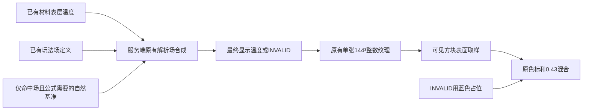

# 红外显示修复：蓝色缺值占位、材料表面与能量塔解析场

- Time: `2026-09-08 21:58:58 +08:00`
- Updated: `2026-09-13 17:22:12 +08:00`
- Author: `Codex; OpenAI GPT-6`
- Status: `superseded`
- Repair status: `display data implemented; rendering work superseded by the exact surface capture plan; strict edge acceptance still pending`
- Scope: `修复红外自然背景估计、恢复能量塔及原有解析场显示，统一单纹理合成、增量与可用性合同`
- Outcome: `自然背景路径已删除，材料与解析场数据合成已实施；当时58项Forge GameTest通过，但后续严格GPU边缘归属测试仍失败。2026-09-13渲染实施转入真实表面捕获plan；本页保留数据合同和历史依据，不再指挥渲染修复。`

> **渲染实施已转入：** [真实归属、紧凑编码与直接混合](2026-09-13_17-18-00_infrared-exact-surface-capture.md)。本文件保留已实现的材料/解析场/增量数据合同及调查历史；先前“不修改Embeddium顶点”和深度恢复归属的约束已被新方案替代，不再作为新代码实施指令。材料与网络本轮不重写；实际当前行为仍以docs和源码为准。

<a id="material-temperature-closure"></a>
<a id="block-surface-infrared"></a>

## 1. 用户要求与本次确定的结果

1. 删除全窗口自然温度估计：无材料且无解析场的表面使用原蓝色占位，不计算区域背景，不发送小背景表，不保留背景纹理。
2. 保留真实已有材料表层温度；恢复能量塔解析场的可见热区，不要求等待物理材料升到玩法保底温度才显示。
3. 圈内维持原`mix(originalRGB, heatColor, 0.43)`，保留贴图与地形细节；色标仍为-20..20°C、扫描半径64 blocks、扩张20 ticks、前沿3 blocks。没有数据不能露出原图形成斑洞。
4. 当前显示是“材料表面温度作为基础 + 既有玩法解析场显示修正”。没有解析修正的材料读数仍符合黑体近似；有修正的值称为`displayTemperature`，不能继续统称实测材料温度、真实辐射温度或全画面定量热像。
5. 显示读取不启动/扩张物理runtime、不加载区块、不修改H/C/T、不回写解析修正。实体/特殊BE/透明介质热成像、固体导热/热容与材料存档仍后续。

当前依据：源码为准；[世界温度](../docs/climate/world-climate-and-temperature.md)、[runtime](../docs/climate/thermal-runtime-architecture-and-optimization.md)、[生命周期](../docs/climate/data-lifecycle-and-integration.md)解释当前实现。`.Codex/memory/project-structure.md`和`architecture.md`当前不存在。

## 2. 已核实的不匹配与修复边界

| 问题 | 当前代码/证据 | 修复决定 |
|---|---|---|
| 缺数据被替换成自然背景，大面积蓝底变紫褐色 | `InfraredCapture.background`生成729值；shader缺材料查backgroundTexture | 整条背景路径删除，NO_DATA直接蓝色占位；不把所有真实低温强改蓝色 |
| 能量塔玩法0°C未进入红外 | `GeneratorData.publishGameplayHeat`仍发布FLOOR_FROM_NATURAL；当前IR不读`MinecraftGameplayFields` | 恢复服务端场显示合成；保留generator物理source及原玩法场 |
| 只在缺材料处补场仍会失败 | 冷材料可能存在，而generator只给玩法环境做保底 | 对有材料位置也执行原合成；不能让材料有效性遮掉解析保底 |
| 解析场生命周期独立于物理worker | `MinecraftGameplayFields.LEVELS`在runtime重启后仍存在 | 无runtime/材料publication invalid时继续合成场，不把场绑定物理presence或IR epoch |
| READABLE错误地成为全显示开关 | `updateData`遇不可读使baseline无效；shader `materialReadable`限制纹理采样 | 分开物理可读状态与最终显示基线；完整field-only快照也能提交和绘制 |
| 只看材料epoch无法发现开关塔/调范围/场叠加变化 | `QueryPublication`只追踪材料与拓扑，field index未参与 | 复用原客户端携带的field刷新Page位图，每poll重算当前/上次场范围；不新增每玩家服务端状态 |
| 仅材料presence清Page会误删场热色 | 当前客户端presence XOR直接`clearPage` | 改为服务端发最终display结果和显式INVALID；presence只用于材料基线，不再由客户端据此擦显示 |
| 场撤销后只写新范围会留下旧热色 | 仅当前场AABB不能表达刚缩小/删除的区域 | 刷新`previousFieldPages | currentFieldPages`，从原始材料重新合成，缺材料则INVALID |
| 材料先量化再加场会改变边界结果 | 当前`writeBrick`先量化节点为short | 场路径使用double原始材料值，合成后仅量化一次；无场快路径保持唯一节点一次量化 |
| 恢复原Air/dormant链路会把空气再涂到墙上 | HEAD中的旧IR基础值来自transport/dormant；当前已改surface mask | 只复用旧场枚举、Sample和必要自然查询优化，不整段恢复旧capture |
| 纯色最终RGB要求破坏原观感 | 用户实机截图；当前已恢复0.43混合 | 保留已恢复的混合；测试同温的混合前heatColor，不要求最终RGB相同 |
| 温度计/HUD与材料表面不是同一个量 | `WorldTemperature.block`走naturalBlock+玩法查询；旧IR场基准用naturalAir | 不能用任一工具显示0°C就断言墙必须实测0°C；场复原对照同位置原场公式，热材料仍可高于保底 |
| 移动渲染挂点改变后续层覆盖关系 | 用户要求后已恢复AFTER_LEVEL | 最终画面中的实体等也会被空间显示值染色，不代表体温；复杂几何边缘仍未通过GPU归属测试，进度见[材料主plan](2026-09-12_23-53-20_thermal-material-enthalpy-lifecycle-repair.md) |

后四项中，Air污染、近表面float舍入等已修复部分保留；FBO/透明层是否另有具体绘制错误尚无实测结论，不作为已发现的渲染bug。当前缺陷不是色标范围被改：0°C与-10°C本来就应得到不同的混合前热色。

## 3. 最小显示模型：一套结果、一张纹理

用`M`表示可读材料表层温度（°C，缺值为NaN），`F(p)`表示在**方块中心**p命中的有序解析场，`N(p)`表示仅公式需要时才取得的`WorldTemperature.naturalAir`。最终规则：

| 条件 | 发送值 |
|---|---|
| 无场，有有限M | quantize(M) |
| 无场，无M | INVALID；shader用MIN_TEMP产生蓝色占位，不发送-20伪测量值 |
| 有场 | 用原`ThermalAnalyticFieldIndex.Sample`合成，得到有限displayTemperature后quantize |

场路径伪代码：

```text
sample.clear()
按原排序将contains(blockCenter)的field include进sample
if !sample.present(): return finite(M) ? quantize(M) : INVALID
needNatural = sample.requiresNatural() || (!finite(M) && sample.requiresBase())
N = needNatural ? existingNaturalAirAtThisPosition() : 0
if needNatural && N不可取得: return finite(M) ? quantize(M) : INVALID
base = finite(M) ? M : N
return quantize(sample.compose(N, base))
```

蓝色占位绝不能作为`base=-20`输入场公式；例如N=-15、塔增温D=15时，空材料位置和M=-10的位置都应得到0°C，M=8则仍为8°C。若拿占位值当N，或直接把D=15当绝对温度，都会改变原玩法语义。

`GeneratorData.publishGameplayHeat`的真实规则是球形`FLOOR_FROM_NATURAL`：中心Y为`actualPos.y - masterYPosInMB + .5`，半径来自`getRadius()`，D来自`getTempMod()`，结果为`max(base, N+D)`。复用已发布field，不在IR重算燃料、猜塔中心、固定写0°C，或把塔改成OVERRIDE。两座塔重叠取原保底规则，不把增温相加两次。

复用`Sample`及索引原排序：combineMode、priority、key；模式顺序为FLOOR_FROM_NATURAL → OVERRIDE → MAX_HEAT → MIN_COOL → ADD_DELTA。保留已有SPHERE/CUBE/PILLAR与其他provider，避免只硬编码generator而再次丢失已有场功能。只在IR输出合成，不影响玩家/作物/城镇、source ledger或材料状态。



纯Air、Air休眠均温和phase不作为普通材料基础值；但有场区域的这些坐标可承载场合成结果，因为纹理是显示场，实际只着色本阶段可见terrain表面。无场时仍INVALID。

## 4. 删除自然背景：明确到字段和调用点

| 文件/位置 | 必须删除或调整 |
|---|---|
| `MinecraftThermalInput.InfraredCapture` | 删除`background(...)`、200-tick bucket、背景key比较、中心自然温度和81区块/729格背景扫描；position仅供场公式按需使用 |
| `InfraredSnapshot`与C2S/S2C | 删除`backgroundBucket/background`、`hasBackground/backgroundCenter`以及BACKGROUND flags；不保留空兼容字段 |
| `InfraredBrickCodec` | 删除BACKGROUND_VALUES/NO_BACKGROUND；保留INVALID/UNIFORM/INDEXED/RAW及palette=36早退 |
| `InfraredViewRenderer` | 删除backgroundMirror/Texture、hasBackground/Key、origin/bucket、install/invalidateBackground、上传和reset释放；保留材料镜像并明确其现在存最终display值 |
| `infrared_view.fsh` | 删除backgroundTexture/backgroundCameraOffset/hasBackground与fallback fetch；缺值直接MIN_TEMP占位 |
| `MinecraftEnvironmentCapture.peekNaturalTemperature` | 检查调用者；若仍仅供IR背景则删除新增方法，不动正常环境capture/cache |
| `FHClientEvents.onRecipesUpdated` | 删除背景专用失效调用，改为使显示请求基线失效、下一tick full；旧GPU可以保留到新提交，不为此清画面 |

每次实施前重新检查调用者。不能误删solver/player仍需要的自然温度缓存。原显示窗口9³ Page继续用于144³纹理地址，删除的是新增的**9³背景温度网格**，不是删除原窗口维度。

## 5. 服务端合成与增量：沿用旧机制，修正数据基础

### 5.1 复用和最少scratch

复用当前`InfraredCapture`、Builder、ReadCursor、surfaceNodeMask/firstSlot、原范围枚举、0.25°C、40-tick错峰poll和两次一致性读上限。无场窗口继续走当前材料Page/Brick epoch快路径。

从HEAD旧实现有选择地恢复`collectRefreshPages`、`clippedPage`、field/brickField复用列表、`Sample`以及按需自然查询辅助。不恢复旧Air采样、dormant所有权、lastPublication冒用新几何或整窗失败等待逻辑。

新增/恢复scratch仅限共享capture的`long[12] currentFieldPages`、工作位图、复用field列表、场路径double[64]节点/块scratch；需要按localPage定位时恢复一个`PagePublication[729]`借用表。无逐玩家服务端对象、历史环、场温度缓存、全尺寸第二镜像或生产统计器。每次尝试清空位图/表，finally释放borrowed publication/field/world引用；数组保留复用。

### 5.2 解析刷新区域

1. 在服务器主线程用`MinecraftGameplayFields.existing(level)`取得现有索引，不创建runtime或字段副本。
2. `collectIntersecting`只枚举与当前显示窗口方块中心范围相交的field，并保持原排序；AABB缩到Page，再用`intersects`筛选。Page内再筛Brick，最后`contains`判断块中心。相交只用于候选裁剪，不能把整个AABB都染热。
3. `currentFieldPages`是当前**几何场覆盖候选**，不是材料presence、非零温度或成功查到自然值的标记。范围仍在而邻区暂缺时必须继续保留候选，后续poll才能补齐。
4. full只使用当前范围；delta刷新`R = previousFieldPages | currentFieldPages`。每次poll主动重建R，故温度/优先级/位置/范围/增删/自然基准变化不依赖材料epoch，也不需要给所有provider增设revision。
5. 不在R内的Page只处理材料dirty/新增/消失。R内每Page只输出一次最终结果，不能先发一遍材料、再发一遍解析覆盖。

### 5.3 Page和Brick输出规则

- 先枚举当前coherent材料Page及`surfacePresence Pcur`，并与客户端`Pprev`对照。`Pcur`继续仅表示可读材料资格，场区域不伪装成物理Page。
- 完整重算Page集合为：R、Pcur/Pprev差异Page、full中的Pcur与当前场Page。其余Page按原材料Brick epoch输出。
- field Brick读每个唯一材料节点一次到double scratch，再展开块成员并合成；无field Brick复用原材料快路径。没有命中场的块绝不调用自然温度函数；有override使Sample不需要N/base时也跳过自然取值。
- **只在full允许省略INVALID**，因为full已预清整镜像。delta包括新增Page、旧场范围、材料消失/局部失效都发必要的显式INVALID；这允许删除客户端“presence变化就擦Page”的耦合，不新增CLEAR_PAGE wire模式。
- 对完整重算Page，64个Brick从最新材料/场重新生成；不存在者用INVALID记录。不是在上次合成温度上再加一次场，避免每poll累加升温。
- 若某Page读取失败或publication身份变动：rewind其记录，移除该Page材料presence，在同一请求中将整Page按**仅解析场/INVALID**重新生成；不丢掉其场，也不影响其他Page。
- 仍核对slot generation、minimumTopologyGeneration和cursor末尾version，不能新布局配旧温度。两次完整尝试仍无法得到一致物理cut时按下一节生成field-only full。

### 5.4 物理不可读与最终显示基线

`materialReadable`仅表示这次能否使用有效年龄≤40 ticks的物理cut。无runtime时为false，dimensionGeneration用0；这不妨碍获得完整可提交的field-only或全INVALID显示。

- full触发：用户开启/换中心/显式失效、generation变化、物理readable状态转换、物理tracking重激活、可读cut的epoch重置/反向、客户端无最终显示基线。
- 物理readable由true变false：返回field-only full，一次清除全部旧材料同时重建当前场。后续稳定false可继续delta，不因`!knownReadable`或epoch=0每poll重发full。
- false恢复true：full重建最新材料+当前场，禁止把field-only基线当成旧材料epoch继续拼接。
- 即使纯控制状态变化而无有效温度，也发送一个可提交的空full；客户端在LAST确认generation/readability/epoch，避免只显示控制却永不更新身份、不断收到同样控制。
- 同状态、无场R、无材料变化则无S2C。存在R时重算/发送R，**不承诺有场静止窗口零响应**；不为追求这项承诺新增逐玩家历史或温度副本。

## 6. 原自然公式需要的最低计算量

删除背景网格不等于删除`FLOOR_FROM_NATURAL`中的N。必须保持：

- 只有块中心实际命中field，且`Sample.requiresNatural()`，或无M而`requiresBase()`时才查询N。
- N使用原IR合成的`WorldTemperature.naturalAir`，不是带随机噪声的`air`、已叠场的`block`，也不是整段统一的Page中心估计。不能因工具显示值不同而悄悄改变IR公式。
- 读取只限已加载区块和有效世界高度；BiomeManager缩放采样可能取邻区，保留`hasBiomeNeighbors`必要可用性判断。在该Page第一次真正需要N时才准备最多9个邻区可用性值，并在该Page复用。无场/override-only不做这些检查。
- 保留此前已做的**精确**同生物群系Brick复用：确认相关3³ quart holder一致且所需邻区可用后，同一Brick按占用Y层最多算4次N；复用已展开后的节点scratch存这些值。混合biome退回命中位置的精确N。该检查本身有成本，不能把“不确定同biome”当同温。
- 缺少计算N必需的已加载数据时，保留M或INVALID；不加载区块、不拿中心估计替代。currentFieldPages不撤销，下一次poll自然恢复。已能确定结果的OVERRIDE不受不必要的自然读取阻塞。
- 复用现有dimension/biome与climate路径，不新增Page自然网格、后台遍历或每客户端缓存。

## 7. 包与客户端：一个最终显示事务

继续使用现有两个packet。建议目标记录合同（实际名称统一调整调用者，旧构造器不保留伪兼容）：

```text
C2S: requestId, forceFull,
     committedGeneration, committedCenter, materialEpoch,
     knownSurfacePresence[12], knownMaterialReadable,
     hasKnownFieldPages, [knownFieldPages[12]]
S2C: requestId, serverCenter, generation, materialEpoch,
     flags(FULL/FIRST/LAST/MATERIAL_READABLE),
     hasSurfacePresence, [surfacePresence[12]],
     hasFieldPages, [currentFieldPages[12]], brickRecords
```

- 删除原MATERIAL_UPDATE/独立背景控制分支：每份响应都是可提交的最终display事务，payload允许为空；MATERIAL_READABLE只描述原始物理数据可用性。
- C2S full省略旧field mask，因为旧中心不参与full；delta空mask编码一个false即可。S2C field mask每个part带相同的完整当前值，false明确表示全0，而不是“保留旧值”。presence仍可在delta未变时省略，full必须携带完整presence。
- 恢复的field mask最多96 B；不传场定义、不让shader每像素遍历field、不加新packet。保持每个**完整包**≤960 KiB及Page边界拆分；沿用现有2,048 B头部预留即可，更新注释和边界测试，无需为节省少量空间调整已验证的分包器。
- FIRST验证requestId/中心/generation；full清唯一CPU镜像，delta只应用显式Brick记录，不根据材料presence调用clearPage。旧GPU继续按已提交origin显示。
- LAST才提交generation、materialReadable、epoch、surfacePresence、currentFieldPages和origin，并执行full/dirty Page上传。中途绝不提交field mask，否则后续撤销范围会用未显示过的状态。
- `deltaBaselineValid`改为最终display基线是否完整；field-only全量也必须设true。单独保留上次提交的materialReadable供请求回显，shader不再用它禁用整个温度纹理。
- shader只按是否已有可用纹理及几何地址读取最终值；无纹理/INVALID显示蓝色占位。保留0.5 block后移上限及分离相机坐标；按19:45 GPU回归修正为沿重建法线内侧偏移，depth量化步长只用于误差估计。
- 请求超时、跨中心、取消/重新打开、旧request丢弃及41..59 tick full重试保留；只有等待完整显示full时重试，不能因materialReadable=false永久处于awaitingFull。
- recipe sync使显示基线请求失效，下一tick full；世界reset清field mask和请求状态并释放原GPU句柄，不再有背景资源。shader资源reload保留原overlay混合。

## 8. 复杂度、成本和明确排除的替代实现

| 路径 | 本方案成本 |
|---|---|
| 无场、无材料窗口 | 无自然采样；首次/失效full后稳定poll可无S2C；shader只查原纹理并蓝色占位 |
| 无场、材料稳定窗口 | 当前Page资格/epoch读取，未变不发S2C；材料一份镜像、一份GPU纹理 |
| 有场窗口 | Page/Brick候选裁剪后做命中块合成；原稳定40-tick周期，不每帧/每tick全窗求值 |
| 场缩小/删除 | 旧/新范围并集重建一次；旧范围之后从field mask消失 |
| 客户端 | 原144³ CPU/GPU各5,971,968 B、8 KiB部分上传scratch；删除背景CPU/GPU各1,458 B与背景取样，恢复一份96 B field mask |
| 服务端 | 一个共享capture scratch；无每玩家温度/field解释器，物理节点/边数不因显示改变 |

令R为前后场候选Page数、Br为相交Brick数、Fb为各Brick候选field数，场路径上界为Page遍历加`Σ(64*Fb)` contains/合成与必要N查询；不能把有场开销说成仅729个低频背景值。精确同biome复用降低自然公式调用，不消除边界判断与合成。

这不是声称“恢复解析场后所有场景更快”：与当前丢失场功能的实现相比，有场窗口增加的是用户要求的必要计算；无场窗口明确删除无用背景工作。与原解析场架构相比，复用原服务器合成机制，移除Air/dormant复杂性，保留已验证的裁剪/早退/精确复用。

暂不加入field revision/温度hash、服务器observer、场结果缓存、第二张全尺寸纹理、GPU field循环或新渲染后端。它们需要额外生命周期和失效合同，当前没有测量证明值得。若实际目标场景超预算，只针对已测热点优化；不以恢复功能为名升级架构。

## 9. 实施顺序与必须通过的验收

1. 先改server最终display合成和协议/客户端事务合同；删除背景路径，保留材料底座与蓝色占位。在这一阶段就用真实generator夹具验证塔内外输出，不能最后才补塔测试。
2. 将当前`ThermalInfraredGameTests`中“解析场不影响IR”“背景729值”的断言替换为本合同；保留材料/空气分离、局部Page、重启、网络分包及144种深度测试。不能以旧57通过当作新方案的证明。
3. 客户端实际验证原混合、蓝底、场内热色、关塔恢复及后续遮挡；然后计量真实目标负载。只做文档修复时不重跑编译/GameTest。

| 场景 | 可观察断言 |
|---|---|
| 无runtime/无场/无材料 | 满圆蓝色占位；没有背景采样/纹理/数据；不开物理runtime、不加载chunk |
| N=-15、真实generator D=15 | 场内缺M和M=-10均编码0°C；场外缺M为INVALID；场内M=8保留8°C；对照真实`publishGameplayHeat`的塔底中心与半径 |
| 场无变化、材料变温 | 未覆盖区域按原epoch增量；覆盖区域从新M合成；不是在旧display上重复加delta |
| 只变场，不变材料epoch | 启停、升降档、移动/缩半径、删除provider均更新；旧区域还原M或INVALID |
| 多场 | 同/不同priority、双塔保底、OVERRIDE/MAX_HEAT/MIN_COOL/ADD_DELTA按原排序；非球形边界不把AABB当真覆盖 |
| 先合成后量化 | 使用靠近0.125°C量化边界及小delta的double值，输出等于quantize(compose(rawM)) |
| Page失效/恢复 | 失效Page仍显示解析场；其他Page材料不丢；恢复时重新合成；没有场的失效格蓝色，无旧热色残留 |
| global invalid/超龄、runtime重启/无runtime | field-only快照能提交；同一不可读状态不每poll full；恢复/代次变更full；场独立生命周期保留 |
| 场删除与材料presence同时变化 | 最终记录一次性恢复，无client清Page误删场；空field mask清掉旧基线 |
| 真协议/客户端事务 | forceFull旧中心mask不参与；LAST才提交两个mask与origin；旧request不复活，partial接收中移动/关闭/recipe reload正确；无背景字段 |
| 编码与GPU地址 | XYZ非对称温度、负坐标、最高localBrick、RAW最大窗口和960 KiB全包边界；full省INVALID，delta显式INVALID |
| 原画面效果 | 同材质固定光照下验证0°C金黄、-10°C红褐、NO_DATA蓝底的混合前颜色与最终截图；0°C不能被当缺值。按原色标，真实-10°C本来不是纯蓝 |
| 实机几何 | 正/斜视、近/远、墙后热源、六面、第三人称、resize、原版/Embeddium及普通图形模式；实体/烟雾/手不读取terrain温度；透明专用热成像不纳入 |

Java17只运行`compileJava compileGameTestJava`与完整`runGameTestServer --offline --no-daemon --console=plain`，不写/跑JUnit，不恢复测试排除脚本。ForgeGradle离线联网预检若仍卡住，沿用已验证命令参数`-Dnet.minecraftforge.gradle.check.certs=false`，不修改项目配置。

性能验收须分别测：无场静止、真实塔r16/r24、多个重叠场、材料+场、移动/撤销、100次观察者请求；记录capture/必要自然查询/实际wire、客户端full/delta上传和GPU帧时。区分warmup、p50/p95和一次值，不复用此前“背景键命中且场被删除”的0.0266 ms作为新场合成基准。用既有测试夹具/外部JFR记录，不加生产计数、逐玩家缓存或复制checkout重编旧版本。

## 10. 实施结果（2026-09-12 19:25）

- 已按本合同实施：删除729自然背景值、background key与第二纹理，恢复原解析场合成；shader保留0.43混合、原色标和蓝色缺值占位。继续仅读取surfaceNodeMask材料基础，不恢复Air/dormant显示。
- 复用一个共享capture，新增一份localPage到handle的借用scratch和原场列表/位图/double scratch；无逐玩家服务端状态或第二套纹理。场并集刷新与显式INVALID统一最终display事务，materialReadable不再作为整张纹理显示开关。
- Java17 `compileJava compileGameTestJava`通过；完整`runGameTestServer`为58/58通过。包含真实GeneratorData发布的塔底球形场、无物理runtime显示、升温/缩小/删除、冷材料保底、局部Page/全局publication失效与field-only delta、0°C有效值、末端量化、分包/field mask往返及原144种深度数值用例。
- 100次同窗口GeneratorData（RLevel=2）delta请求：capture中位3.5303 ms、p95 8.3229 ms，合计3,971,100 S2C字节；100次full：中位3.4527 ms、p95 3.812 ms，3,754,500字节。营火+半径8场delta：中位0.2582 ms、p95 0.4022 ms。均为单机串行样本，不等于100实际在线玩家，也未与旧版本做受控GPU/堆对比。
- 客户端已启动本次构建，创建独立`Codex Infrared Repair`世界。进入场景后用户按Esc停止界面控制；停止继续操作，未把截图、蓝底/热区对照、图形模式或GPU耗时记为通过。日志仅确认红外shader资源加载。
- 三份living docs已同步最终display语义、独立场刷新、field-only事务及背景删除。日记见[本轮实现记录](../diary/2026-09-12_19-25-00_infrared-fields-blue-placeholder.md)。当前计划保持in-progress只因实机验收未完成；生产代码不再处于待实施状态。
### 追加：19:45实际GPU条纹回归

用户两张截图显示同平面黄蓝细条纹。离屏只画单平面即可复现，不需要重叠几何，因此确认原“depth两个量化步后移即可保证内侧”不足；传统双面Z-fighting不能解释该复现。理想点投影的144组测试没有包含真实光栅化，不能据此保证材料归属。

shader已改为在所有early return之前计算深度表面导数，沿内侧法线加`1/1024 + 4*length(depthNudged-surface)` block取样余量，保留0.5 block限制和原纹理/混合/解析逻辑。沿法线避免斜视时沿切线横跨相邻块；导数必须在非均匀分支之前求值，否则扫描边缘仍会出现错误。

新增`InfraredRasterValidation`，用项目现有LWJGL/JOML在隐藏OpenGL context中直接执行生产fragment shader，只替换最终输出为成功/缺值诊断色。6朝向×8距离×5俯角×3yaw×2 depth格式=1,440场景，RTX 4070 Laptop实测130,955,206个被分类像素、错误侧0、GL error=0。原单平面120场景方法出现3,943,910个错误侧像素。没有新增生产pass、vertex或GPU附件；这不是对所有自定义模型/驱动的完全证明。
### 23:12材料/相变状态复查

用户要求全面检查相变方块无材料温度的类似问题，结果见[材料与相变覆盖复查](2026-09-12_23-12-00_thermal-material-phase-coverage-review.md)。报告区分了状态缺口、空间聚合/迁移、覆盖/恢复与查询语义，共15类已确认行为及修复方向。本轮仅调查和纠正文档，不把当前红外修复扩大为已实施的完整材料模型，也不把phase阈值加入红外冒充材料温度。
## 历史记录说明

以下Outcome记录2026-09-12凌晨那一版已做的工作与局限；其中自然背景和移除解析场的决定已被上面的本轮修复替代，不是当前执行要求。旧开发记录保持原样。

## 本阶段 Outcome（2026-09-12）

- 生产接线已完成：共享surfaceNodeMask、material-only firstSlot、仅材料量化变化、Air-only恢复过滤、局部surfacePresence、generation/full/delta、独立自然背景、既有后处理内侧取样。旧红外analytic/dormant合成及客户端所有权缓存已移除。
- Java17生产及GameTest编译通过；完整57项Forge GameTest全部通过，未排除测试类、未运行JUnit。新增深度夹具144种六面/距离/斜视/世界原点组合通过，最大后移0.01562342 block，且修复了原计算在1 block反向平面上的float舍入问题。
- 真实营火场景100次同窗口稳定增量请求：capture中位0.0266 ms、p95 0.046 ms、0响应/0 S2C字节。100次full（背景键已命中）：中位0.0387 ms、p95 0.1676 ms、合计24,400 S2C字节。只是本机同一场景的串行请求样本，不是100实际玩家、更不是受控CPU/GPU前后性能证明。
- **用户实机截图判定纯热色效果失败。** 原纯色覆盖抹掉了地形贴图和层次，已恢复原`mix(originalRGB, heatColor, 0.43)`。完整圆形覆盖与材料优先/自然背景取值保留。恢复原观感优先于旧“最终RGB同温同色”条目；该条目已统一撤回。
- `processResources`通过，修正版shader已进入运行资源目录，可用F3+T重载。客户端界面控制被用户Esc终止，未继续操作其世界；不能声称修正版画面、实体/粒子遮挡、图形模式或GPU耗时已验收。
- 剩余当前验收：修正版实机画面、原版/Embeddium图形模式与resize/第三人称、实际分包提交画面、目标负载的受控GPU/分配对比。实现不再扩大到新渲染后端或后续材料系统。
- Living docs已同步：[世界温度](../docs/climate/world-climate-and-temperature.md)、[runtime](../docs/climate/thermal-runtime-architecture-and-optimization.md)、[网络生命周期](../docs/climate/data-lifecycle-and-integration.md)。开发记录见[本轮日记](../diary/2026-09-12_00-08-00_surface-infrared-implementation.md)。
<a id="deferred-thermal-work"></a>

## 后续材料修复与其他延期事项

最新材料计划已按用户澄清统一为同一能量/换热模型，物质通过C和H→T关系区分；楼梯等气隙不再独立储热；本体一份H、实际Air区域共享状态，气隙只生成路线与阻力。已撤回逐楼梯双节点/128槽要求；共享区域和稀疏路线的近似及重建成本见该计划第3、12节。

- Status: `material repair planned separately; other extensions deferred`
- 用户已要求制定材料基础修复方案：材料温度计、固体导热/热容、相变状态及材料持久化现在转入[2026-09-12_23-53-20_thermal-material-enthalpy-lifecycle-repair.md](2026-09-12_23-53-20_thermal-material-enthalpy-lifecycle-repair.md)，尚未实施；不再只以“以后再做”概括。其余人体/作物生理、实体/特殊BE/透明热成像仍延期，不能据此扩大普通红外补丁。原完整A–G安排不恢复。

| 后续事项 | 已知缺口 / 后续要解决的事 |
|---|---|
| 材料温度计 | 已转入材料基础计划P5：SoilThermometer改材料查询；环境HUD保持其空气/玩法语义，尚未实施 |
| 固体导热与热容 | 已转入材料基础计划P1/P2/P4：固定C、逐块M、固体连接与有界前沿，尚未实施 |
| 材料余热保存恢复 | 红外补丁仅修过Air恢复过滤；独立材料记录及物体身份/交接已转入材料基础计划P3/P4，尚未实施 |
| 作物根部温度 | 以后区分根部土壤与地上环境及解析场玩法，验证普通/双高/水生/附着植物；不在本阶段改变生长或生存阈值 |
| 玩家/物品的材料长波 | 以后单独评估可见表面采样、冷壁效应、热源重复计算与接收者预算。14/6方向方案只是候选，不在当前tick路径增加射线或sample字段 |
| 实体与衣物热成像 | 以后确定皮肤/毛皮/衣物外表模型、tracking和初次同步；当前不发实体温度包、不改身体模型、不维护实体热表 |
| BlockEntity、自定义模型、掉落/放置热容物品显示 | 以后接入已有surface状态及其独立绘制时序；当前不重画模型或扩展所有BlockEntity渲染器 |
| 透明材质与流体热成像 | 以后定义玻璃、水、熔岩在热波段的表面与遮挡，再选择必要时序；当前不将玻璃强制变热不透明 |
| 火焰/机器的有效发射模型 | 以后明确温度、功率、有效面积与发射率的关系；当前不从W反推温度或新增profile协议 |
| 相变表面状态 | 已转入材料基础计划P1/P2/P3/P5：单H相图、逐块phase与实际温度显示；不直接使用旧固定阈值冒充温度 |
| 精确几何归属与真实shaderpack适配 | 仅当后续需求确实超过depth取样能力时再选方案。专用热表面pass、owner字段、Embeddium顶点扩展均撤回为未选定候选，不安排“以后必做”的改造 |
| 显示与辐射模型扩展 | 高温色标、定量图例、分材质发射率、金属反射、空气吸收、光谱响应、准星测温以后讨论。已有材料取值、原热色叠加、蓝色缺值覆盖及既有解析场显示属于当前修复阶段 |

前几轮关于顶点布局、完整材料闭环的调查结论保留在既有日记中作为历史参考；不将那些日记的Remaining列表当作最新排期。文末是此前已实施工作的原始记录，不因收缩当前计划而删除或重写。

## 先前方案与实施记录

以下内容为2026-09-08至2026-09-09采用的方案与实施记录。其已通过的测试不证明上述新材料闭环已经完成。

## 确定范围

保留 16³ Page、4³ Brick、稀疏驻留、source ledger、解析场与现有求解器。删除单个方块内部的微格分割、微格体积计算、精细空隙与面片列表。每个方块用数值通风率 V 表达通透程度：0 不通风、100 为普通空气参考、未知方块兜底 75。楼梯等部分形状首版同样近似为 75。缺失或未加载状态仍不可用，不能当作未知方块。

保留暴露面积：从方块六个外表面与可通风邻块的接触统计，不再统计内部微格表面。普通材料沿用 `surfaceCapacityJPerK * exposedArea`，不是统一乘 6；通风率不作为体积或容量倍率。不维护方块内部两套空气／实体温度。无暴露材料容量的通风节点使用已有空气参考容量，以保持孤立通风位置可接收 source；有暴露材料容量时使用该材料容量，不叠加内部空气容量。此处只使用一个有效节点和温度。

已知完整实体和 T1/T2 为 V0。门／活板门关闭 0、打开 100；流体整块阻挡优先。有效相变配方保留 reservoir、潜热和 ACK 流程。保留既有材料分类；未知动态形状进入普通材料分类，不能令整个 Brick 编译失败。不顺带改变含水材料分类或增加地热。

## 实施

1. 启动期编译数值通风率及材料 profile；静态形状只判 empty/full/partial，动态形状不作世界查询。删除生产微格几何表。
2. `BlockBrickLayout` 保存 `byte[64] blockToNode` 与 `long[K] nodeBlockMasks`。仅合并相连的无材料 V100 方块；完整空气 Brick 仍只有一个节点且不分配混合布局。V75 和带材料的通风方块各自保留节点；V0 材料仅在暴露时建立节点。节点顺序为 transport、材料、phase。
3. 内部只遍历 144 个正向方块面，跨 Brick 对齐 16 对方块；完整空气双方直接编译一个面积 16 的连接。无向面由负坐标侧持有，包括材料／phase-only Brick。删除持久面片联系和重复材料坐标目录。
4. 通风交换使用 `G=K*A/(dL/pL+dR/pR)`，`p=V/100`，到面的中心距离至少 0.5。材料与 transport 用现有材料面导热参数。天空沿用既有资格及风系数，编译时乘 p；不为缺失邻区制造额外散热边界。保持指数交换内核。
5. 容量与暴露面积相关，因此边界变化可能使相邻材料节点容量变化，必须在最终签名／驻留 cut 上收集布局依赖；以暴露面数变化判断，而不只检查材料是否首次暴露。不递归扩散布局依赖。连接重编使用 `cellsResolved && compiled.resolved()`，resolved 翻转标记 source 重绑。
6. source、环境查询和红外按整块定位唯一 transport 节点。V75 接收完整端口功率，阻力只作用于后续交换。arena 中心从块成员 mask 求出，不增加 XYZ 中心数组。
7. 在线迁移最多扫描 64 块，以旧节点容量份额承接旧焓；相同材料改变暴露面积／门状态保留焓，再由新容量得温度。真正替换材料按自然温度初始化。phase 单独延续请求身份和焓。保留结算、staging、commit、重绑、释放旧 span 的顺序及预算。
8. 休眠直接采用唯一新格式：Brick 均值，加可选整块成员 mask／温度残差；数值载荷上限 640 字节，精确项全部装得下才保存，否则均值。均值按同一已发布布局的完整方块数量加权，不为休眠另外发布每节点容量，也不读取更新后的世界状态。恢复按空间温度聚合到新节点，不宣称离线能量守恒。无旧存档兼容层。
9. 保留主线程变更中心读取；同 Brick 的就绪中心合并后一次编码。替换 sparse face 查询的旧 face-port 循环，保留迟滞、天空排除与驻留预算。

## 验证与结果

只编译生产／GameTest，并运行真实 Forge GameTest；不写或运行 JUnit。验证空气快路径、未知75、楼梯、门、材料暴露面积及焓迁移、跨 Brick/Page、相变、generator source 与解析保底、休眠格式和生命周期。性能结论依据实际节点／边数和生产运行，不能仅凭布局载荷公式宣称全场景最优。

本文件集中记录进度和最终结果，不为每次澄清新建 Markdown。

2026-09-09 00:58 完成：生产编译通过，最终 **35 项真实 Forge GameTest 全部通过**。命令为 Java 17 下的 `./gradlew.bat runGameTestServer --offline --no-daemon --console=plain`；输出见 `run-gametest/block-model-verification.log`，服务端日志见 `run-gametest/logs/latest.log`。

- 实际世界捕获验证 75/75、75/100 和跨 Page 面连接；跨 Page 开洞使材料暴露热容从 900 变为 1800，迁移与内部交换保持总焓；两个完整空气 Brick 仍为两个节点、一个连接。
- 楼梯与未知动态方块能接收真实篝火 source，各自保留通风阻力；两处同时改为空气后正确合并，经过实际 mutation/capture/worker/publication 路径。
- 新休眠格式的生产样本为 48 个数值字节、4 个位置 mask，通过 NBT 往返；640 字节预算包含 mask 和按 long 打包后的残差。此验证不等同于服务器进程重启的专项测试。
- 塔体与排气口同 Brick：密闭物理温度约 29.86°C，高于约 25.10°C 的解析下限。露天塔物理温度约 -10.59°C，最终由解析场保底到 19.5°C。修正了旧测试把露天排气口放进天然深板岩的布置，现明确要求空气与可见天空。
- 待加载篝火“不实例化 BlockEntity”的断言移至生产 `discoverChunk` 返回时检查，再验证后续正常 ticking 仍保持 source；不再把延后 40 tick 的实体生命周期行为归因于发现函数。
- 生产热模型已移除旧微格几何、体积和面片调用。增量中心线性扫描，同 Brick 一次编码；未新增每 Page 的可变 Brick 缓存或新的调度系统。

范围与限制：未写或运行 JUnit，也未迁移 `src/test` 中引用已删除几何接口的旧 JUnit，因此本次通过的构建目标是生产／GameTest，不是包含旧 JUnit 的默认 `build`。尚无全服分配量、retained heap 和同场景前后耗时基准，不能把结构缩减称为已测得的全场景最优性能。已有 runtime 架构文档同步更新，按用户要求不新增开发日记。

## 实现复查（2026-09-09）

状态：完成；下列问题已由当前调用链确认并修复，真实 Forge GameTest 已重新通过。

- 删除无人调用的 `PrimitiveTopologyScratch.OwnerLongInt`、`ThermalCellArena.isMixedComponent` 与新布局未使用的 `nodeCount`。
- mixed transport 节点按序连续分配，节点编号等于 `slot - supportRef`；删除 arena 的重复 `int[] mixedComponentIds`。
- 相变迁移已经限定同 Page 生命周期、同 Brick，只需 slot 列表和 arena 内的 profile；删除 worker 相变目录的重复坐标、profile 数组及包装对象。
- 相邻 Brick 自身签名未变时，暴露面积只可能在外边界变化；仅比较这些面的净变化，保留角点多面增减抵消的正确性。跨 Brick 连接每个邻区只取一次 Page/cut，天空面直接使用 owner cut。
- 不新增缓存层或调度；通风率、暴露热容、相变 ACK、物理 source 和解析场语义保持现有约定。

首轮验证：生产／GameTest 编译通过，35 项中 34 项通过。容量恢复测试失败：测试以 `highWaterMark + 1` 假定仅余一槽，但 `allocateSlot` 优先复用 free list。修正真实世界测试布置，在第一个火源已登记后限制增长，并用实际有燃料的篝火占满回收槽；保留第二个火源被拒绝、chunk 排队、移除第一个后恢复的全部断言。未修改生产 source 分配器。

2026-09-09 01:12 最终结果：同一 Java 17 / `runGameTestServer --offline --no-daemon --console=plain` 命令 **35 项全部通过**，`BUILD SUCCESSFUL`；最终证据见 `run-gametest/block-model-review-final.log`，首轮失败保留在 `run-gametest/block-model-review.log`。`git diff --check` 通过，生产／GameTest 无已删符号调用。

可确定的代价改善：arena 少一条按容量分配的 `int[]`，数值载荷减少 `4 * arena容量槽位数` 字节，同时省去初始化、扩容复制和清理；每个含相变 Brick 少四个重复 int 数组及目录包装对象。邻 Brick 检查的外部位置比较上限由 64×6 降为 6×16（材料过滤和首次差异退出仍有效），跨面不再对 16 对方块重复解析同一邻 Page。此为代码路径与载荷核算，不是服务器耗时或 retained heap 实测。更新已有 runtime 架构文档；未新增文档文件、JUnit、缓存层或调度系统。

## 红外解析场接入：按需生成显示 Page/Brick（2026-09-09）

作者：Codex / OpenAI GPT-6。状态：**用户已授权实施，明确批准96字节通用显示Page刷新标记及最小分包方案；代码修复与限定范围的真实Forge验证完成**。新增机制仍需先说明必要性与代价，由用户判断。

### 已确定的边界

- 服务端负责最终温度计算；客户端只知道显示位置、有效性和温度，沿用解码、纹理上传及配色，不执行解析场或自然温度公式。
- 以显示 Page/Brick 为按需查询、更新和编码单位。这里的“激活”指产生/更新所需显示数据，不是创建物理模拟 Page、arena 节点、worker 或驻留请求，也不是给每个 Brick 新建一个解析器对象。
- 原有 9³=729 个 section 地址是固定显示窗口，原有纹理为 144³；本方案复用这些地址，不要求分配729个热模拟 Page，也不把现有固定纹理说成已经实现的稀疏客户端系统。
- **撤回把解析场纳入休眠覆盖系统的方案**。休眠仅在需要时提供已有温度记录；解析场的有效性、更新和退出不得借用休眠保存、衰减或覆盖所有权。不存在“解析场休眠 Page”这一新类别。
- generator 的 FLOOR_FROM_NATURAL 与 Boss 场一起接入服务端最终合成。自然温度只在服务端按需读取既有计算结果，不新增客户端自然温度同步，不延期 generator 保底显示。

### 复用原有温度链路

1. 沿用每40 tick错峰请求及窗口移动时的full刷新。服务端在显示范围内确定需要输出的Page/Brick，按需读取原始温度并合成；不每tick遍历整个144³方块窗口。
2. Page只做显示组织地址。一次定位已有publication，再按Brick读取各唯一transport节点，用现有成员布局展开到方块；不对64个点重复查Page或重复读取同一节点。
3. 解析场定义仍在现有ThermalAnalyticFieldIndex集中保存。对本次显示Brick筛选相交场，再对必要的位置计算；不创建每Brick解析器、场副本或独立客户端场通道。
4. 取温遵守现有可用性规则：有有效物理温度则读取；需要时取已有休眠背景。命中解析场但基础温度不可用时，服务端按该场规则读取自然温度。按现有mode/priority/key顺序合成，最后量化；无场位置保持原红外行为。
5. 无驻留物理Page时，仍能按显示地址直接生成解析场温度。只访问已加载世界数据，不为显示加载区块或启动热模拟。没有active runtime不能成为丢弃全部解析场显示的条件。
6. 每个输出Brick只发送最终温度。复用InfraredBrickCodec的INVALID、UNIFORM、INDEXED、RAW，不先传原始温度再追加同位置的场覆盖层。只有最终64个值确实一致时才用UNIFORM；物理Brick是纯空气不代表跨场边界后的显示温度也一致。
7. 客户端继续写同一温度镜像、按变化Page上传原有R16I纹理、由现有shader取温配色。没有第二张温度纹理、第二份全尺寸镜像或客户端场解释器。合成结果不回写query、arena或休眠存档。

### 显示更新必须解决的问题

这些是正确性要求，不能靠借用休眠生命周期掩盖：
- 物理温度变化、当前解析场新增/改变、场移动/缩小/消失都可能改变最终显示值。场内自然基准变化也必须在后续红外刷新中体现。
- 旧范围退出解析场后，输出该点现在的基础温度；没有可用结果则发送原有INVALID。整个显示Page无数据时才移除其显示存在信息；同Page内只退出一部分Brick不能依靠删除整个Page处理。
- 原worker infraredEpoch只反映物理发布，不能直接当作最终显示版本；原knownPresence只有Page存在位，不能凭空推导上次场覆盖的精确Brick。
- 若复用现有presence/变化标记，需要先核对所有读写方与全量、增量、物理不可读、休眠显示清理的关系，防止更新遗漏或误删。客户端显示有效性不应等同于worker驻留有效性。
- **显示变化记录已获用户明确批准**：客户端保存/回传12个long（96字节）的knownRefreshPages，响应给出refreshPages。服务端重建旧标记Page与当前场相交Page的并集，每Page输出64个Brick的最终结果；场退出后，新标记不再包含该Page。没有逐Brick场mask、场定义或服务器逐玩家记录。代价是相关Page中未变的Brick也可能重发；完整请求不传旧标记。

### 新增项的约束

| 项目 | 当前决定 | 理由 |
|---|---|---|
| 用休眠覆盖mask或BACKGROUND记录管理解析场 | 撤回 | 混合了温度来源与显示生命周期，增加语义耦合 |
| 独立解析场客户端协议、场参数、自然温度同步 | 不采用 | 客户端只需最终温度，原Brick载荷可以表达 |
| 每Brick解析器/场副本 | 不采用 | 按需调用现有集中场定义即可，不需要大量对象 |
| 通用显示Page刷新标记 | 用户明确批准96字节方案 | 精确定位需重建的Page，保留纯物理Page原增量；不加服务器逐玩家缓存 |
| 独立MinecraftInfraredFields服务或编码器 | 不默认保留 | 优先在原红外组包与Brick取温边界接入；拆分须说明实际必要性 |
| Page边界分包 | r128实测超限后已获用户明确批准并实现 | 原标志字节编码FULL/FIRST/LAST，客户端只增加一个接收中布尔量；不加场通道或第二份温度镜像 |

### 性能目标与验证

保留未受解析场影响区域的原有快路径，把额外逐点计算限定到需要更新的显示Brick。设B为本次要重新生成的Brick数，F_b为各Brick的相交场数量，逐点合成上界约为64×ΣF_b；Page查找与唯一节点读取不能重复嵌套进每点的场遍历。需要恢复的旧范围如何确定，其时间和内存成本必须计入，不能只报合成函数的成本。

原uniform/indexed/raw压缩与每变化Page 8192字节的GPU上传继续复用。减少服务器读取、压缩字节和客户端上传是不同指标，不能用“少一个数组”代替整体成本判断，也不声称在未实测时已经达到绝对最优。

用户允许动代码后：
1. 先列明此前未完成尝试中需要保留/撤回的具体变更；按新方案处理，不整仓回退，不动此前已验证的方块级热模型。
2. 核对显示更新的必要状态并取得所需决定，再接入原红外Page/Brick取温与唯一最终记录输出。
3. 真实Forge GameTest覆盖generator保底、物理温度超过保底、Boss形状/叠加、同Page移动/缩小/删除、休眠仅作数据来源、无runtime且零新增热学Page、负坐标/跨Page、编码往返与最大支持载荷；不写或运行JUnit。
4. 真实客户端验证无残影、窗口变化、开关红外、世界退出；测r16/r24、大场、移动Boss和多观察者的组包耗时、读取/合成点数、字节、上传及帧时间。编译前确认共用输出目录的runClient已退出。
5. 实施完成后更新原runtime文档及本plan，分别记录编译、GameTest和客户端验证结果，不互相替代。

### 当前代码状态

已撤回独立MinecraftInfraredFields、逐Brick field mask、分段响应及BACKGROUND记录标记。原红外捕获代码与缓冲移入MinecraftThermalInput.InfraredCapture，按服务器主线程请求复用一份，物理runtime可选；没有第二条场显示通道。真实休眠背景仍沿用其原记录，在每Page的普通最终温度记录之后输出，只保留真实休眠Brick的所有权。物理读取临时失效时回退该Page的未提交字节并保留刷新标记，下次重试；不把原来的热区误清成自然温度。

生产编译已通过一次；后续小修复、真实GameTest与实际payload测量仍在进行。此前35项通过的结果不代表新增红外接入已经验证。客户端仍使用同一温度镜像和纹理，没有解析场业务或自然温度同步。

### 2026-09-09 18:09 真实测试结果

- 先前38项运行37项通过；远处篝火fixture等待期间缺少区块保留ticket，物理温度为NaN。为该真实测试保持目标Chunk加载后，原升温、200°C场覆盖、同Page移走后恢复实际物理温度的断言均通过；未改生产热源或放宽断言。
- 用户已注释掉落物生产接口调用并要求暂不处理该功能，但其旧GameTest类仍引用缺失接口。本轮用临时Gradle init脚本仅排除FrostedHeartMinecraftThermalInputGameTests整个类，因此实际执行24项，不能声称是完整套件；其中新增4项红外测试均运行。
- 检测到runClient运行，本轮命令显式跳过compileJava/processResources/createMcpToSrg/createSrgToMcp，复用现有生产产物，只编译GameTest。日志：run-gametest/infrared-page-verification-4.log；临时范围脚本：run-gametest/infrared-test-scope.gradle。
- **23/24通过**。generator r16实际响应17276字节、单次6.21ms；r24为41602字节、单次18.35ms；Boss组合为2762字节、单次1.73ms；恢复篝火实际物理温度为324字节、单次0.18ms。这里只记录此次生产运行观察，不作为稳定性能分位或全场景最优结论。
- 唯一失败为largeGeneratorFieldFitsTheProductionDisplayPayload：真实GeneratorData设RLevel=15（r128）、TLevel=3，中心y240，加载11×11 Chunk。当前编码写到983035字节，下一次写8字节超过现有983040字节上限。未扩大限制、未截断或跳过该测试。大范围解析场的完整显示尚未完成。

当时提出的分包扩展随后获得用户明确批准。最终实现进一步省掉独立顺序号，使用TCP顺序、原requestId、原标志字节中的首包/尾包位，以及客户端一个接收中布尔量。下方记录最终修复与验证；运行中的客户端仍不得与生产重编译共用输出目录。

### 2026-09-09 19:11 审查修复结果

- 请求结束时清除InfraredCapture借用的Page handles与InfraredReadCursor引用，保留可复用数组，避免静态scratch延迟释放已退休Page和查询缓冲。
- 完整刷新若有Page未能读取完整物理数据，返回无响应并沿用现有full重试；不会发送一个先清空客户端、却缺少该Page内容的full响应。普通增量继续用Page回退与刷新标记重试。
- 未受场影响的无数据/普通空气Brick直接写INVALID/UNIFORM，不再展开64个相同值、重复量化和扫描字典。
- Builder在Page开始前预留最大完整Page记录空间，只在Page边界拆分，每包仍不超过960 KiB。服务端完整捕获后才发送已编码parts；客户端只在LAST提交纹理、窗口原点和增量基线，中断走full恢复。没有增加持久温度镜像或观察者缓存。
- 自然温度仅对需要的位置计算；证明原生BiomeManager可能选择的3³ quart采样具有同一biome后，复用已有节点scratch保存Brick四个高度的温度。混合biome保持逐点原函数。没有近似取样或长期缓存。进一步的整页复用尝试未证明明确收益，已撤回，最终未保留额外分支。
- 测试还复现了已有BlockRadiationIndex熔岩侧面检查的双轴跨区段越界：x/z边界邻块上方使局部y=16。修正为实际对角区段和三轴局部坐标；普通单邻面继续原缓存，没有新增对角缓存。

最终命令：Java17下运行runGameTestServer，使用run-gametest/infrared-test-scope.gradle临时排除含未接通掉落物接口的FrostedHeartMinecraftThermalInputGameTests类。**26项真实Forge GameTest全部通过，BUILD SUCCESSFUL，git diff --check通过**。日志：run-gametest/infrared-review-fixes-final.log。未写/运行JUnit，未修改用户暂时停用的掉落物调用。

覆盖包括：借用引用释放、物理读取关闭时full响应不提交、真实篝火热温度恢复、generator/Boss移动删除与合成、混合biome逐块对照原自然温度、熔岩X/Y及Z/Y跨边界、r128多包完整解码和请求/响应wire往返。

最终r128载荷1104489字节，2包；同场景首采集413.99ms、两次连续采集308.90/305.75ms。此次r16为12.57ms、r24为14.72ms。各轮受JIT和测试执行环境影响，不能挑选最快单次数字宣称固定加速比例；满窗口重算仍存在明显CPU峰值。上述数据是服务器组包观测，不是客户端FPS。客户端实际图像与分包帧提交尚未现场验证；本次通过的是明确列出的限定测试范围，不是完整测试套件。

### 2026-09-09 分包重试与编码扫描修复

作者：Codex。状态：已实现，生产编译与限定范围真实Forge测试通过；客户端慢网实测待完成。

- 服务端一次性发送同一响应的所有分包，TCP保持顺序；客户端沿用receivingResponse暂停接收期间的定时重试，避免旧请求时间达到41–59 tick就丢弃仍在接收的响应。等待首包仍重试，窗口移动仍立即发full。无需新增计时器或状态。
- Brick出现第36个不同温度后停止调色板扫描，复用已有RAW分支。此时INDEXED至少130字节，RAW129字节（均不计共享地址），继续扫描不会改变选择；不改协议或新增缓存。
- 验证沿用限定范围真实Forge GameTest及生产编译；专用服务器测试不覆盖客户端慢网接收时序，不将其报告为已实测。
- 结果：27项全部通过，BUILD SUCCESSFUL；日志run-gametest/infrared-retry-codec-verification.log。沿用临时init脚本排除含未接通掉落物接口的旧测试类，未写或运行JUnit。r128仍为1104489字节、2包；本轮采集442.74/435.89/288.53ms，不据此宣称整体固定加速。无新增生产状态、缓存或协议字段。

### 2026-09-09 全窗口上传与物理节点展开最小修复

作者：Codex。状态：已实现，生产编译及限定范围27项真实Forge测试通过；客户端OpenGL实测待完成。

- 在原dirtyUploadPages扫描中计数；729个有效显示Page全部变脏时，复用uploadFullTemperatureTexture，省去逐页复制与729次上传。部分更新保持原路径，尾包提交时机不变，不增加持久状态或缓冲。
- 普通物理混合Brick按transportNodeCount读取及量化节点，再通过blockLayout.transportAt直接展开。保留原infraredCursor与结束时一致性检查，不调用会重新取得cut的copyRawBrick。删除infraredUniqueSlots；原short温度scratch改为按节点编号索引，净减少256字节数组载荷。
- 沿用真实Forge GameTest验证物理取温、场退出与协议往返；客户端OpenGL调用/FPS只能由实际客户端验证，不把专用服务器结果当成客户端实测。
- 结果：run-gametest/infrared-upload-node-verification.log记录27项全部通过、BUILD SUCCESSFUL。现有篝火测试增加移除全部场后的普通物理混合Brick检查：热空气、同Brick石块INVALID、协议往返均通过。沿用原范围脚本排除未接通掉落物接口的旧测试类，未运行JUnit。删除已无调用者的纹理创建包装方法，混合Brick逐块完整赋值后省去预填循环；git diff --check通过。

### 2026-09-09 世界温度生命周期修复

作者：Codex。状态：已完成；Java17生产编译与限定范围29项真实Forge测试通过。

- 温度配方表重建后调用现有WorldTemperature.clear；空配方集合也重建空表，避免保留已删除配置。空气/方块公式与海拔曲线不改。
- 自然边界刷新完成后以实际gameTick加200安排下一次，保留原初始错峰与16项预算，不追赶历史采样。
- 有效机器输出按需启动现有runtime；篝火使用区块加载及已有LevelChunk mixin的首次点燃回调。启动/重载时只检查已加载区块的BlockEntity位置，找到有效篝火即复用原启动及发现队列。不增加tick轮询、持久缓存或新调度器；解析场/被动查询不主动启动物理runtime。
- 同步现有世界温度、runtime与生命周期文档，删除过时的子方块空气、continuation和红外描述。真实测试覆盖配方重建、无人热源启动/重载及过期自然刷新；不写或运行JUnit。
- 最终结果：run-gametest/world-temperature-lifecycle-final.log，29项全部通过，BUILD SUCCESSFUL；仍由临时范围脚本排除含未接通掉落物接口的旧测试类。真实T1/T2、喷泉、散热器改为由生产tick启动及恢复；篝火覆盖点燃、已加载世界重载及待恢复NBT的区块加载入口。温度表测试覆盖原生配方重建和空配方移除；积压测试使用实际source Page的生产队列。git diff --check通过。
- 没有新增长期缓存、定时轮询或独立服务。有效热源现在能让无人维度运行原有物理引擎，其必要驻留与计算是新增的实际工作；冷启动/重载检查只遍历已加载BE位置，不加载chunk。海拔数值曲线和旧城镇模拟器applyHeat保留。

### 2026-09-09 tags绑定与集成服务器同步时序

作者：Codex。状态：已完成；生产编译与限定范围30项真实Forge测试通过，集成客户端并发实机验证待完成。

- 配方监听器只关闭物理runtime并使profiles失效；恢复已有篝火移至现有Forge TagsUpdatedEvent的SERVER_DATA_LOAD阶段，避免按旧tags冻结材料/辐射表。初始启动仍沿用ServerStartedEvent；不增加待办标记、缓存或调度器。
- FHClientEvents.onRecipesUpdated在集成服务器连接中复用服务端已重建静态表，不再从客户端线程重复buildRecipeLists/清理温度缓存。远程客户端继续正常重建。不给取温热路径加锁。
- 真实Forge测试增加完整MinecraftServer.reloadResources调用及实际临时tag数据包，核对重载后的runtime使用新材料分类；专用服务器不能验证集成客户端线程，单独记录限制。
- 结果：run-gametest/world-temperature-tags-verification.log，30项全部通过，BUILD SUCCESSFUL。实际临时数据包将stone加入wool tag，完整重载后自动恢复的runtime采用新材料分类；移除并再次完整重载恢复原分类。原篝火恢复测试也改走完整reloadResources。测试数据包已清理，git diff --check通过。未写或运行JUnit，仍排除含未接通掉落物接口的旧测试类。
- 生产修复只移动启动时机并恢复客户端现有单人游戏条件，不新增持久状态、缓存、锁或调度器。已同步现有runtime、生命周期及热源文档；先前29项结果不覆盖完整tag重载，此轮验证补齐该范围。

### 2026-09-10 篝火启动回调收敛与此前改动检查

作者：Codex。状态：已完成；生产编译与完整53项真实Forge GameTest通过。

- 删除LevelChunk.setBlockState上的篝火启动注入及其专用imports。复用既有CampfireBlockMixin_TimeLimit，覆盖继承的onPlace并保留super调用，仅处理篝火未点燃到点燃的变化。普通方块写入不再执行篝火判断。
- onPlace在BlockEntity创建前运行时，只启动/挂接原runtime和排队；原有稍后发现流程读取完整BE位置。已点燃篝火的加载、tags重载恢复沿用现有入口，不恢复cookTick轮询。
- 检查此前提交7e1e8c715中新增/修改的全局事件、tick与请求路径，寻找同类局部功能扩大到无关高频路径或重复工作的问题；不顺带实施材料温度计划。
- 使用真实Forge游戏世界验证新放置、已有篝火点燃及Forge暂存方块修改的提交/取消。全量GameTest，不写/运行JUnit。
- 结果：run-gametest/campfire-local-callback-verification.log，53项全部通过，BUILD SUCCESSFUL。新增真实打火石使用测试确认普通方块修改不启动runtime、被取消的点燃不启动runtime、同方块LIT变化在获准后启动并进入原发现流程；原新放置/加载/完整重载测试同时通过。
- 类似问题检查覆盖此前提交的全局事件、tick、重载缓存、红外捕获/编码/上传与辐射邻区读取。未发现第二处同类全局高频挂载：启动/tags扫描仅生命周期触发，机器复用生产tick，红外额外工作只在显示请求或提交时发生，辐射修正仅处理实际跨区段读取。原section热学变更监听负责通风/材料/遮挡失效，具有通用职责，保留。无新增生产缓存、状态或轮询；已同步现有文档。

### 2026-09-10 红外邻区检查按需执行与高频路径复查

作者：Codex。状态：邻区检查修复完成，完整53项真实Forge GameTest通过；继续检查发现的候选项记录如下，尚未实施。

- writeRefreshPages不再无条件初始化9个邻区加载标记；仅在当前Page第一次确实需要自然温度时读取，同Page后续方块复用。使用方法局部布尔变量，无新增持久状态、缓存数组或协议。
- OVERRIDE、旧场退出后的纯物理恢复、未加载区块清理不执行这组查询。需要自然温度的路径保留原加载边界检查和精确群系计算。
- 验证沿用完整真实Forge GameTest（覆盖Boss组合/删除、generator保底、物理恢复和混合群系）；继续检查高频路径中的无关准备、重复查找与分配，新发现明确列出触发范围和最小修复方向。
- 验证结果：run-gametest/infrared-lazy-neighbors-verification.log，53项全部通过、BUILD SUCCESSFUL；git diff --check通过。未运行JUnit，无排除测试类。该修复按路径省去不必要的邻区查询，未进行受控耗时对比，不宣称固定加速比例。
- 后续候选1：PlayerThermalEnvironment.localAirTemperatureC在采样空气温度未变时仍remove/add同一UUID的AttributeModifier；每次分配对象并使原生属性缓存失效。可比较已有modifier，仅值/操作不匹配时替换，不新增缓存。
- 后续候选2：writeRefreshPages在确定是否需要dormant fallback前调用infraredSection。Page留有checkpoint但已有物理温度覆盖所有目标时，仍可能初始化快照、计算自然温度/衰减和量化。可推迟到首次真正需要休眠背景的Brick，复用现有局部引用；注意保留真实休眠所有权和最终记录语义。
- 后续候选3：PhysicalSourceSpatialIndex.observe先查slotsById，遇停用/零功率后调用remove再次查同一ID。可将首次查找移到启用分支，无需改动移除和dirty语义。以上为源码确认的工作量，尚无实际整体收益占比。

### 2026-09-10 三处高频重复工作的最小修复

作者：Codex。状态：三项均已完成；生产编译与完整54项真实Forge GameTest通过。

- 玩家环境属性复用已有同UUID的ADDITION修饰器；仅缺失、数值或操作改变时替换，仍每次读取属性最终值，以响应其他修饰器变化。复用已取得的AttributeInstance，不新增缓存。
- 红外休眠快照局部引用初始为null；只有物理读取不可用且该Brick确有checkpoint时才调用infraredSection，同Page复用原快照。不改变休眠所有权、分包和最终温度语义。
- source停用/零功率分支在首次ID查找之前进入原remove，省掉重复查询；启用分支和移除dirty逻辑不改。
- 完整真实Forge GameTest验证，沿用真实机器停机/恢复测试，补充属性稳定值与外部修饰器、物理/休眠红外切换的检查。无JUnit。
- 结果：run-gametest/thermal-hotpath-reuse-verification.log，54项全部通过，BUILD SUCCESSFUL；git diff --check通过。真实ServerPlayer完整体温更新验证稳定modifier对象复用、其他修饰器及解析场变化仍生效；真实篝火创建checkpoint，在live覆盖和runtime关闭后的休眠背景间切换，红外温度及协议往返正确。停用/恢复由原真实机器测试覆盖。无测试类排除、无JUnit。
- 未新增持久状态、缓存数组或协议；更新现有player-temperature与runtime文档。工作量减少由代码路径确认，未测量整体加速比例。

### 2026-09-10 维度缓存快路径与红外presence差分

作者：Codex。状态：已完成；生产编译与完整54项真实Forge GameTest通过，客户端差分分支静态核对完成。

- WorldTemperature.dimension对Level直接返回原worldCache结果；非Level才读取默认配置。缓存未命中时仍由WorldTempData处理配方/默认值，不新增缓存。
- 红外增量首包的presence差分改为12个long逐字XOR，只遍历变化位并调用原clearPage；保留729个有效Page边界，忽略末尾填充位。原full、分包时序、清理与脏标记语义不改。
- 验证生产编译、完整真实Forge GameTest与差分检查；客户端分支另做静态核对，不把专用服务器测试当成客户端实测。无JUnit。
- 结果：run-gametest/temperature-cache-presence-verification.log，54项全部通过、BUILD SUCCESSFUL；git diff --check通过。维度配方重建/空表回退等原真实用例通过。XOR差分保留完整12字、增量首包触发条件和尾部有效Page边界；无新增持久状态、缓存或协议。整体耗时/FPS未实测，已更新现有runtime文档。

### 2026-09-11 自然温度与玩家对流系数复用

作者：Codex。状态：已完成；生产编译与完整55项真实Forge GameTest通过。

- 一次玩家更新计算一次固定33°C参考皮肤温度对应的自然对流系数，作为局部double传给五部位准备和等效环境温度；强制对流/衣物防护仍逐部位计算。修改现有内部方法参数，不增加上下文成员、缓存或兼容包装。
- naturalAirUnclamped在已有气候影响系数为零时跳过climate查询，保留维度/群系/海拔项及上层绝对零度限制。
- naturalBlock直接调用原climateBlockAffection与naturalTemperature，再限制绝对零度；不读取零热量无效的heat multiplier。原公共公式接口保留；旧城镇模拟器继续使用applyHeat。
- 完整真实Forge GameTest验证玩家、自然温度、解析场和热源场景；不写/运行JUnit。性能收益按省掉的工作说明，不宣称固定加速比例。
- 结果：run-gametest/thermal-shared-coefficients-verification.log，55项全部通过，BUILD SUCCESSFUL；git diff --check通过。新增真实世界查询在10个高度、4组气候输入下对照原零热量公式，并验证地下空气的维度/群系/海拔贡献与下限。现有真实玩家完整更新、解析场、热源和重载用例通过；无测试类排除、无JUnit。
- 同步现有玩家温度、世界温度文档。未新增持久状态/缓存；共用系数仍以固定33°C参考和本次空气温度计算，未改各部位防护和强制对流计算。整体耗时改善比例未实测。

### 2026-09-09 19:46 后续边界修复

- 首包已进入CPU镜像但GPU纹理尚未创建时，沿用receivingResponse暂停红外绘制；尾包提交前不调用空纹理初始化，不清掉已收到的数据。没有新增状态或缓冲。
- full请求的整个物理cut不可读时，复用现有Page收集方法确认是否仍有已发布物理Page；有则不发不完整full响应，沿用重试。没有物理Page的解析场仍可正常返回。新增真实测试移除所有目标场并关闭实际publication，验证没有刷新标记的纯物理目标也受保护。
- WorldTemperature.biome改用原map的primitive getOrDefault(biome, Float.NaN)识别未命中，0°C不再被误判。原cache对象与清理生命周期不变，没有containsKey二次探测或新增装箱。真实世界测试验证缓存零值及显式clear后刷新。
- Java17生产编译及限定范围的**27项真实Forge GameTest全部通过**，BUILD SUCCESSFUL；日志run-gametest/infrared-boundary-fixes-verification.log。仍以临时init脚本排除含未接通掉落物接口的旧测试类，未写或运行JUnit。客户端初始化保护已编译并静态核对，实际客户端图像验证仍待完成。现有runtime文档已同步。
