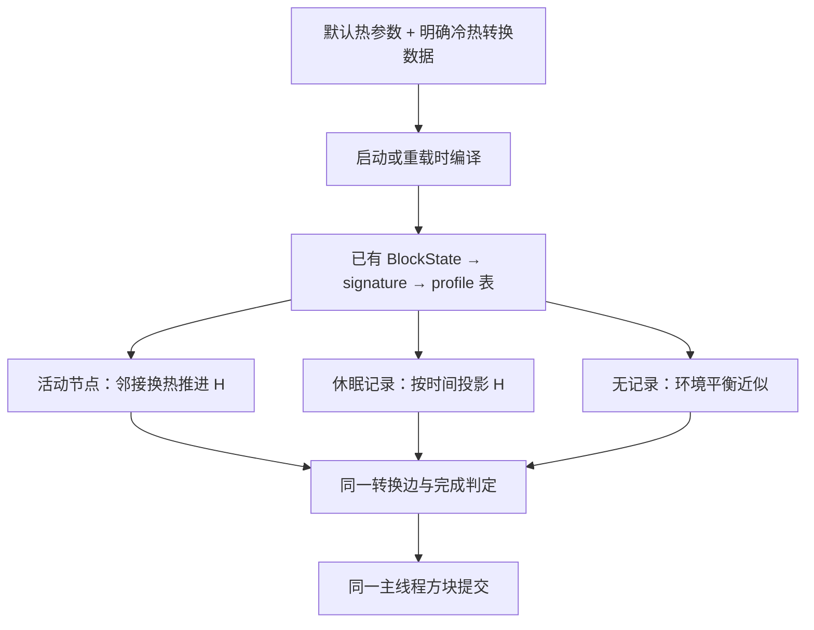

# 统一材料热规则：参数查表与同一相变流程

- Time: `2026-09-14 19:06:50 +08:00`
- Updated: `2026-09-15 00:54:09 +08:00`
- Authors: `Codex; OpenAI GPT-6; primary engineering agent`
- Status: `completed`
- Scope: `统一材料规则、相变数据迁移与旧入口清理；代码实施和验证`
- Next stage: `2026-09-15空气表达与浮力方案集中在材料主计划；本体发热候选已撤回，本文已完成的数据架构不重做。`
- Related: [已实施休眠冷却](2026-09-14_16-22-45_thermal-unified-dormant-natural-cooling.md)、[材料主计划](2026-09-12_23-53-20_thermal-material-enthalpy-lifecycle-repair.md)、[当前runtime](../docs/climate/thermal-runtime-architecture-and-optimization.md)、[当前热源/相变](../docs/climate/heat-production-and-network.md)、[职责收拢记录](../diary/2026-09-14_18-58-02_thermal-input-responsibility-cleanup.md)

## 1. 决定与范围

后续设计入口：[固定近源空气混合与5～10°C误差取舍](2026-09-15_18-49-35_thermal-local-air-mixing-tradeoff.md)。用户容差放宽后不优先增加Air节点；方向修复及局部直接Air系数为当前候选，数值原型已测，生产未实施。本文已完成的数据架构不重做。

**所有材料使用同一换热和相变规则，差异只来自少量参数和转换数据。** 增加一种材料，不应要求修改solver、休眠积分器、提交控制器或增加Mixin。

本计划取代继续添加材料特判、或把特判拆成水/雪/岩浆几个专用方法的路线。保留已有稀疏Page、单材料节点/单H、六向传热、表面向内两层、休眠时间/COW、红外真实表面归属。

运行时只按事实分支：有没有有效状态、哪个转换方向、有没有转换边、能量是否完成、世界方块是否仍是同一物体。不得按`Blocks.LAVA`、冰/水tag或雪层身份选择热算法。内容ID属于数据和数据生成声明。

## 2. 实施前核实的现状

- `MaterialThermalLaw`已有C、offset、heating/cooling及端点H，通用积分基础可复用。
- `MinecraftMaterialLawCompiler`同时推导互逆配方、处理冰系列、消失阶段和原生水/雪/岩浆，输入规则仍然分裂。
- `StateTransitionData`的`solid/liquid/gas`被整合包用作阶段槽；冰、岩浆块也可能标成`liquid`，不能据此可靠推断全部转换。
- 旧`heat_capacity`既控制随机概率，又参与潜热换算，并不等于材料的`capacityJPerK`。
- `canTransition`还有水边缘、岩浆高度和biome特判；雪层/岩浆回调另有阈值及概率。
- 现有state→signature→profile密集索引已经支持直接查表。当前也没有遍历所有材料逐个判断；主要问题是规则分散和重复，不能把清理if当成已证明的巨大性能收益。

## 3. 总体流程与组件职责



| 现有组件 | 最终职责 |
|---|---|
| `StateTransitionData`及原加载/数据生成设施 | 提供参数和直接转换声明，不执行世界规则 |
| `MinecraftMaterialLawCompiler` | 参数合并、状态展开、目标解析、端点编译，不识别具体物质 |
| `MaterialThermalLaw`、solver、`DormantThermalCooling` | 固定H↔T关系及显热/潜热推进 |
| `MinecraftPhaseController` | 用编译边判定和提交，保留身份接续及worker ACK |
| `MinecraftGameplayFields` | 通用场合成与明确温度下限，不出现物质分支 |
| `MinecraftThermalInput` | 门面与输入编排，不回填材料规则 |

沿用这些组件，不增加规则引擎、策略注册器、每材料子类或回调链。

## 4. 数据设计：直接声明，不猜转换关系

重写现有`StateTransitionData`定义及Codec，继续使用原配方加载设施。实施后的字段如下：

| 数据 | 含义与缺省 |
|---|---|
| 方块/状态选择范围 | 复用现有block或精确BlockState展开机制 |
| `capacity_j_per_k` | 可选覆盖；缺省使用现有少量材料分类默认值，C>0 |
| `enthalpy_offset_j` | 0°C能量基准O；普通无相变材料默认0，相变状态在相应数据组定义 |
| `conductance_w_per_k` | 可选覆盖；缺省沿用共同材料参数，不由暴露面反推热容 |
| `heating` / `cooling` | 各最多一条，直接给出目标BlockState与`temperature_c`；缺省为空 |
| 终止边的`latent_heat_j` | 仅目标没有材料状态时使用，缺省为共用潜热值 |
| 转换边的`world_conditions` | 少量固定环境约束，见第6节；不参与H计算，不提供任意脚本或条件树 |
| 转换边的`effect` | 可选视觉/音效枚举，缺省none；保留原效果，不用于推导相变方向 |

普通石头不必新增JSON；少数相变系列才需要转换声明。液位等参数和目标在数据生成/编译时展开，运行时不判断具体物质。C和O按已有通用物质量比例一起变化，不能只缩放其中之一。

取消相变中的`PhysicalState`阶段槽推断与互逆关系猜测。升温、降温独立定义，允许单向或两个方向去往不同目标。存在边就使用同一算法，无边就没有这个方向的转换；不再回退另一套`solid/liquid/gas`目标选择switch。

旧`heat_capacity=10`不能解释成`10 J/K`。迁移时删除其概率惯性语义；C使用材料默认值，潜热通过下面的能量参考统一。已无用途的旧字段、读取分支及配置在相关调用迁移后删除，不保留双格式兼容读取。

### 4.1 每个状态只有一个能量参考

沿用显热关系`H=O+C*T`。H、O单位J，C单位J/K，T单位°C。

对温度Tp、源状态s到目标状态d的转换：

```text
Hs = Os + Cs * Tp
Hd = Od + Cd * Tp
潜热区间为 Hs → Hd
```

升温要求Hd>Hs，降温要求Hd<Hs。真正目标状态已有能量参考时，潜热就是两端之差，不能再独立配置一个与目标H冲突的L。转换成功保留H，目标law自然得到Tp。

例如两个状态C均为100 J/K，O分别为0和1000 J，在0°C转换需要1000 J；目标H=1000 J时，目标温度仍为0°C。是否存在反向配方不影响这个算法。

同一个状态被多条边引用，所有边都必须使用同一个O。冷热阈值可以不同，但对应的能量差未必相同，不能额外声称两方向具有同一个独立L。

目标没有材料law时，采用统一终止边：源端经过共用或明确的L后，移除该物体及其H。不是判断目标名字是否为Air，也不创建气体节点或把余热转给任意邻居。

### 4.2 迁移数据，不编写通用图求解器

把现有有效C/O/目标/端点导出作为对照，整理为少数相变数据组。冲突的单向配方必须在该数据组中统一能量参考，随代码交付完整可编译的数据；不能只交空框架，也不能继续在runtime补物质特判。

本版不求解任意化学反应网络，不为每条边临时修改目标O。参数正确性由发行数据和对应回归保证。具体数值迁移属于实施步骤，不能在本轮尚未迁移时宣称全部配方已经统一。

编译期复用`MinecraftThermalProfiles`、`MaterialBoundaryRegistry`：合并默认值/覆盖，解析目标ID，计算端点，生成原不可变law。同参数继续共享profile；节点不复制数据定义、字符串、判断器或转换列表。复杂度为O(注册状态数+边数)，无需运行时扫描配方。

## 5. 同一规则，保留三种状态来源

- 活动节点由原solver推进H，到端点后走请求/ACK；随机tick不额外积分它。
- 休眠记录使用原时间投影，随机更新命中后检查相同端点并提交；不增加周期任务。
- 无记录区域保留环境平衡近似，使用相同编译边和温度参数选目标；不为每次抽样创建永久H记录。

无记录区域没有连续热历史，不能声称逐块模拟了潜热等待。这里假设未跟踪物体已与环境平衡；统一参数和执行入口不等于扩大整世界存储或统一模拟精度。温度计/红外仍不因读取创建Page或材料记录。

常规提交条件为：区块已加载、方块身份匹配、存在所选方向、物理能量完成或环境平衡近似成立、通用更新开关及所配置的固定环境约束允许。已修复的嵌套替换和迟到回调处理继续使用。

能量塔等解析场仍是通用输入：明确下限可以阻止冷却转换，或通过原受控能量路径推进到指定升温端点；一般delta保持原合成语义。所有方向都已编译后，删除`gameplayOnlyPhase`这类“物理边缺失再切旧配方”的补丁，无需岩浆块专项处理。

## 6. 保留必要玩法，用固定环境约束表达

**用户最新明确允许水边缘与岩浆高度限制存在，本计划保留它们。** 统一热算法不要求删掉这些玩法；要消除的是控制器按材料名称选择算法，以及同一规则散落在多个入口。

转换边只允许以下固定、扁平字段，不引入组合表达式、predicate列表、策略注册或按材料的handler：

| 字段 | 检查含义 | 现有数据映射 |
|---|---|---|
| `min_y_exclusive` | 位置Y必须大于给定值；缺省不限制 | 岩浆凝固边配置-55，保留Y≤−55不凝固 |
| `fluid_boundary_tag` | 四个水平邻居至少一个不属于指定流体tag；缺省不查邻居 | 水冻结边配置`minecraft:water`，保留水边缘规则 |
| `excluded_biome_tag` | 当前biome不能属于指定tag；缺省不查 | 保留已有冰不融化/水不冻结的biome约束，不新增其他特殊玩法 |

上述都是“某条转换需要什么环境”，不是“某种材料应当运行哪段算法”。运行时只检查字段是否配置；不出现`if (isLava)`/`if (isWater)`。只有确实可能提交转换时才进行这些检查，便宜的高度判断在邻居/biome查询之前。必要邻居未加载则保留状态，等下一次原更新，不加载区块。

环境条件保存在`MinecraftThermalProfiles`现有主线程编译快照中，按profile和方向共享。可用一个小的嵌套值类型和按profile索引的条件表；缺省为空，不逐节点保存。profile去重同时考虑这些条件，避免相同热参数、不同环境要求的状态被错误合并。条件不进入`MaterialThermalLaw`的能量公式、worker邻接计算或H存档，因此不扩大每条保存材料记录。

条件只影响能否提交，不产生或吞掉能量。水在潜热端点等待边缘条件时保留H；条件后来成立，仍由同一提交过程完成。活动与休眠入口使用同一条件检查，不复制两份。

### 随机更新

2026-09-15用户修订：恢复水的原地表抽样，不把相变能力直接等同于Section随机资格。
`StateTransitionData.hasRandomTransitions`对水返回false，其余有转换定义的状态复用
`BlockStateBaseMixin_RandomTick`和已有重载计数处理。资格查询不执行`prepare()`或扫描配方。

通用Section随机入口跳过水，包括因其他方块而参与随机更新的Section。水恢复原来每Chunk
默认20tick一次的地表列抽样，只调用同一转换入口，不实现第二份水温/目标/边缘判断。
天气积雪、降水保留地表职责。雪层/岩浆重复物理判定不恢复，原生点火继续运行。

本计划实施的迁移边界如下：

| 当前实现 | 迁移目标 |
|---|---|
| 水必须位于水体边缘才能冻结 | 保留，通过冻结边的流体边缘条件表达 |
| 岩浆Y≤−55不凝固 | 保留，通过凝固边的高度条件表达，不补建地下热源 |
| 指定biome禁止冰融化/水冻结 | 保留，通过转换边的排除tag表达 |
| 雪层光照/温度等现有玩法 | 材料温度转换统一使用原物理整块Snow→Air边；独立保留未跟踪雪层光照>11减层，不增加逐层质量模型，降雪/降水不变 |
| 岩浆1/1000及旧材料额外概率 | 使用共用随机机会；物理快慢由热参数/潜热决定 |
| 各种物质的专用提交逻辑 | 同一提交过程，数据决定目标与是否存在某方向 |

删除的是散落的物质特判和重复执行逻辑；上述已确定保留的环境约束只有一处实现。其他系统使用的tag/config继续有效。

**撤回水获得通用随机资格的实施选择。** 水域自然冻结抽样数量恢复按参与更新的Chunk计算，
不随海洋纵深的Section数增加。不新增逐方块计时器、候选轮询、配置项或数据调度框架。
地下/覆盖水的休眠记录不再获得新增随机机会；活动水的worker换热/相变仍保留。
原生Section的流体增量计数保持原样，不能声称纯水Section无论状态都完全不抽样；
本次保证的是水不新增方块随机资格、也不在Section抽样中触发水冻结检查。

自然生成岩浆的初温继续列为独立未完成项。按用户停止扩展细节的要求，本版不加`if(lava) 初始化1000°C`，也不把有效辐射温度直接当材料初温。未来如需热初态，采用所有材料共用的profile参数另行确定。本次保留高度条件，不宣称已经解决初温问题。

## 7. 工程成本约束

- 沿用state/signature/profile表，只查命中的状态，不枚举材料或规则对象。
- 每law最多两个方向；保留显热快路径及有界潜热积分。增加内容主要影响装载数据量，不把单次判定变成长if链。
- 不新增per-player热状态、per-block条件缓存、气隙温度、128节点Brick、世界扫描、通用规则框架或每材料子类。
- 使用现有类和加载设施。目标和端点已编译，随机命中时不分配转换列表/`HeatingTransition`。
- 保留现有H、时间、COW和红外网络布局；优先使用v4 law持久化及参数适配，不因整理职责无故升级存档或增加兼容reader。
- 可读性来自直接数据和短的统一流程；不是把每个if包装成一个名字模糊的方法。公式变量带单位，加载期工作与逐tick工作明确分开。

## 8. 实施顺序

1. 列出现有配方、原生边和整合包覆盖，统一少数数据组的C/O及冷热目标；提交迁移清单与完整新数据。
2. 替换现有Codec和compiler，生成原`MaterialThermalLaw`；删除`compileIceStages`、`compileNativeTransitions`等物质专用编译与旧阶段槽推断。
3. 统一活动/休眠/无记录的边选择和提交，场作为通用输入；门面继续薄转发。
4. 按第6节迁移固定环境约束，删除重复入口和旧概率，同步注册、字段/配置及断言；验证水边缘、岩浆高度、biome及非相变天气/点火规则。
5. 运行下面回归及负载对照，更新living docs、plan结果和开发日记。

已核实伴随Git仓库为`D:/TheWinterRescue`，递归未发现AGENTS.md；检查未发现相变配方覆盖或被删除配置项的引用。该仓库原有36项工作区变更，本轮未修改。`D:/The-Winter-Rescue`为游戏实例，不作为源码仓库修改。

## 9. 验收与结果

2026-09-15人工编辑入口修订：用户明确state_transition.xlsx是配合生成器的人类维护源表。
此前删除该表的选择撤回。现已将74份材料数据接回Excel，并适配FHRecipeProvider读取新列。
五个旧表明确关闭的降温方向保留目标与阈值，以独立方向启用列控制生成，不进入runtime兼容逻辑。
material_transitions.json不再作为人工输入源，编辑流程恢复为表格→生成配方。
表格生成专项已验证74份配方与发行数据一致，并验证开关、0°C和空白默认值可驱动实际生成器；
正常测试环境90/90回归通过。见[源表接回记录](../diary/2026-09-15_00-54-09_material-workbook-generator.md)。

2026-09-15修订结果：水恢复原Chunk地表抽样间隔和位置选择，退出通用Section水相变检查；
原生流体计数不改。真实Chunk.tick验证地表到期冻结、未到期/零随机速度不冻结、覆盖水不受影响，
并验证所有水液位不增加方块随机资格。最终90/90 GameTests通过，见
[恢复记录](../diary/2026-09-15_00-24-30_restore-water-surface-ticks.md)。
以下为2026-09-14数据架构实施的原验收记录，调度选择以本次修订为准。
2026-09-15按用户要求清理本轮build日志、离线迁移脚本/导出及GameTest世界；验证结论保留于日记，
相关历史临时文件链接不再可用，见[清理记录](../diary/2026-09-15_00-28-29_thermal-temporary-artifact-cleanup.md)。

- 添加一条只存在于测试数据的新转换，Java热规则不改动，活动/休眠/无记录路径都能按同一声明选目标。
- 水/冰、雪、岩浆、岩浆块及非互逆冷热目标不同的转换使用同一入口；不能因为一个方向已被物理接管而吞掉另一方向。
- 验证不同C/O、冷热阈值、目标消失及液位变化：端点H一致，潜热不重复扣除，无无法解释的温度跳变。
- 保留六向/两层、未加载不改、读取不写H、恢复不双重冷却、嵌套替换、红外LAST增量等既有回归。
- 验证无水边缘时不冻结、有边缘时可提交；Y≤−55的岩浆保持不凝固，高处满足其他条件时可凝固。确认biome约束、雪层既有玩法及点火/天气不被误停。
- 玩家集中/分散×内容稀疏/密集的整体负载仍待实测；水抽样按用户要求恢复原范围，另以真实Chunk.tick回归检查地表间隔、覆盖水与Section随机资格。
- 静态检查solver、休眠工具和提交控制器不引用具体物质ID/tag。ID留在数据、数据生成和测试；通用几何/物质量计算不属于材料专用相变算法。

Outcome: 代码与发行数据已完成。新Codec、两遍编译、同一提交条件已实施。74份声明迁移为新JSON数据；删除旧阶段枚举、工作簿、互逆推导、物质专用编译、独立岩浆相变Mixin、地表水冻结函数和旧相变概率配置。现有类承担职责，没有新增生产规则类或兼容reader。

能量参考迁移及最终数据契约见[材料规则](../docs/climate/heat-production-and-network.md#material-transition-data)。最终Forge GameTests为88/88通过，核验1,405条编译边方向及目标能量；74份源数据与生成配方内容一致。新增测试覆盖数据独立冷热方向、条件参与profile去重、水边缘和岩浆高度。既有活动/休眠/无记录、解析场、两层传热与红外回归通过。

性能样本：休眠随机检查每次0 bytes分配；实际4096记录Chunk上的1024次setBlockState样本也为0 bytes/次。当前发行数据生成69个共享profile，转换表只含2×70个引用；不扩大节点和NBT记录。实际多玩家集中/分散、纯水区域与红外组合的MSPT/带宽尚未实测，不能以微基准代替该结论。

主代码和datagen代码编译通过。完整runData被原有warm_stone缺失掉落表阻塞，本次只生成相变JSON并通过实际游戏加载验证；普通JUnit源集仍有26个旧几何类型引用编译错误，没有恢复兼容类。详情及日志见[实施日记](../diary/2026-09-14_21-19-17_data-driven-material-transitions.md)。
